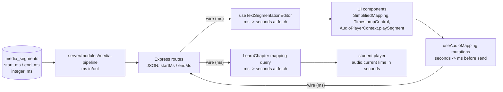

# Bundle E - Media milliseconds contract (isolated slice)

Tracks tasks `6.1`, `6.2`, `6.4`, `6.4.a` from [docs/implementation/db-solidification-task-coverage-matrix.md](docs/implementation/db-solidification-task-coverage-matrix.md). Lands on a fresh branch `dbdsolidify/bundle-e-media-ms` cut from `dbsolidify`.

## Strategy chosen: Option B - ms at DB + API wire only

- DB columns and API wire: integer **milliseconds** (`start_ms` / `end_ms`, `startMs` / `endMs`)
- Frontend UI components and the `<audio>` player layer: **seconds** (unchanged)
- Conversion lives in exactly three boundary hooks (two read sites + one write site)

## Architecture (data flow)



## Step 1 - Branch + baseline (task 0.x carryover)

- Create branch `dbdsolidify/bundle-e-media-ms` from `dbsolidify`.
- Run `npm run check` and `npm run test:content` as a baseline before edits.

## Step 2 - SQL migration (tasks 6.1 + 6.2)

New file: [server/migrations/005_bundle_e_media_segments_ms.sql](server/migrations/005_bundle_e_media_segments_ms.sql)

Idempotent, single transaction, follows the Bundle C pattern:

- Phase A (cleanup): `ROUND(start_timestamp * 1000)::int` into a temp value; clamp `start_timestamp >= 0`, `end_timestamp >= 0`, swap inverted ranges; bump zero-length segments by `+1` ms so `start < end` holds.
- Phase B (schema):
  - `ALTER TABLE media_segments ADD COLUMN IF NOT EXISTS start_ms integer`
  - `ALTER TABLE media_segments ADD COLUMN IF NOT EXISTS end_ms integer`
  - Backfill from `start_timestamp` / `end_timestamp` if values present.
  - `ALTER COLUMN start_ms SET NOT NULL` and same for `end_ms`.
  - `ALTER TABLE media_segments DROP COLUMN start_timestamp` and `end_timestamp`.
- Phase C (constraints, all `IF NOT EXISTS` guarded via `pg_constraint`):
  - `media_segments_start_ms_nonneg_check` -> `start_ms >= 0`
  - `media_segments_end_ms_nonneg_check` -> `end_ms >= 0`
  - `media_segments_start_lt_end_check` -> `start_ms < end_ms`

## Step 3 - Drizzle schema (task 6.1 + 6.2)

In [packages/types/src/schema.ts](packages/types/src/schema.ts) (around line 131):

- Replace `startTimestamp: real("start_timestamp").notNull()` and `endTimestamp: real("end_timestamp").notNull()` with `startMs: integer("start_ms").notNull()` and `endMs: integer("end_ms").notNull()`.
- Add table-level CHECKs matching the SQL constraints (mirrors the `text_segments_start_lte_end_check` style already in the file).

## Step 4 - Server module + routes (task 6.4.a)

Files:
- [server/modules/media-pipeline/types.ts](server/modules/media-pipeline/types.ts): rename `startTimestamp`/`endTimestamp` -> `startMs`/`endMs` on `MediaSegment` and `CreateMediaSegmentData`. Rename `startTime`/`endTime` -> `startMs`/`endMs` on `MappingWithTimestamps` and `CreateMappingData`. All values are integer ms.
- [server/modules/media-pipeline/storage.ts](server/modules/media-pipeline/storage.ts): update inserts, selects (`mediaSegments.startMs`/`endMs`), `orderBy(asc(mediaSegments.startMs))`, and the joined `getSegmentMappingsByChapter` / `getSegmentMappingsByAudioFile` selects to project `startMs` / `endMs`.
- [server/modules/media-pipeline/service.ts](server/modules/media-pipeline/service.ts): keep the validation (`data.startMs < 0 || data.endMs <= data.startMs`) and add an integer guard.
- [server/routes/media.routes.ts](server/routes/media.routes.ts): both Zod schemas become `startMs: z.number().int().nonnegative()` and `endMs: z.number().int().nonnegative()`. Drop the legacy `startTime/endTime` and `startTimestamp/endTimestamp` field names entirely (hard cut).
- [server/routes/content.routes.ts](server/routes/content.routes.ts) (POST/PUT/PATCH around lines 537-621): switch request body parsing to `startMs` / `endMs`; update the error code `MISSING_TIMESTAMP_FIELDS` message text accordingly.

## Step 5 - Shared types (task 6.4.a contract)

[packages/types/src/types.ts](packages/types/src/types.ts) line 20:

- `MappingWithTimestamps` interface fields rename: `startTime` -> `startMs`, `endTime` -> `endMs` (this IS the wire shape).

[packages/types/src/text-segmentation.ts](packages/types/src/text-segmentation.ts):

- `SimplifiedMapping` keeps `startTime` / `endTime` (frontend-only, in **seconds**).
- Update `toSimplifiedMapping` to convert: `startTime: db.startMs / 1000`, `endTime: db.endMs / 1000`.

This converter is the single source of truth for the ms->seconds boundary on the read path.

## Step 6 - Frontend boundaries (Option B, three sites only)

### Read site #1 - admin portal mappings query
[apps/admin-portal/src/lib/content/hooks/useTextSegmentationEditor.ts](apps/admin-portal/src/lib/content/hooks/useTextSegmentationEditor.ts) line 55-57:

```ts
const { data: allChapterMappings = [] } = useQuery<AudioMapping[]>({
  queryKey: ['content', 'chapters', chapterId, 'mappings'],
  queryFn: async () => {
    const wire = await apiRequest<MappingWithTimestamps[]>(`/content/chapters/${chapterId}/mappings`, { method: 'GET' });
    return wire.map(toSimplifiedMapping);
  },
});
```

UI components consuming `allChapterMappings` (e.g. `MappingTab`, `SegmentMappingGrid`, `TimestampControl`, `FocusSessionSetup`, `ProgressiveMapper`, `AudioPlayerContext.playSegment`) **do not change** - they continue receiving seconds.

### Read site #2 - student portal mappings query
[apps/student-portal/src/components/learning/LearnChapter.tsx](apps/student-portal/src/components/learning/LearnChapter.tsx) line 145:

Same pattern: fetch `MappingWithTimestamps[]` (ms), map to a local `AudioTextMapping` shape with seconds. The `audio.currentTime = mapping.startTime` lines (244, 248) keep working unchanged.

### Write site - admin portal mutations
[apps/admin-portal/src/lib/content/hooks/useAudioMapping.ts](apps/admin-portal/src/lib/content/hooks/useAudioMapping.ts):

Each mutation body multiplies by 1000 before sending:

```ts
body: JSON.stringify({
  textSegmentId: mapping.textSegmentId,
  audioFileId: mapping.audioFileId,
  startMs: Math.round(mapping.startTime * 1000),
  endMs: Math.round(mapping.endTime * 1000),
}),
```

Apply the same pattern to the PATCH body in `updateMappingMutation`.

## Step 7 - Smoke test + OpenAPI

- [scripts/test/content-smoke.ts](scripts/test/content-smoke.ts) line 60 / 70: change `startTime: 0, endTime: 5` -> `startMs: 0, endMs: 5000` for `createMapping`. The `updateMediaSegment` call on line 70 changes to `{ startMs: 1000, endMs: 6000 }`.
- [openapi.yaml](openapi.yaml):
  - Lines 975-1032 (mapping PATCH/PUT bodies): rename `startTime`/`endTime` -> `startMs`/`endMs`, type `integer`, `minimum: 0`.
  - Lines 1062-1067 (bulk segments items): same rename.
  - Lines 2099-2140 (`MediaSegment`, `SegmentMapping`, `CreateSegmentMappingRequest` schemas): same rename, update `description` to "milliseconds".

## Step 8 - Verification (task 6.4.a / Gate 3)

Per the matrix Gate 3: "mapping/playback works with `startMs/endMs` end-to-end."

1. `npm run db:reset` then `npm run db:seed` -> migration applies cleanly on fresh DB.
2. `npm run check` -> typecheck green across server + admin-portal + student-portal.
3. `npm run test:content` -> smoke test passes (create/list/update/delete mapping with ms).
4. Manual flow in admin portal: open Mapping tab on a chapter, create a mapping by dragging, play it back, edit timestamps via `TimestampControl`, delete it. Verify the `<audio>` element seeks to the correct seconds.
5. Manual flow in student portal: open a chapter in Learn mode, click a segment, verify segment-bounded playback stops at the correct end time.
6. Tick boxes 6.1, 6.2, 6.4, 6.4.a in [docs/implementation/db-solidification-implementation-checklist.md](docs/implementation/db-solidification-implementation-checklist.md).

## Out of scope (explicitly)

- Task `6.3` (`media_segments.created_at` -> `timestamptz`) belongs to **Bundle F** (timestamp normalization). Not touched here.
- No changes to other tables, no tenancy work.

## Risk notes

- `media_segments` is referenced via FK from `segment_mappings`, but the FK is on `id` not on the timestamp columns, so dropping/replacing the timestamp columns does not require touching `segment_mappings`.
- The integer rounding (`Math.round(seconds * 1000)`) introduces at most 1ms of quantization vs. the previous `real` storage, which is below human perception and matches the doc's stated tolerance.
- Hard cut (no aliases) means a stale frontend deploy against the new server (or vice versa) will fail on missing fields. Land server + admin-portal + student-portal in one PR; deploy them together.
