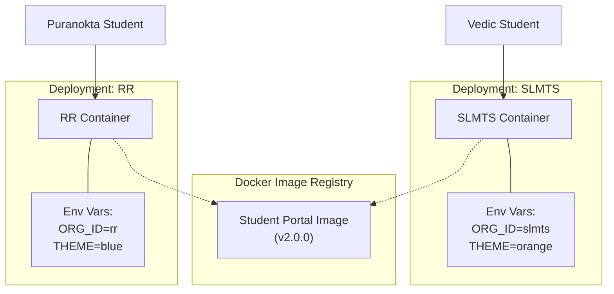
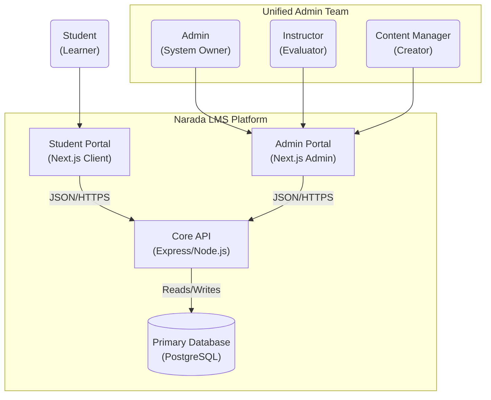

# 🏗️ Narada LMS: Architecture Re-Platforming Strategy

**Date:** January 28, 2026
**Status:** DRAFT (Detailed Technical Spec)

## 1. Executive Summary: The "Golden Path"

The proposed re-architecture transits Narada LMS from a monolithic structure to a **Managed Monorepo with Micro-Frontend characteristics**, favoring **Configuration over Duplication**.

We employ a **"Build Once, Deploy Many"** strategy to support SLMTS and RR pathasalas from a single codebase.

---

## 2. High-Level Architecture

### 2.1 The "Chameleon" Concept

The **Student Portal** is a generic shell that adapts its identity, curriculum, and theming based on runtime configuration.



### 2.2 System Context & Persona Map



---

## 3. Deep-Dive Technical Strategy

### 3.1 🎨 Frontend Specialist: The "Chameleon" Implementation

**Challenge:** How do we make one Next.js build serve two different brands without rebuilding?
**Solution:** **Runtime Configuration** + **React Context**.

#### A. Runtime Configuration Pattern

Next.js hardcodes `NEXT_PUBLIC_` env vars at build time. To avoid rebuilding for every school, we will inject configuration at *runtime*.

* **Mechanism:** Docker entrypoint script writes a `window.__ENV__` object to `public/env.js`.
* **Usage:** A `ConfigProvider` reads this global object on initialization.

#### B. Component Sharing (Monorepo)

* `packages/ui`: Contains generic atoms (Button, Card, Modal) styled with Tailwind.
* `apps/student-portal`: Consumes `packages/ui`.
* `apps/admin-portal`: Consumes `packages/ui`.

#### C. Theme Implementation

We won't just hardcode colors. We will use CSS Variables mapped to a Semantic Token layer.

* **SLMTS:** Inject `--primary: 246 101 22` (Orange)
* **RR:** Inject `--primary: 30 64 175` (Blue)
* **Code:** `tailwind.config.ts` refers to `var(--primary)`, not hex codes.

---

### 3.2 ⚙️ Backend Specialist: The "Gatekeeper" Middleware

**Challenge:** How do we ensure strict data isolation without physical database separation?
**Solution:** **Middleware-Driven Request Context**.

#### A. The `OrganizationGuard` Middleware

Every request must arrive with an identifying header (e.g., `x-org-id` or via JWT claim).

```typescript
// Pseudo-code for Gatekeeper Middleware
const organizationGuard = (req, res, next) => {
  const orgId = req.user?.orgId || req.headers['x-org-id'];
  
  // 1. Validate
  if (!['slmts', 'rr'].includes(orgId)) {
    return res.status(403).json({ error: "Invalid Organization" });
  }

  // 2. Mount to Request Context
  req.ctx = { orgId }; 
  next();
};
```

---

### 3.3 👥 Access Control Architect: The "Unified Admin" Pattern

**Clarification:** Moving features to a separate "Admin Portal" does **NOT** change the roles.

* **Goal:** Consolidation. Instead of "Content Manager" logging into the student app to upload files, they log into the Admin Portal.
* **RBAC (Role-Based Access Control):** The backend logic remains identical.
  * **Admins:** Full access to Settings, Users, Finance.
  * **Instructors:** Restricted access to 'Evaluations' & 'Batches'.
  * **Content Managers:** Restricted access to 'Library' & 'Curriculum'.

---

### 3.4 🛠️ DevOps Engineer: The "Build Once" Pipeline

**Challenge:** Preventing "Drift" and optimizing build times.
**Solution:** **Docker Multi-Stage Builds** + **Turborepo**.

#### A. Application Container Strategy

We produce **Immutable Artifacts**. The Docker image for `student-portal:v1.0` is exactly the same byte-for-byte for SLMTS and RR.

**Dockerfile Concept:**

1. **Builder Stage:** Uses Turbo to prune and build only the necessary app.
2. **Runner Stage:** Minimal Node.js alpine image.
3. **Entrypoint:** A shell script `docker-entrypoint.sh` that detects `ORG_ID` environment variable and generates the runtime config `env.js` before starting the node process.

---

## 4. Phase-by-Phase Execution Plan

### Phase 1: Foundation (The Skeleton)

* [ ] **Repo Restructure:** Initialize Turborepo. Move current code to `apps/temp-legacy`.
* [ ] **Package Extraction:**
  * `packages/types`: Move Zod schemas and Typscript interfaces.
  * `packages/database`: Move Drizzle config and schema.
* [ ] **UI Library:** Create `packages/ui`.  Move `Button`, `Input`, `Card` components there.

### Phase 2: Backend Transformation

* [ ] **API Abstraction:** Create `apps/api`.
* [ ] **Schema Migration:** Add `organization_id` column to Database.
* [ ] **Middleware:** Implement `OrganizationGuard`.
* [ ] **Endpoint Update:** Refactor all endpoints to use `req.ctx.orgId`.

### Phase 3: Frontend Splitting

* [ ] **Student App Setup:** Create `apps/student-portal`.
* [ ] **Runtime Config:** Implement `ConfigProvider` and environment injection logic.
* [ ] **Port Features:** Move "Student-facing" pages (Curriculum, Test) from legacy.
* [ ] **Admin App Setup:** Create `apps/admin-portal`.
* [ ] **Feature Consolidation:** Move all Admin, Instructor, and Content Manager features to this app.

### Phase 4: Verification

* [ ] **Docker Compose:** Spin up full stack locally with Mock SLMTS & RR.
* [ ] **Cross-Pollination Test:** Ensure SLMTS student cannot login to RR student portal.
* [ ] **Data Leak Test:** Ensure API returns empty list for RR batches when queried with SLMTS context.

---

## 5. Technology Stack & Tooling Impact

The transition requires introducing specific tools to manage complexity. Here is the breakdown of the Current vs. Future state.

| Domain | Current State | Future State | Impact / Rationale |
| :--- | :--- | :--- | :--- |
| **Orchestration** | None (Single Folder) | **Turborepo** (or Nx) | Essential for managing dependencies between the shared UI library and the 3 apps. Handles strict build caching to speed up CI. |
| **Frontend Runtime** | Vite SPA (React) | **Next.js** (Proposed) | Migration allows for better SEO, Server Components, and easier standard configuration. *Alternative: Keep Vite if team is strictly SPA-oriented.* |
| **Backend Runtime** | Node/Express (Monolith) | **Node/Express (Micro-service)** | The core tech remains Node.js/Express but architecture shifts to "Stateless API" mode (JWT preferred over sticky sessions). |
| **Database** | PostgreSQL + Drizzle | **PostgreSQL + Drizzle** (No Change) | Drizzle is perfect for this. We only need to utilize Drizzle's "schema separation" or standard migration tools for the new columns. |
| **Styling** | Tailwind CSS (Utility) | **Tailwind + Variables** (Semantic) | Moving from hardcoded `bg-orange-500` to Semantic `bg-primary` variables defined in CSS to allow switching themes at runtime. |
| **Validation** | Zod (Scattered) | **Zod (Shared Package)** | Critical to move all Zod schemas to `packages/types` so the Frontend and Backend guarantee they are speaking the same language. |
| **Infrastructure** | Manual / Simple Docker | **Docker Compose / K8s** | The deployment complexity increases (3 containers vs 1). Requires a robust `docker-compose.yml` for local dev. |

### 5.1 Critical Toolkit decisions

* **Turborepo:** Selected for its ease of adoption and "zero config" caching.
* **Next.js:** Recommended for the Student Portal to support future AI/Assessment features that may need server-side security or easy API routes.
* **Drizzle ORM:** Retained. It is best-in-class.

---

## 6. Risk Assessment (Architect Level)

| Risk | Probability | Severity | Mitigation Strategy |
| :--- | :--- | :--- | :--- |
| **"Leakage" of Data** | Low | High | Automated Integration Tests must attempt to fetch 'RR' data while authenticated as 'SLMTS'. |
| **Design System Divergence** | Medium | Low | Strict Code Review policy: No one-off styles in Apps. All UI changes must happen in `packages/ui`. |
| **Monorepo Complexity** | Medium | Medium | Developer Onboarding Docs (Environment setup is harder than single repo). Service scripts provided in `package.json` |
