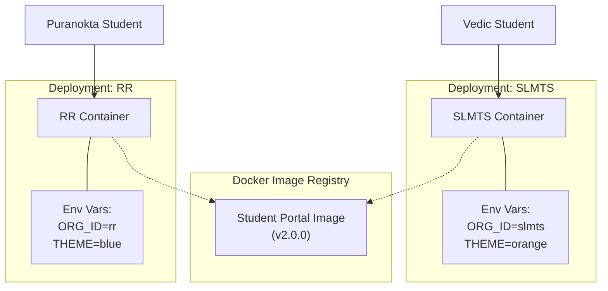
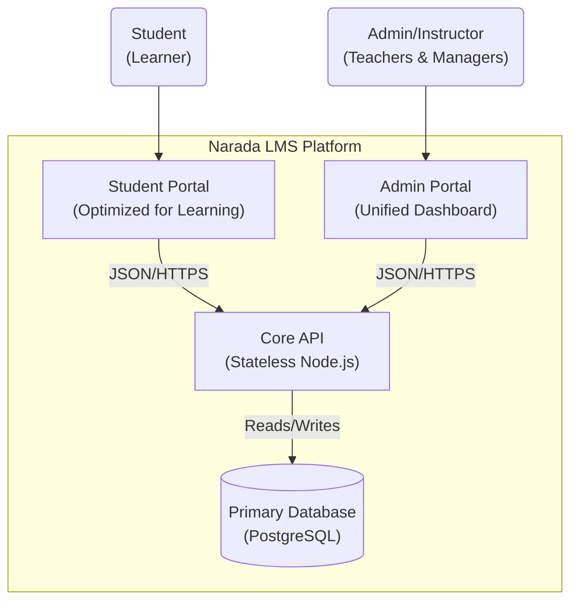

# 🏗️ Narada LMS: Architecture Re-Platforming Strategy

**Date:** January 28, 2026
**Status:** DRAFT (For Architectural Review)

## 1. Executive Summary: The "Golden Path"

The proposed re-architecture aims to transition Narada LMS from a monolithic structure to a **Managed Monorepo with Micro-Frontend characteristics**. This approach favors **Configuration over Duplication**.

Instead of physically forking the codebase for each pathasala (SLMTS vs. RR), which leads to code drift and quadrupled maintenance, we propose a **"Build Once, Deploy Many"** strategy. We will build a single, highly flexible "Chameleon" application that adapts its identity, curriculum, and theming based on runtime configuration.

### Key Benefits

* **Zero Drift:** A bug fixed for one school is fixed for all.
* **Unified Management:** A single Admin Portal manages all organizations.
* **Optimization:** The Student Portal is optimized purely for learning (mobile-first), while the Admin Portal is optimized for management (desktop-heavy).

---

## 2. High-Level Architecture

### 2.1 The "Chameleon" Concept

The core philosophy is that the **Student Portal** is a generic shell. It knows how to render a "Course" or a "Test", but it doesn't know *which* course or test until it wakes up.



### 2.2 System Context Diagram

This diagram illustrates how the three proposed core components interact with each other and the shared database.



---

## 3. Technical Strategy

### 3.1 The Monorepo Structure

We will utilize a Monorepo tool (like **Turborepo** or **Nx**) to manage the codebase. This allows us to separate concerns without losing type safety.

**Proposed Directory Structure:**

```text
/narada-lms
├── apps/
│   ├── api/                 # Node.js Express Server (The Brain)
│   ├── student-portal/      # Next.js App (The Learning Interface)
│   └── admin-portal/        # Next.js App (The Management Interface)
├── packages/
│   ├── ui/                  # "Gayatri" Design System (Shared Components)
│   ├── database/            # Drizzle ORM Schema & Migrations
│   ├── types/               # Shared Zod Schemas & TS Interfaces
│   └── config/              # Shared ESLint/TSConfig
```

**Why this matters:**

* **Shared "Gayatri":** When you update the `Button` component in `packages/ui`, both the Student and Admin portals get the update instantly.
* **Shared Types:** If the API changes the `User` object structure, the Frontend apps will fail to build *immediately*, preventing runtime bugs.

### 3.2 Data Strategy: Logical Separation

To support the "Unified Admin Portal", all data will reside in a single database schema, segregated by an `organization_id`.

**Schema Logic:**

* **Table:** `users`
  * `id`: UUID
  * `organization_id`: 'slmts' | 'rr'
  * `email`: ...
* **Table:** `courses`
  * `id`: UUID
  * `organization_id`: 'slmts' | 'rr'

**Security:**
The API Layer serves as the **Gatekeeper**. middleware will strictly enforce:
`SELECT * FROM courses WHERE organization_id = req.user.organization_id`

### 3.3 Deployment Infrastructure

We will move to a fully containerized (Docker) workflow.

1. **API Container:** Scalable, stateless. Connected to Postgres.
2. **Admin Container:** Single deployment. protected by strict RBAC.
3. **Student Containers:**
    * **Scale:** Can autoscale based on load independently of Admin.
    * **Isolation:** If "SLMTS" has a massive exam event, we can spin up 10 extra containers for SLMTS without touching the RR deployment.

---

## 4. Detailed Implementation & Migration Plan

This is a **non-destructive** migration path. We build the new structure alongside the old one.

### Phase 1: Foundation (The Skeleton)

* [ ] **Init Monorepo:** Initialize Turborepo in the root.
* [ ] **Create Packages:**
  * Move `shared` folder contents to `packages/types` and `packages/utils`.
  * Extract Design System components to `packages/ui`.
* [ ] **Setup Apps:**
  * Create `apps/api` and move `server` code there.
  * Create `apps/student-portal` and move `client` code there (temporarily includes everything).

### Phase 2: Separation (The Surgery)

* [ ] **Create Admin App:** Initialize `apps/admin-portal`.
* [ ] **Port Admin Features:** Move all `/admin` routes and "Manager" related pages from `student-portal` to `admin-portal`.
* [ ] **Clean Student App:** Delete all admin-related code, dependencies, and complex routing from `student-portal`.
  * *Result:* A lightweight, focused Student App.

### Phase 3: The Chameleon (Configuration)

* [ ] **Env Variable Logic:** distinct configuration for:
  * `NEXT_PUBLIC_APP_TITLE`
  * `NEXT_PUBLIC_THEME_COLOR`
  * `NEXT_PUBLIC_LOGO_URL`
  * `NEXT_PUBLIC_ORG_ID`
* [ ] **Database Migration:** Add `organization_id` column to all relevant tables.
* [ ] **API Middleware:** Implement `OrganizationGuard` middleware to filter data based on the Request/User context.

### Phase 4: Verification & Dockerize

* [ ] **Docker Compose:** Create a local stack running 1 API, 1 Admin, and 2 Student instances (mocking SLMTS and RR).
* [ ] **E2E Testing:** Verify that data created in SLMTS does not appear in RR.

---

## 5. Potential Risks & Mitigations

| Risk | Impact | Mitigation Strategy |
| :--- | :--- | :--- |
| **Data Leakage** | Critical | Strict API middleware (Row Level Security) + Automated Tests ensuring cross-org access fails. |
| **Complexity** | Moderate | Use Turborepo tooling to simplify "Build All" and "Dev All" commands. |
| **Shared Lib Versioning** | Low | In a Monorepo, all apps use the *head* version of shared libs. No version mismatch issues. |
