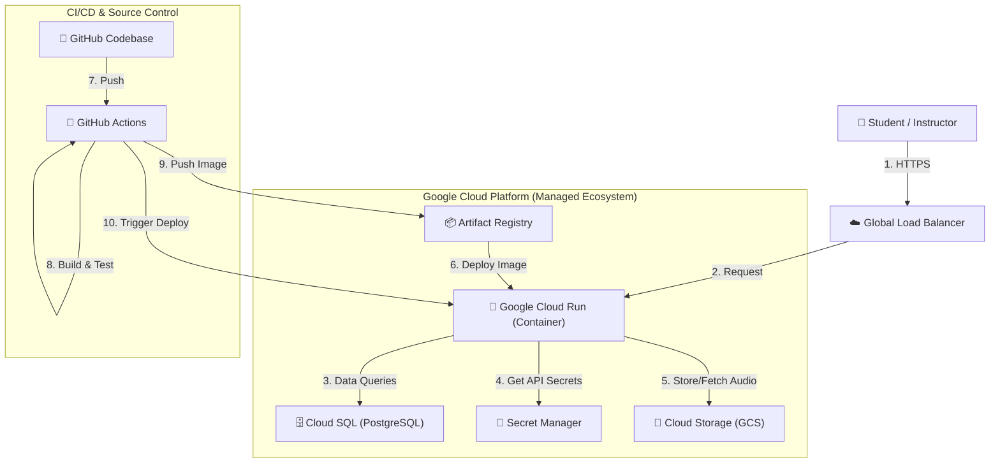

# Cloud Deployment Strategy: GitHub Actions + Google Cloud Platform

> **Status**: Proposed / Under Review
> **Last Updated**: 2026-01-25

---

## 🎯 Vision: The Cloud-Native Future

The goal of NaradaLMS's housing strategy is to transition from a "local-first" server to a **Cloud-Native "Food Truck" Architecture**. This ensures that the application is resilient, extremely low-maintenance, and infinitely scalable without manual intervention.

### Core Philosophy
- **Stateless Execution**: The application "executes" in containers but doesn't store anything locally.
- **Zero-Ops**: Using managed services so we cook code, not manage servers.
- **Scale to Zero**: Cost efficiency—paying only for what is used.

---

## 🏗️ Architecture Diagram

---

## 🛠️ The GCP Product Stack (The "Big Six")

| Product | Role | Why it is the Best Fit |
|:---|:---|:---|
| **[Cloud Run](https://cloud.google.com/run)** | **Application Runner** | Automatically scales from 0 to 1,000 instances. You don't manage a VM or OS. It is the gold standard for "Hassle-Free" container execution. |
| **[Cloud SQL (Postgres)](https://cloud.google.com/sql)** | **Database** | Managed PostgreSQL. Automatic backups, patching, and encryption at rest. Zero maintenance for the DB admin. |
| **[Cloud Storage (GCS)](https://cloud.google.com/storage)** | **Asset Library** | Infinite storage for audio files. Extremely high availability and cheaper than storing on a server's hard drive. |
| **[Artifact Registry](https://cloud.google.com/artifact-registry)** | **Blueprint Garage** | Securely stores our Docker images. Fast deployments to Cloud Run via Google's internal network. |
| **[Secret Manager](https://cloud.google.com/secret-manager)** | **Vault** | Removes the need for `.env` files on servers. Secrets are encrypted and injected into the app at runtime. |
| **[IAM & WIF](https://cloud.google.com/iam)** | **The Key Master** | **Workload Identity Federation (WIF)** allows GitHub Actions to talk to GCP without using permanent (dangerous) service account keys. |

---

## 🤖 Why GitHub Actions?

Instead of using GCP's native "Cloud Build", we use **GitHub Actions** for three reasons:
1. **Developer Velocity**: Build logs and status checks appear right next to your code in the PR.
2. **Standardization**: Most modern dev teams use GitHub Actions, making it easier for future contributors.
3. **Advanced Workflows**: Rich ecosystem of pre-built actions for testing, linting, and security scanning.

---

## 💎 Impact Analysis

### 1. Minimal Maintenance
By choosing managed serverless products, you eliminate the need for:
- SSH-ing into servers to fix packages.
- Worrying about "Disk Full" errors.
- Manual OS security patching.

### 2. Cost Efficiency
- **Cloud Run** scales to zero. If no one uses the app for a day, you pay $0 for compute.
- **Micro Cloud SQL** instances for Dev/Test are extremely affordable (~$10/mo).

### 3. Professional Standards
This architecture replicates what Tier-1 tech companies use. It prepares NaradaLMS for growth from 10 students to 10,000 without a single architectural change.

---

> [!IMPORTANT]
> To achieve this "Future State", the application must be refactored to be **Stateless**—meaning it cannot rely on local file storage (`/uploads`). This is the primary effort required in the implementation roadmap.
