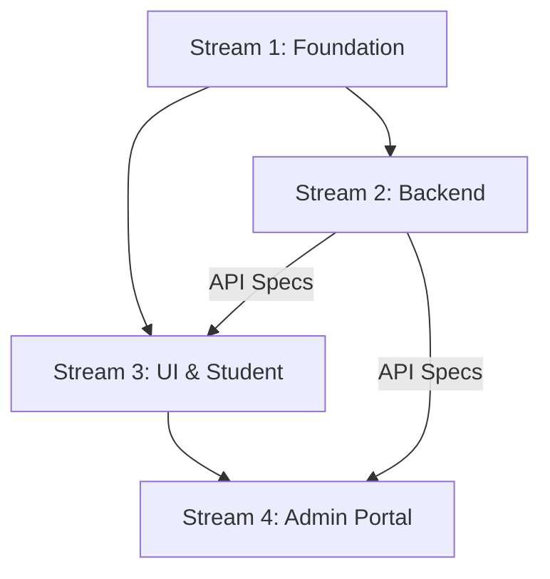

# 🎮 Orchestration & Parallel Execution Guide

This document defines how to execute the Narada LMS re-platforming using parallel workstreams. Use this as a "Controller" to delegate tasks to specialist agents or new sessions.

## 🏗️ Execution Strategy

We use a **"Core-First" propagation model**. Stream 1 finishes the foundation, then Streams 2 and 3 can run simultaneously. Stream 4 follows once the UI library is extracted.

---

## 🛰️ Stream 1: Foundation (Branch: `feat/monorepo-foundation`)

**Objective:** Setup Turborepo and extract `@narada/types` and `@narada/database`.

### 📝 Prompt for Agent
>
> "Initialize a Turborepo monorepo for Narada LMS. Use `pnpm`.
>
> 1. Create `packages/types` and migrate all Zod schemas and TS interfaces from `shared/`.
> 2. Create `packages/database` and migrate Drizzle schema and config from `shared/schema.ts` and `server/db.ts`.
> 3. Verify that the root build runs and types are exported correctly."

---

## ⚙️ Stream 2: Backend & Security (Branch: `feat/standalone-api`)

**Objective:** Build `apps/api` with JWT Auth and Multi-Tenancy.
*Requires: `packages/types` and `packages/database` from Stream 1.*

### 📝 Prompt for Agent
>
> "Initialize `apps/api` as a standalone Express service using `@narada/database` and `@narada/types`.
>
> 1. Implement JWT-based Auth (Access/Refresh tokens) removing `express-session`.
> 2. Implement `OrganizationGuard` middleware to enforce `organization_id` isolation.
> 3. Enable strict CORS whitelisting via `process.env.ALLOWED_ORIGINS`.
> 4. Port all routes from the legacy server."

---

## 🎨 Stream 3: UI & Students (Branch: `feat/student-portal`)

**Objective:** Build `@narada/ui` and the "Chameleon" Student Portal.
*Requires: Stream 1 (Foundation).*

### 📝 Prompt for Agent
>
> "1. Extract the Gayatri Design System from `client/src/components/ui` into `packages/ui`.
> 2. Implement a CSS Variable-based theme system to support Orange (SLMTS) and Blue (RR) tokens.
> 3. Initialize `apps/student-portal` as a Next.js application.
> 4. Implement the 'Chameleon' engine: Inject `public/env.js` at runtime and use a `ConfigProvider` to set the theme and API endpoints."

---

## 🏢 Stream 4: Admin Cloud (Branch: `feat/admin-portal`)

**Objective:** Build the consolidated Admin Portal.
*Requires: `packages/ui` from Stream 3.*

### 📝 Prompt for Agent
>
> "Initialize `apps/admin-portal` as a desktop-optimized Next.js app.
>
> 1. Import `@narada/ui` and `@narada/types`.
> 2. Consolidate features from legacy `admin`, `instructor`, and `batches` into a unified management layout.
> 3. Ensure RBAC properly hides/shows modules based on user roles (Admin vs Instructor)."

---

## 🚦 Integration & Handoff Checklist

| Interaction | Responsibility | Documentation |
| :--- | :--- | :--- |
| **Schema Changes** | Stream 2 (Backend) | Update `@narada/database`, notify Stream 3/4. |
| **UI Updates** | Stream 3 (Student) | Update `@narada/ui`, common components for Stream 4. |
| **API Endpoints** | Stream 2 (Backend) | Provide Swagger/OpenAPI spec or Postman collection. |

## 🛠️ User (Controller) Responsibilities

1. **Branch Management:** Create the four branches listed above.
2. **Secrets:** Ensure `.env` files in `apps/api` and `apps/student-portal` are populated with corresponding `ALLOWED_ORIGINS` and `ORG_ID`.
3. **Merging:** Merge Stream 1 into `main` before starting Stream 2 and 3 to avoid dependency conflicts.
