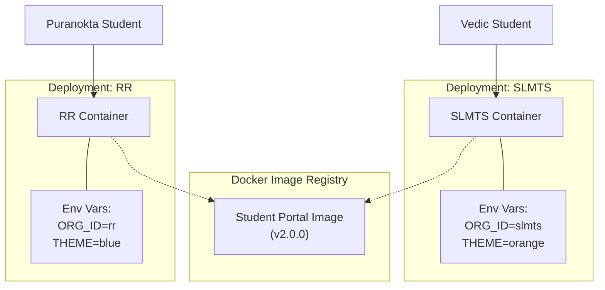
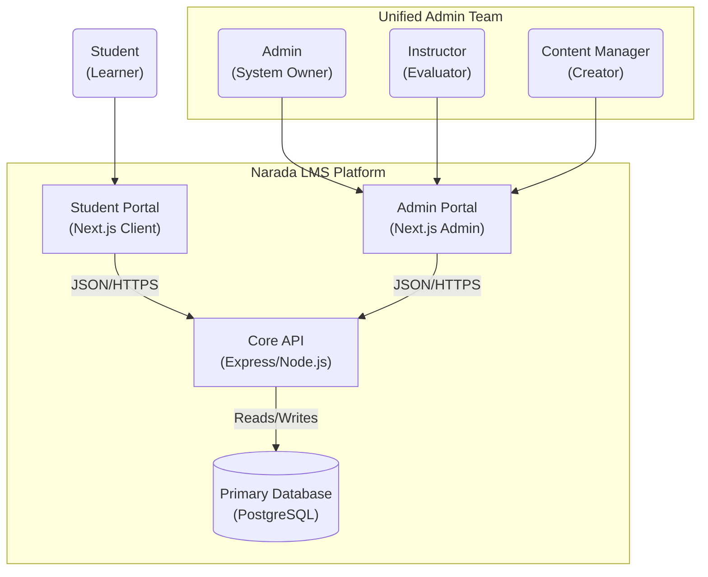

# 🏗️ Narada LMS: Architecture Re-Platforming Strategy

**Date:** February 12, 2026
**Status:** ACTIVE (Master Strategy)
**Related Documents:**

- [Technical Specifications](./technical-specifications.md) (API, Schema, Config, Modules)
- [Technical Context](./technical-context.md) (Codebase Analysis, Decisions, Audits)
- [Stage 0: Foundation](./stage-0-foundation.md)
- [Stage 1: Structural Split](./stage-1-structural-splitting.md)
- [Stage 2: Chameleonization](./stage-2-chameleonization.md)
- [Stage 3: Multi-Tenancy](./stage-3-multi-tenancy.md)

---

## 1. Executive Summary: The "Golden Path"

The Narada LMS re-architecture transitions the system from a modular monolith to a **Managed Monorepo with Micro-Frontend characteristics**.

We are moving away from a single "Vite SPA + Express" build to a **3-Container Architecture** suited for scale:

1. **Student Portal**: A "Chameleon" Next.js app that adapts branding per organization.
2. **Ops Portal**: A specialized Next.js app for Admins, Instructors, and Content Managers.
3. **Core API**: A stateless Node.js/Express service handling business logic and data isolation.

This strategy employs a **"Build Once, Deploy Many"** philosophy to support SLMTS and RR pathasalas from a single codebase configuration.

---

## 2. High-Level Architecture

### 2.1 The "Chameleon" Concept

The **Student Portal** is a generic shell that adapts its identity, curriculum, and theming based on runtime configuration.



### 2.2 System Context & Persona Map



---

## 3. Implementation Roadmap (The 4 Stages)

We are executing this re-architecture in **4 distinct stages** to minimize risk and ensure zero-regression. Each stage builds upon the previous one.

### [Stage 0: Foundation Preparation](./stage-0-foundation.md)

**Status: ✅ COMPLETED**
**Goal**: Resolve architectural dependencies before structural changes.

- **Key Deliverables**:
  - **JWT Auth**: Replaced stateful sessions with stateless JWTs to allow multi-domain scalability.
  - **Environment Standardization**: Removed hardcoded config; implemented strict 12-factor apps config injection.
  - **API Consolidation**: Unified routes to prepare for extraction.
  - **Docker Baseline**: Established base images for containers.

### [Stage 1: Structural Split](./stage-1-structural-splitting.md)

**Status: 🚧 IN PROGRESS**
**Goal**: Physical separation into a Monorepo with 3 containers (Student, Ops, API).

- **Key Deliverables**:
  - **Monorepo Setup**: Turborepo initialization with `apps/` and `packages/`.
  - **@narada/ui**: Extraction of shared component library and Tiptap editor adapter.
  - **Student Portal**: Porting student-facing views to Next.js 15 (Port 3000).
  - **Ops Portal**: Porting admin/instructor views to Next.js 15 (Port 3001).
  - **API Extraction**: Moving Express logic to `apps/api` (Port 5000).
  - **Dual Boot**: Running new apps alongside the legacy monolith during transition.

### [Stage 2: Chameleonization](./stage-2-chameleonization.md)

**Status: 📋 PLANNED**
**Goal**: Enable runtime theme injection for multi-branding.

- **Key Deliverables**:
  - **Theme Schema**: Database support for storing brand colors, logos, and fonts.
  - **Runtime Injection**: `ConfigProvider` to inject themes into the Next.js client at runtime.
  - **Asset Management**: Org-specific media storage (S3 bucket isolation).
  - **Theme Editor**: UI for admins to customize their portal appearance.

### [Stage 3: Multi-Tenancy](./stage-3-multi-tenancy.md)

**Status: 📋 PLANNED**
**Goal**: Strict data isolation at the database level.

- **Key Deliverables**:
  - **Schema Migration**: Adding `organization_id` to all core tables.
  - **The Gatekeeper**: Middleware that acts as a firewall, rejecting any request without a valid Org Context.
  - **RLS-like Logic**: Updating all queries to filter by `req.orgId`.
  - **Org Switcher**: UI for users belonging to multiple organizations.

---

## 4. Technical Deep Strategy

### 4.1 🎨 Frontend: The "Chameleon" Implementation

**Challenge:** How do we make one Next.js build serve two different brands without rebuilding?
**Solution:** **Runtime Configuration** + **React Context**.

- **Mechanism:** Docker entrypoint script writes a `window.__ENV__` object to `public/env.js`.
- **Usage:** A `ConfigProvider` reads this global object on initialization.
- **Theming:** CSS Variables mapped to a Semantic Token layer (e.g., `--primary` instead of `bg-orange-500`).

### 4.2 ⚙️ Backend: The "Gatekeeper" Middleware

**Challenge:** How do we ensure strict data isolation without physical database separation?
**Solution:** **Middleware-Driven Request Context**.

Every request must arrive with an identifying context (via JWT). The **OrganizationGuard** middleware validates this context before any business logic executes.

```typescript
const organizationGuard = (req, res, next) => {
  const orgId = req.user?.currentOrgId;
  // If no org context, block immediately
  if (!isValidOrg(orgId)) return res.sendStatus(403);
  req.orgId = orgId; // Bind to request
  next();
};
```

### 4.3 👥 Access Control: "Unified Admin"

We are consolidating personas. Instead of three different login flows, we have one **Ops Portal** with Role-Based Access Control (RBAC):

- **Admins**: Full System Access.
- **Instructors**: Access to Batches & Evaluations.
- **Content Managers**: Access to Curriculum & Library.

### 4.4 🛠️ DevOps: "Build Once" Pipeline

We produce **Immutable Artifacts**. The Docker image for `student-portal:v1.0` is exactly the same byte-for-byte for all organizations.

**Dockerfile Strategy**:

1. **Builder Stage**: Turbo prunes and builds the app.
2. **Runner Stage**: Minimal Node.js Alpine image.
3. **Entrypoint**: `docker-entrypoint.sh` detects `ORG_ID` env var -> generates `env.js` -> starts Node.

---

## 5. Security Architecture

### 5.1 CORS Strategy

Since frontends and APIs may run on different subdomains (e.g., `api.slmts.org` vs `portal.slmts.org`), we enforce **Strict Whitelisting**. The API rejects any `Origin` not explicitly allowed via environment variables.

### 5.2 Authentication (JWT)

- **Stateless**: No server-side sessions.

- **Token Strategy**: Short-lived Access Tokens (Header) + Long-lived Refresh Tokens (HttpOnly Cookie).
- **Isolation**: Tokens are bound to an Organization Context.

---

## 6. Technology Stack Impact

| Domain | Current State | Future State | Rationale |
| :--- | :--- | :--- | :--- |
| **Orchestration** | Single Folder | **Turborepo** | Manage dependencies between Apps and UI Library. |
| **Frontend** | Vite SPA | **Next.js 15** | Server Components, SEO, and easier Config Injection. |
| **Backend** | Express Monolith | **Express API** | Stateless, JSON-only API. |
| **Database** | Postgres + Drizzle | **Postgres + Drizzle** | No change, just schema updates. |
| **Styling** | Tailwind Utility | **Tailwind + Variables** | Semantic tokens for theming. |
| **Validation** | Scattered Zod | **@narada/types** | Shared Zod schemas for FE/BE contract. |

---

## 7. Risk Assessment

| Risk | Probability | Severity | Mitigation Strategy |
| :--- | :--- | :--- | :--- |
| **Data Leakage** | Low | Critical | Automated tests MUST attempt to access Org B data with Org A credentials |
| **Design Divergence** | Medium | Low | Strict code review: all generic UI components must live in `@narada/ui` |
| **Monorepo Complexity** | Medium | Medium | Comprehensive "Getting Started" guides and `turbo` pipeline optimizations |
