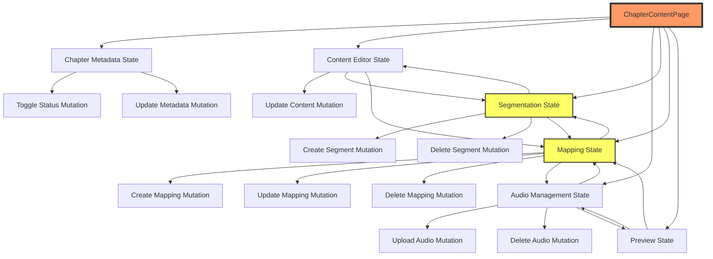
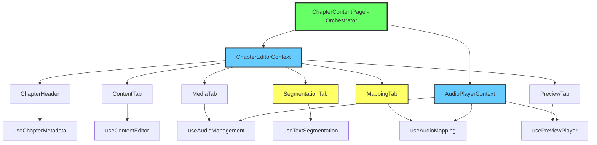
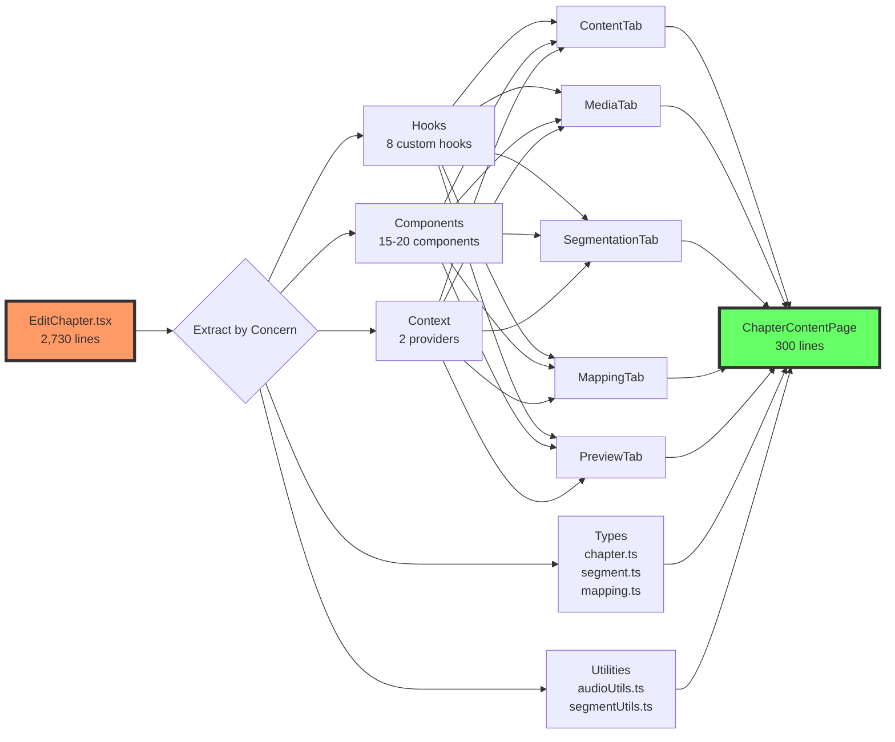
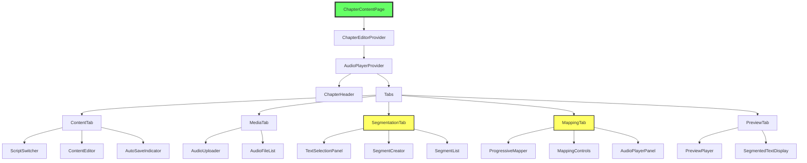

# ChapterContentPage Migration - Technical Architecture Documentation

**Document Version:** 1.0  
**Date:** 2026-01-08  
**Author:** AI Technical Architect  
**Status:** Draft for Review

---

## Table of Contents

1. [Executive Summary](#executive-summary)
2. [Legacy Architecture Analysis](#legacy-architecture-analysis)
3. [New Architecture Design](#new-architecture-design)
4. [Code Migration Mapping](#code-migration-mapping)
5. [Implementation Plan](#implementation-plan)
6. [Testing Strategy](#testing-strategy)
7. [Risk Assessment](#risk-assessment)
8. [Appendix](#appendix)

---

## Executive Summary

### Problem Statement

The current `EditChapter.tsx` (legacy) and `ChapterContentPage.tsx` (new-ui) are essentially identical monolithic components with **2,700+ lines** of code that violate multiple software engineering principles:

- **Single Responsibility:** Handles 5 different features in one component
- **Separation of Concerns:** Business logic, UI, and state management are intertwined
- **Maintainability:** Small changes require hours due to tight coupling
- **Testability:** No isolation of logic makes unit testing impossible

### Proposed Solution

Complete migration to a **modular, component-based architecture** using:
- Custom hooks for state management (one per concern)
- Isolated tab components (one per feature)
- Shared context for cross-cutting concerns
- Modern React patterns (composition over configuration)

### Success Criteria

1. **File Size:** Main orchestrator ~300 lines (from 2,700)
2. **Component Count:** 15-20 small, focused components (from 1 monolith)
3. **State Variables:** 8-10 grouped hooks (from 40+ individual variables)
4. **Change Impact:** UI changes take minutes, not hours
5. **Zero Regression:** All functionality preserved

---

## Legacy Architecture Analysis

### File Structure Overview

```
EditChapter.tsx (2,731 lines)
├── Imports (1-68)
├── Interfaces (70-110)
├── Component Definition (112-2730)
    ├── Feature Flags (122-138)
    ├── State Variables (140-348) ❌ 40+ useState
    ├── Helper Functions (149-435) ❌ Mixed concerns
    ├── Mutations (437-1192) ❌ 20+ mutations
    ├── Effects (993-1055) ❌ Complex dependencies
    ├── Event Handlers (1200-1600) ❌ Deeply nested
    └── JSX Render (1650-2730) ❌ 1,000+ lines of markup
```

### Architectural Problems

#### 1. State Management Chaos

**Current State (40+ variables):**

```typescript
// Chapter Metadata (5 variables)
const [isEditingMetadata, setIsEditingMetadata] = useState(false);
const [editingTitle, setEditingTitle] = useState("");
const [editingDescription, setEditingDescription] = useState("");
const [showUnpublishConfirm, setShowUnpublishConfirm] = useState(false);
const [saveStatus, setSaveStatus] = useState('clean');

// Content Editor (5 variables)
const [textContent, setTextContent] = useState({ te: "", hi: "", en: "" });
const [chapterContent, setChapterContent] = useState({}); // DUPLICATE!
const [contentScript, setContentScript] = useState("te");
const [selectedScript, setSelectedScript] = useState("te"); // DUPLICATE!

// Audio Management (8 variables)
const [selectedAudioFile, setSelectedAudioFile] = useState(null);
const [audioPlayer, setAudioPlayer] = useState(null);
const [isPlaying, setIsPlaying] = useState(false);
const [currentTime, setCurrentTime] = useState(0);
const [duration, setDuration] = useState(0);
const [isDragOver, setIsDragOver] = useState(false);
const [editingFileId, setEditingFileId] = useState(null);
const [editingFileName, setEditingFileName] = useState("");

// Text Segmentation (4 variables)
const [selectedSegmentId, setSelectedSegmentId] = useState(undefined);
const [textSelection, setTextSelection] = useState(null);
const [segmentName, setSegmentName] = useState("");
const [selectedScript, setSelectedScript] = useState("te"); // DUPLICATE AGAIN!

// Audio Mapping (3 variables)
const [editingSegmentId, setEditingSegmentId] = useState(null);
const [editingSegmentData, setEditingSegmentData] = useState(null);
const [selectedMediaSegment, setSelectedMediaSegment] = useState(null);

// Preview State (8 variables)
const [selectedTextSegmentPreview, setSelectedTextSegmentPreview] = useState(undefined);
const [isPreviewPlaying, setIsPreviewPlaying] = useState(false);
const [previewCurrentTime, setPreviewCurrentTime] = useState(0);
const [previewDuration, setPreviewDuration] = useState(0);
const [previewVolume, setPreviewVolume] = useState(80);
const [previewPlaybackRate, setPreviewPlaybackRate] = useState(1);
const [selectedAudioFilePreview, setSelectedAudioFilePreview] = useState(null);
const [learnMode, setLearnMode] = useState(true);

// Tab Management (1 variable)
const [activeTab, setActiveTab] = useState("content");

// PLUS: 3 useRef, 7 useQuery, 15+ useMutation
```

**Problems:**
- Duplicated state (`selectedScript` appears 3 times!)
- Unclear ownership (who manages `audioPlayer`?)
- State interdependencies (changing one breaks 5 others)
- No encapsulation

#### 2. Mutation Soup

**20+ mutations scattered throughout:**

```typescript
// Lines 437-490: Toggle publish status
const toggleStatusMutation = useMutation({...});

// Lines 492-520: Update chapter metadata
const updateChapterMetadataMutation = useMutation({...});

// Lines 673-706: Upload audio
const audioUploadMutation = useMutation({...});

// Lines 708-741: Update media segment
const updateMediaSegmentMutation = useMutation({...});

// Lines 743-763: Delete media segment
const deleteMediaSegmentMutation = useMutation({...});

// Lines 765-828: Create text segment
const createSegmentMutation = useMutation({...});

// Lines 830-850: Delete text segment
const deleteSegmentMutation = useMutation({...});

// Lines 852-890: Update content
const updateContentMutation = useMutation({...});

// Lines 1059-1082: Delete audio file
const deleteAudioMutation = useMutation({...});

// Lines 1084-1112: Update filename
const updateFileNameMutation = useMutation({...});

// Lines 1129-1147: Create mapping
const createMappingMutation = useMutation({...});

// Lines 1150-1172: Update mapping
const updateMappingMutation = useMutation({...});

// Lines 1175-1192: Delete mapping
const deleteMappingMutation = useMutation({...});

// ... and more
```

**Problems:**
- No grouping by concern
- Error handling duplicated across all mutations
- Toast messages hardcoded everywhere
- Query invalidation logic repeated

#### 3. The Massive Render Function (1,000+ lines)

```typescript
return (
  <div>
    {/* Lines 1650-1750: Header with metadata editing */}
    {/* Lines 1750-1850: Tab navigation */}
    <Tabs>
      {/* Lines 1850-1950: Content Tab (Step 1) */}
      <TabsContent value="content">
        {/* 100+ lines of RichTextEditor setup */}
      </TabsContent>

      {/* Lines 1950-2100: Media Tab (Step 2) */}
      <TabsContent value="media">
        {/* 150+ lines of file upload/management */}
      </TabsContent>

      {/* Lines 2100-2300: Segmentation Tab (Step 3) */}
      <TabsContent value="text-segmentation">
        {/* 200+ lines of text selection logic */}
      </TabsContent>

      {/* Lines 2300-2500: Mapping Tab (Step 4) */}
      <TabsContent value="audio-mapping">
        {/* 200+ lines of mapping interface */}
      </TabsContent>

      {/* Lines 2500-2700: Preview Tab (Step 5) */}
      <TabsContent value="preview">
        {/* 200+ lines of playback controls */}
      </TabsContent>
    </Tabs>
  </div>
);
```

**Problems:**
- Too much to comprehend in one view
- Difficult to find specific logic
- Copy-paste errors go unnoticed
- Change in one tab affects others

### Dependency Graph (Current)



**Key Issue:** Everything depends on everything. No clear boundaries.

---

## New Architecture Design

### Design Principles

1. **Single Responsibility:** Each component does ONE thing
2. **Composition Over Configuration:** Build complex UIs from simple parts
3. **Separation of Concerns:** Logic, state, and UI are separate
4. **Dependency Injection:** Components receive what they need via props/context
5. **Testability:** Each unit can be tested in isolation

### File Structure (Target)

```
client/src/new-ui/content/
├── pages/
│   └── ChapterContentPage.tsx (300 lines) ✅ Orchestrator only
│
├── components/
│   ├── ChapterHeader/
│   │   ├── index.tsx (exports)
│   │   ├── ChapterHeader.tsx (UI component)
│   │   ├── MetadataEditor.tsx (inline editing)
│   │   ├── PublishButton.tsx (publish/unpublish logic)
│   │   └── useChapterMetadata.ts (metadata state hook)
│   │
│   ├── ContentTab/
│   │   ├── index.tsx
│   │   ├── ContentTab.tsx (tab wrapper)
│   │   ├── ContentEditor.tsx (RichTextEditor wrapper)
│   │   ├── ScriptSwitcher.tsx (te/hi/en selector)
│   │   ├── AutoSaveIndicator.tsx (status display)
│   │   └── useContentEditor.ts (content state + auto-save)
│   │
│   ├── MediaTab/
│   │   ├── index.tsx
│   │   ├── MediaTab.tsx (tab wrapper)
│   │   ├── AudioUploader.tsx (drag-drop + file input)
│   │   ├── AudioFileList.tsx (list of uploaded files)
│   │   ├── AudioFileItem.tsx (single file with edit/delete)
│   │   └── useAudioManagement.ts (audio CRUD + state)
│   │
│   ├── SegmentationTab/ ⚠️ CRITICAL
│   │   ├── index.tsx
│   │   ├── SegmentationTab.tsx (tab wrapper)
│   │   ├── TextSelectionPanel.tsx (text display + selection)
│   │   ├── SegmentCreator.tsx (create segment form)
│   │   ├── SegmentList.tsx (list of segments)
│   │   ├── SegmentItem.tsx (single segment with actions)
│   │   └── useTextSegmentation.ts (selection + segment CRUD)
│   │
│   ├── MappingTab/ ⚠️ CRITICAL
│   │   ├── index.tsx
│   │   ├── MappingTab.tsx (tab wrapper)
│   │   ├── ProgressiveMapper.tsx (existing component - keep)
│   │   ├── MappingGrid.tsx (grid of mappings)
│   │   ├── MappingControls.tsx (create/edit mapping)
│   │   ├── AudioPlayerPanel.tsx (audio playback controls)
│   │   └── useAudioMapping.ts (mapping CRUD + audio state)
│   │
│   └── PreviewTab/
│       ├── index.tsx
│       ├── PreviewTab.tsx (tab wrapper)
│       ├── PreviewPlayer.tsx (audio player with controls)
│       ├── SegmentedTextDisplay.tsx (existing - keep)
│       └── usePreviewPlayer.ts (playback state + segment sync)
│
├── hooks/ (shared custom hooks)
│   ├── useChapterQuery.ts (fetch chapter data)
│   ├── useSegmentsQuery.ts (fetch segments for script)
│   ├── useAudioFilesQuery.ts (fetch audio files)
│   ├── useMappingsQuery.ts (fetch mappings)
│   └── usePublishStatus.ts (publish state management)
│
├── context/
│   ├── ChapterEditorContext.tsx (shared state across tabs)
│   └── AudioPlayerContext.tsx (shared audio player instance)
│
└── utils/
    ├── audioUtils.ts (time formatting, validation)
    ├── segmentUtils.ts (overlap detection, positioning)
    └── mappingUtils.ts (status calculation, validation)
```

### Component Dependency Graph (New)



**Key Improvement:** Clear hierarchy. Each tab is independent. Contexts provide shared state.

### State Management Strategy

#### Hook-Based State (8 Custom Hooks)

```typescript
// 1. useChapterMetadata (replaces 5 variables)
interface ChapterMetadataState {
  isEditing: boolean;
  title: string;
  description: string;
  status: 'draft' | 'published';
  showUnpublishDialog: boolean;
  saveStatus: 'clean' | 'dirty' | 'saving' | 'saved';
}

// 2. useContentEditor (replaces 5 variables)
interface ContentEditorState {
  content: { te: string; hi: string; en: string };
  activeScript: 'te' | 'hi' | 'en';
  isDirty: boolean;
  lastSaved: Date | null;
}

// 3. useAudioManagement (replaces 8 variables)
interface AudioManagementState {
  selectedFile: AudioFile | null;
  uploadProgress: number;
  isDragOver: boolean;
  editingFileId: number | null;
  editingFileName: string;
}

// 4. useAudioPlayer (replaces 4 variables, shared via context)
interface AudioPlayerState {
  player: HTMLAudioElement | null;
  isPlaying: boolean;
  currentTime: number;
  duration: number;
}

// 5. useTextSegmentation (replaces 4 variables)
interface TextSegmentationState {
  selectedSegmentId: number | null;
  textSelection: { start: number; end: number; text: string } | null;
  activeScript: 'te' | 'hi' | 'en';
}

// 6. useAudioMapping (replaces 3 variables)
interface AudioMappingState {
  selectedMapping: Mapping | null;
  editingSegmentId: number | null;
  pendingMapping: Partial<Mapping> | null;
}

// 7. usePreviewPlayer (replaces 8 variables)
interface PreviewPlayerState {
  selectedSegmentId: number | null;
  playbackState: {
    isPlaying: boolean;
    currentTime: number;
    duration: number;
    volume: number;
    playbackRate: number;
  };
  learnMode: boolean;
}

// 8. useTabNavigation (replaces 1 variable)
interface TabNavigationState {
  activeTab: 'content' | 'media' | 'segmentation' | 'mapping' | 'preview';
}
```

#### Context Providers

```typescript
// ChapterEditorContext.tsx
interface ChapterEditorContextValue {
  chapterId: string;
  trackId: string;
  chapter: Chapter | null;
  isLoading: boolean;
  isPublished: boolean;
  refetch: () => void;
}

// AudioPlayerContext.tsx
interface AudioPlayerContextValue {
  player: HTMLAudioElement | null;
  isPlaying: boolean;
  currentTime: number;
  duration: number;
  play: () => void;
  pause: () => void;
  seek: (time: number) => void;
  setAudioSource: (url: string) => void;
  playSegment: (startTime: number, endTime: number) => void;
}
```

### Component API Specifications

#### ChapterContentPage (Orchestrator)

```typescript
export default function ChapterContentPage() {
  const { trackId, chapterId } = useParams();
  const { activeTab, setActiveTab } = useTabNavigation();
  
  return (
    <ChapterEditorProvider chapterId={chapterId} trackId={trackId}>
      <AudioPlayerProvider>
        <div className="flex flex-col h-screen">
          <ChapterHeader />
          
          <Tabs value={activeTab} onValueChange={setActiveTab}>
            <TabsList>
              <TabsTrigger value="content">Step 1: Content</TabsTrigger>
              <TabsTrigger value="media">Step 2: Audio</TabsTrigger>
              <TabsTrigger value="segmentation">Step 3: Segmentation</TabsTrigger>
              <TabsTrigger value="mapping">Step 4: Mapping</TabsTrigger>
              <TabsTrigger value="preview">Step 5: Preview</TabsTrigger>
            </TabsList>
            
            <TabsContent value="content"><ContentTab /></TabsContent>
            <TabsContent value="media"><MediaTab /></TabsContent>
            <TabsContent value="segmentation"><SegmentationTab /></TabsContent>
            <TabsContent value="mapping"><MappingTab /></TabsContent>
            <TabsContent value="preview"><PreviewTab /></TabsContent>
          </Tabs>
        </div>
      </AudioPlayerProvider>
    </ChapterEditorProvider>
  );
}
```

**Lines: ~50** (vs. 2,730 in legacy)

#### ContentTab Component

```typescript
export function ContentTab() {
  const { chapter, isPublished } = useChapterEditor();
  const {
    content,
    activeScript,
    setActiveScript,
    updateContent,
    saveStatus,
  } = useContentEditor(chapter);
  
  return (
    <div className="flex flex-col h-full p-4">
      <div className="flex justify-between items-center mb-4">
        <ScriptSwitcher 
          value={activeScript} 
          onChange={setActiveScript}
          scripts={['te', 'hi', 'en']}
        />
        <AutoSaveIndicator status={saveStatus} />
      </div>
      
      <ContentEditor
        value={content[activeScript]}
        onChange={(html) => updateContent(activeScript, html)}
        disabled={isPublished}
        language={activeScript}
      />
    </div>
  );
}
```

**Lines: ~30** (vs. 100+ inline in legacy)

---

## Code Migration Mapping

### Detailed Mapping Table

| Legacy Code Section | Lines | New Location | Hook/Component | Notes |
|---------------------|-------|--------------|----------------|-------|
| **Imports** |
| React core imports | 1-4 | Each component | N/A | Duplicated per file |
| UI component imports | 35-43 | Each component | N/A | Only import what's needed |
| Business components | 46-68 | Specific tabs | N/A | Import in relevant tab |
| **Interfaces** |
| `ChapterData` | 70-96 | `types/chapter.ts` | Shared | Centralized type def |
| `TextSegment` | 98-110 | `types/segment.ts` | Shared | Centralized type def |
| **State Variables** |
| Chapter metadata | 278-286 | `useChapterMetadata.ts` | Hook | Lines 5-15 |
| Content editor | 242-257 | `useContentEditor.ts` | Hook | Lines 8-25 |
| Audio management | 288-304 | `useAudioManagement.ts` | Hook | Lines 10-30 |
| Segmentation | 313-322 | `useTextSegmentation.ts` | Hook | Lines 12-20 |
| Mapping | 298-312 | `useAudioMapping.ts` | Hook | Lines 15-25 |
| Preview | 329-342 | `usePreviewPlayer.ts` | Hook | Lines 18-35 |
| **Helper Functions** |
| `formatTime` | 146-152 | `utils/audioUtils.ts` | Utility | Export as `formatAudioTime` |
| `playAudioSegment` | 154-244 | `useAudioPlayer.ts` | Hook method | Part of `playSegment()` |
| `handleResetAudio` | 346-354 | `useAudioPlayer.ts` | Hook method | Part of `reset()` |
| `startEditingSegment` | 355-365 | `SegmentItem.tsx` | Component | Inline handler |
| `saveSegmentEdit` | 372-425 | `useTextSegmentation.ts` | Hook method | `updateSegment()` |
| `deleteSegment` | 427-435 | `useTextSegmentation.ts` | Hook method | `deleteSegment()` |
| **Mutations** |
| `toggleStatusMutation` | 437-456 | `useChapterMetadata.ts` | Hook | Lines 40-60 |
| `handlePublishToggle` | 459-490 | `PublishButton.tsx` | Component | Event handler |
| `updateChapterMetadataMutation` | 492-520 | `useChapterMetadata.ts` | Hook | Lines 65-85 |
| `updateContentMutation` | 852-890 | `useContentEditor.ts` | Hook | Lines 50-75 |
| `audioUploadMutation` | 673-706 | `useAudioManagement.ts` | Hook | Lines 45-70 |
| `deleteAudioMutation` | 1059-1082 | `useAudioManagement.ts` | Hook | Lines 75-95 |
| `updateFileNameMutation` | 1084-1112 | `useAudioManagement.ts` | Hook | Lines 100-120 |
| `createSegmentMutation` | 765-828 | `useTextSegmentation.ts` | Hook | Lines 60-95 |
| `deleteSegmentMutation` | 830-850 | `useTextSegmentation.ts` | Hook | Lines 100-120 |
| `createMappingMutation` | 1129-1147 | `useAudioMapping.ts` | Hook | Lines 55-75 |
| `updateMappingMutation` | 1150-1172 | `useAudioMapping.ts` | Hook | Lines 80-100 |
| `deleteMappingMutation` | 1175-1192 | `useAudioMapping.ts` | Hook | Lines 105-125 |
| **Effects** |
| Auto-save debounce | 1014-1043 | `useContentEditor.ts` | Hook | Lines 85-110 (useEffect) |
| Audio cleanup | 1046-1055 | `useAudioPlayer.ts` | Hook | Lines 120-135 (useEffect) |
| Preview sync | 340-347 | `usePreviewPlayer.ts` | Hook | Lines 45-60 (useEffect) |
| **Event Handlers** |
| Text selection | 1387-1443 | `TextSelectionPanel.tsx` | Component | onMouseUp handler |
| Segment creation | 1445-1490 | `SegmentCreator.tsx` | Component | onSubmit handler |
| Mapping creation | 1550-1620 | `MappingControls.tsx` | Component | onSubmit handler |
| Preview segment click | 566-645 | `PreviewTab.tsx` | Component | onClick handler |
| **JSX Sections** |
| Header | 1650-1750 | `ChapterHeader.tsx` | Component | Full component |
| Tabs navigation | 1750-1850 | `ChapterContentPage.tsx` | Page | Lines 20-30 |
| Content tab | 1850-1950 | `ContentTab.tsx` | Component | Full component |
| Media tab | 1950-2100 | `MediaTab.tsx` | Component | Full component |
| Segmentation tab | 2100-2300 | `SegmentationTab.tsx` | Component | Full component |
| Mapping tab | 2300-2500 | `MappingTab.tsx` | Component | Full component |
| Preview tab | 2500-2700 | `PreviewTab.tsx` | Component | Full component |

### Migration Workflow Diagram



---

## Implementation Plan

### Phase-Based Approach

The migration will follow a **9-phase iterative approach**, porting one step at a time and verifying functionality after each phase.

### Phase 0: Foundation (Days 1-2)

#### Objectives
- Safely preserve existing code as reference
- Set up new file structure
- Create skeleton components
- Establish basic routing

#### Tasks

**1. Preserve Existing Implementation**
```bash
# Rename current file to legacy (for reference only)
cd client/src/new-ui/content/pages/
mv ChapterContentPage.tsx ChapterContentPage.legacy.tsx

# This file will NOT be used in the app anymore
# It's kept only as a reference for copying code during migration
```

**2. Create New ChapterContentPage (Fresh Start)**
```typescript
// client/src/new-ui/content/pages/ChapterContentPage.tsx
import React from 'react';
import { useParams } from 'wouter';
import { useQuery } from '@tanstack/react-query';
import { Tabs, TabsContent, TabsList, TabsTrigger } from '@/components/ui/Tabs';
import { Card } from '@/components/ui/card';
import { Skeleton } from '@/components/ui/skeleton';
import { Alert, AlertDescription } from '@/components/ui/alert';
import { useRoleGuard } from '@/features/shared-features/hooks/useRoleGuard';
import { useToast } from '@/features/shared-features/hooks/use-toast';

export default function ChapterContentPage() {
  // 1. Role guard - only content managers can access this page
  useRoleGuard(['content_manager']);
  
  // 2. Get route parameters
  const params = useParams();
  const chapterId = params?.chapterId || '';
  const trackId = params?.trackId || '';
  
  // 3. Toast for notifications
  const { toast } = useToast();
  
  // 4. Fetch chapter data (placeholder query - will be moved to context in Phase 1)
  const { data: chapter, isLoading, error } = useQuery({
    queryKey: ['content', 'chapters', chapterId, 'details'],
    queryFn: async () => {
      const response = await fetch(`/api/content/chapters/${chapterId}/details`);
      if (!response.ok) throw new Error('Failed to fetch chapter');
      return response.json();
    },
    enabled: !!chapterId,
  });

  // 5. Loading state
  if (isLoading) {
    return (
      <div className="flex flex-col h-screen bg-gray-50 dark:bg-gray-900">
        <div className="bg-white dark:bg-gray-800 border-b px-4 py-3">
          <Skeleton className="h-8 w-64 mb-2" />
          <Skeleton className="h-4 w-96" />
        </div>
        <div className="flex-1 p-4">
          <Skeleton className="h-full w-full" />
        </div>
      </div>
    );
  }

  // 6. Error state
  if (error) {
    return (
      <div className="flex flex-col h-screen bg-gray-50 dark:bg-gray-900">
        <div className="bg-white dark:bg-gray-800 border-b px-4 py-3">
          <h1 className="text-xl font-semibold">Chapter Content Editor</h1>
        </div>
        <div className="flex-1 p-4 flex items-center justify-center">
          <Alert variant="destructive" className="max-w-md">
            <AlertDescription>
              Failed to load chapter. Please try refreshing the page.
            </AlertDescription>
          </Alert>
        </div>
      </div>
    );
  }

  // 7. Main render
  return (
    <div className="flex flex-col h-screen bg-gray-50 dark:bg-gray-900">
      {/* Header placeholder - will be replaced with ChapterHeader in Phase 1 */}
      <div className="bg-white dark:bg-gray-800 border-b px-4 py-3">
        <h1 className="text-xl font-semibold">
          {chapter?.title || 'Chapter Content Editor'} - Phase 0
        </h1>
        <p className="text-sm text-muted-foreground">
          Chapter ID: {chapterId} | Track ID: {trackId} | Status: {chapter?.status || 'Unknown'}
        </p>
      </div>

      {/* Tab structure skeleton */}
      <Tabs defaultValue="content" className="flex-1 flex flex-col overflow-hidden">
        <TabsList className="m-4">
          <TabsTrigger value="content">Step 1: Content</TabsTrigger>
          <TabsTrigger value="media">Step 2: Audio</TabsTrigger>
          <TabsTrigger value="segmentation">Step 3: Segmentation</TabsTrigger>
          <TabsTrigger value="mapping">Step 4: Mapping</TabsTrigger>
          <TabsTrigger value="preview">Step 5: Preview</TabsTrigger>
        </TabsList>

        <TabsContent value="content" className="flex-1 m-4 overflow-auto">
          <Card className="p-6">
            <h3 className="font-medium mb-2">Content Tab</h3>
            <p className="text-muted-foreground">Coming in Phase 2</p>
            <p className="text-xs text-muted-foreground mt-2">
              Will include: RichTextEditor, ScriptSwitcher, AutoSaveIndicator
            </p>
          </Card>
        </TabsContent>

        <TabsContent value="media" className="flex-1 m-4 overflow-auto">
          <Card className="p-6">
            <h3 className="font-medium mb-2">Media Tab</h3>
            <p className="text-muted-foreground">Coming in Phase 3</p>
            <p className="text-xs text-muted-foreground mt-2">
              Will include: AudioUploader, AudioFileList
            </p>
          </Card>
        </TabsContent>

        <TabsContent value="segmentation" className="flex-1 m-4 overflow-auto">
          <Card className="p-6">
            <h3 className="font-medium mb-2">Segmentation Tab</h3>
            <p className="text-muted-foreground">Coming in Phase 6</p>
            <p className="text-xs text-muted-foreground mt-2">
              ⚠️ Critical: TextSelectionPanel, SegmentCreator, SegmentList
            </p>
          </Card>
        </TabsContent>

        <TabsContent value="mapping" className="flex-1 m-4 overflow-auto">
          <Card className="p-6">
            <h3 className="font-medium mb-2">Mapping Tab</h3>
            <p className="text-muted-foreground">Coming in Phase 7</p>
            <p className="text-xs text-muted-foreground mt-2">
              ⚠️ Critical: ProgressiveMapper, MappingControls, AudioPlayerPanel
            </p>
          </Card>
        </TabsContent>

        <TabsContent value="preview" className="flex-1 m-4 overflow-auto">
          <Card className="p-6">
            <h3 className="font-medium mb-2">Preview Tab</h3>
            <p className="text-muted-foreground">Coming in Phase 4</p>
            <p className="text-xs text-muted-foreground mt-2">
              Will include: PreviewPlayer, SegmentedTextDisplay
            </p>
          </Card>
        </TabsContent>
      </Tabs>
    </div>
  );
}
```

**Key Application Standards Included:**

1. **Role Guard** - `useRoleGuard(['content_manager'])` at the top
2. **React Query** - Using `useQuery` for data fetching with proper error handling
3. **Toast Notifications** - `useToast()` hook initialized (ready for use)
4. **Loading States** - Skeleton UI while data loads
5. **Error Handling** - Alert component for error states
6. **Dark Mode** - All elements have dark mode classes
7. **Proper Overflow** - `overflow-hidden` and `overflow-auto` for scrolling
8. **Accessibility** - Semantic HTML and proper ARIA patterns

**3. Create Component Folder Structure**
```bash
# Create all component directories (empty for now)
cd client/src/new-ui/content/components/

mkdir -p ChapterHeader
mkdir -p ContentTab
mkdir -p MediaTab
mkdir -p SegmentationTab
mkdir -p MappingTab
mkdir -p PreviewTab

# Create placeholder index files
echo "export {};" > ChapterHeader/index.tsx
echo "export {};" > ContentTab/index.tsx
echo "export {};" > MediaTab/index.tsx
echo "export {};" > SegmentationTab/index.tsx
echo "export {};" > MappingTab/index.tsx
echo "export {};" > PreviewTab/index.tsx
```

**4. Create Hooks Directory**
```bash
cd client/src/new-ui/content/

mkdir -p hooks
mkdir -p context
mkdir -p utils

# Create placeholder files
echo "export {};" > hooks/index.ts
echo "export {};" > context/index.ts
echo "export {};" > utils/index.ts
```

**5. Verify Routing**
- Navigate to any chapter via "Open" button on Tracks & Chapters page
- Verify new skeleton page loads with 5 tabs
- Verify tab switching works
- Verify chapter ID and track ID display correctly

#### Deliverables

```
new-ui/content/
├── pages/
│   ├── ChapterContentPage.tsx (~150 lines - full skeleton with standards)
│   └── ChapterContentPage.legacy.tsx (2,660 lines - reference only)
│
├── components/
│   ├── ChapterHeader/ (empty - Phase 1)
│   ├── ContentTab/ (empty - Phase 2)
│   ├── MediaTab/ (empty - Phase 3)
│   ├── SegmentationTab/ (empty - Phase 6)
│   ├── MappingTab/ (empty - Phase 7)
│   └── PreviewTab/ (empty - Phase 4)
│
├── hooks/ (empty - will add custom hooks in later phases)
├── context/ (empty - will add providers in Phase 1)
└── utils/ (empty - will add utilities as needed)
```

#### Testing Checklist
- [ ] Navigate to chapter → Loading skeleton appears first
- [ ] Chapter data loads → Header shows chapter title and status
- [ ] All 5 tabs are visible in TabsList
- [ ] Click each tab → Placeholder card appears with phase info
- [ ] Chapter ID displays correctly in header
- [ ] Track ID displays correctly in header
- [ ] Status displays correctly (draft/published)
- [ ] Error handling: Navigate to invalid chapter ID → Error alert appears
- [ ] Dark mode: Toggle theme → All elements adapt correctly
- [ ] No console errors or warnings
- [ ] Legacy file (.legacy.tsx) is NOT imported anywhere
- [ ] Role guard works: Non-content-manager users are redirected

#### Success Criteria
- ✅ Clean skeleton structure established
- ✅ Routing works to new page
- ✅ Old code safely preserved as .legacy.tsx
- ✅ No confusion about which file to edit (only one ChapterContentPage.tsx)
- ✅ Foundation ready for Phase 1

#### Git Commit
```bash
git add .
git commit -m "Phase 0: Foundation - Rename legacy to .legacy.tsx, create new skeleton ChapterContentPage"
git push origin feature/chapter-content-refactor
```

#### Notes
- **Legacy file:** `ChapterContentPage.legacy.tsx` will be kept for reference during Phases 1-7
- **No imports:** Make sure no other files import from `.legacy.tsx`
- **After Phase 9:** Once migration is complete and tested, we can safely delete `.legacy.tsx`

---

---

### Phase 1: Chapter Header & Metadata (Days 3-4)

#### Prerequisites (Completed in Phase 0)
✅ Role guard implemented (`useRoleGuard(['content_manager'])`)
✅ React Query setup with chapter data fetching
✅ Toast notifications available (`useToast()`)
✅ Loading and error states handled
✅ Route parameters extracted (`chapterId`, `trackId`)
✅ Dark mode support established

#### Objectives
- Create `ChapterEditorContext` to share chapter data across tabs
- Port chapter title/description editing (inline editing)
- Port publish/unpublish functionality with confirmation dialog
- Replace Phase 0 placeholder header with full `ChapterHeader` component

#### Tasks

**1. Create Shared Types** (if not already in codebase)
```typescript
// client/src/new-ui/content/types/chapter.ts
export interface Chapter {
  id: number;
  trackId: number;
  title: string;
  description: string;
  status: 'draft' | 'published';
  content: {
    te?: string;
    hi?: string;
    en?: string;
  };
  order: number;
}
```

> **Note:** Check if this interface already exists in the codebase before creating a new one.

**2. Create Context Provider**
```typescript
// client/src/new-ui/content/context/ChapterEditorContext.tsx
import React, { createContext, useContext, ReactNode } from 'react';
import { useQuery } from '@tanstack/react-query';
import type { Chapter } from '../types/chapter';

interface ChapterEditorContextValue {
  chapterId: string;
  trackId: string;
  chapter: Chapter | null;
  isLoading: boolean;
  isPublished: boolean;
  refetch: () => void;
}

const ChapterEditorContext = createContext<ChapterEditorContextValue | undefined>(undefined);

export function ChapterEditorProvider({ 
  children, 
  chapterId, 
  trackId 
}: { 
  children: ReactNode; 
  chapterId: string; 
  trackId: string; 
}) {
  // Move the query from Phase 0 ChapterContentPage here
  const { data: chapter, isLoading, refetch } = useQuery<Chapter>({
    queryKey: ['content', 'chapters', chapterId, 'details'],
    queryFn: async () => {
      const response = await fetch(`/api/content/chapters/${chapterId}/details`);
      if (!response.ok) throw new Error('Failed to fetch chapter');
      return response.json();
    },
    enabled: !!chapterId,
  });
  
  return (
    <ChapterEditorContext.Provider value={{ 
      chapterId, 
      trackId, 
      chapter: chapter || null, 
      isLoading,
      isPublished: chapter?.status === 'published',
      refetch,
    }}>
      {children}
    </ChapterEditorContext.Provider>
  );
}

export function useChapterEditor() {
  const context = useContext(ChapterEditorContext);
  if (!context) {
    throw new Error('useChapterEditor must be used within ChapterEditorProvider');
  }
  return context;
}
```

> **Migration from Phase 0:** Move the `useQuery` from `ChapterContentPage.tsx` into this context provider.

**3. Create Metadata Hook**
```typescript
// hooks/useChapterMetadata.ts
export function useChapterMetadata() {
  const { chapter, chapterId } = useChapterEditor();
  const [isEditing, setIsEditing] = useState(false);
  const [showUnpublishDialog, setShowUnpublishDialog] = useState(false);
  
  const updateMetadataMutation = useMutation({
    mutationFn: async ({ title, description }) => { /* ... */ },
    onSuccess: () => { /* ... */ },
  });
  
  const toggleStatusMutation = useMutation({
    mutationFn: async (newStatus) => { /* ... */ },
    onSuccess: () => { /* ... */ },
  });
  
  return {
    chapter,
    isEditing,
    showUnpublishDialog,
    startEditing: () => setIsEditing(true),
    cancelEditing: () => setIsEditing(false),
    saveMetadata: updateMetadataMutation.mutate,
    toggleStatus: toggleStatusMutation.mutate,
    openUnpublishDialog: () => setShowUnpublishDialog(true),
    closeUnpublishDialog: () => setShowUnpublishDialog(false),
  };
}
```

**4. Create ChapterHeader Component**
```typescript
// components/ChapterHeader/ChapterHeader.tsx
export function ChapterHeader() {
  const {
    chapter,
    isEditing,
    startEditing,
    cancelEditing,
    saveMetadata,
  } = useChapterMetadata();
  
  return (
    <div className="sticky top-0 z-10 bg-white border-b px-4 py-3">
      {isEditing ? (
        <MetadataEditor 
          title={chapter?.title} 
          description={chapter?.description}
          onSave={saveMetadata}
          onCancel={cancelEditing}
        />
      ) : (
        <div className="flex justify-between items-center">
          <div>
            <h1>{chapter?.title}</h1>
            <p>{chapter?.description}</p>
          </div>
          <div className="flex gap-2">
            <Button onClick={startEditing}>
              <Edit2 />Edit
            </Button>
            <StatusBadge status={chapter?.status} />
            <PublishButton />
          </div>
        </div>
      )}
    </div>
  );
}
```

**5. Create PublishButton Component**
```typescript
// components/ChapterHeader/PublishButton.tsx
export function PublishButton() {
  const {
    chapter,
    toggleStatus,
    openUnpublishDialog,
    closeUnpublishDialog,
    showUnpublishDialog,
  } = useChapterMetadata();
  
  const handleClick = () => {
    if (chapter?.status === 'published') {
      openUnpublishDialog();
    } else {
      toggleStatus('published');
    }
  };
  
  return (
    <>
      <Button onClick={handleClick}>
        {chapter?.status === 'published' ? 'Edit Chapter' : 'Publish Chapter'}
      </Button>
      
      <Dialog open={showUnpublishDialog} onOpenChange={closeUnpublishDialog}>
        <DialogContent>
          <DialogTitle>Unpublish Chapter?</DialogTitle>
          <DialogDescription>
            This will hide the chapter from students.
          </DialogDescription>
          <DialogFooter>
            <Button variant="outline" onClick={closeUnpublishDialog}>Cancel</Button>
            <Button variant="destructive" onClick={() => {
              toggleStatus('draft');
              closeUnpublishDialog();
            }}>
              Unpublish & Edit
            </Button>
          </DialogFooter>
        </DialogContent>
      </Dialog>
    </>
  );
}
```

#### Source Code Mapping
```
Legacy EditChapter.tsx → New Architecture

Lines 278-286 (state) → useChapterMetadata.ts (lines 8-15)
Lines 437-456 (mutation) → useChapterMetadata.ts (lines 40-60)
Lines 459-490 (handler) → PublishButton.tsx (lines 15-35)
Lines 492-520 (mutation) → useChapterMetadata.ts (lines 65-85)
Lines 1650-1750 (JSX) → ChapterHeader.tsx (full component)
```

#### Testing
- [ ] Header displays chapter title and description
- [ ] Click "Edit" → Inline editing works
- [ ] Save changes → Title/description update
- [ ] Click "Publish" → Status changes to published
- [ ] Click "Edit Chapter" → Dialog appears
- [ ] Click "Unpublish & Edit" → Status changes to draft

#### Git Commit
```bash
git add .
git commit -m "Phase 1: Implement ChapterHeader with metadata editing and publish workflow"
git push origin feature/chapter-content-v2
```

---

### Phase 2: Content Tab (Step 1) - Days 5-7

#### Prerequisites (Completed in Previous Phases)
✅ **Phase 0:** Role guard, React Query, Toast, Loading/Error states, Route params
✅ **Phase 1:** `ChapterEditorContext` providing chapter data and `isPublished` state

#### Objectives
- Create `useContentEditor` custom hook for content state management
- Implement multi-language text editor (Telugu, Hindi, English)
- Implement auto-save functionality with 15-second debounce
- Add script switcher (te/hi/en)
- Add auto-save status indicator
- Handle read-only state when chapter is published

#### Tasks

**1. Create Content Editor Hook**
```typescript
// hooks/useContentEditor.ts
export function useContentEditor() {
  const { chapter, isPublished } = useChapterEditor();
  const [activeScript, setActiveScript] = useState<'te' | 'hi' | 'en'>('te');
  const [content, setContent] = useState({ te: '', hi: '', en: '' });
  const [saveStatus, setSaveStatus] = useState<'clean' | 'dirty' | 'saving' | 'saved'>('clean');
  
  // Sync from server
  useEffect(() => {
    if (chapter?.content) {
      setContent({
        te: chapter.content.te || '',
        hi: chapter.content.hi || '',
        en: chapter.content.en || '',
      });
    }
  }, [chapter?.content]);
  
  // Auto-save with debounce
  useEffect(() => {
    if (isPublished) return;
    
    const hasChanges = content[activeScript] !== (chapter?.content?.[activeScript] || '');
    if (!hasChanges) {
      setSaveStatus('clean');
      return;
    }
    
    setSaveStatus('dirty');
    const timeoutId = setTimeout(() => {
      updateContentMutation.mutate({
        ...chapter?.content,
        [activeScript]: content[activeScript],
      });
    }, 15000);
    
    return () => clearTimeout(timeoutId);
  }, [content, activeScript, chapter?.content, isPublished]);
  
  const updateContentMutation = useMutation({
    mutationFn: async (newContent) => {
      setSaveStatus('saving');
      await apiRequest('PATCH', `/api/content/chapters/${chapter?.id}/content`, {
        content: newContent,
      });
    },
    onSuccess: () => {
      setSaveStatus('saved');
      setTimeout(() => setSaveStatus('clean'), 2000);
    },
    onError: () => {
      setSaveStatus('dirty');
    },
  });
  
  const updateContent = (script: 'te' | 'hi' | 'en', value: string) => {
    setContent(prev => ({ ...prev, [script]: value }));
  };
  
  return {
    content,
    activeScript,
    setActiveScript,
    updateContent,
    saveStatus,
  };
}
```

**2. Create ContentTab Component**
```typescript
// components/ContentTab/ContentTab.tsx
export function ContentTab() {
  const { isPublished } = useChapterEditor();
  const {
    content,
    activeScript,
    setActiveScript,
    updateContent,
    saveStatus,
  } = useContentEditor();
  
  return (
    <div className="flex flex-col h-full p-4">
      <div className="flex justify-between items-center mb-4 p-3 bg-white border rounded">
        <ScriptSwitcher 
          value={activeScript}
          onChange={setActiveScript}
          scripts={['te', 'hi', 'en']}
        />
        <AutoSaveIndicator status={saveStatus} />
        
        {isPublished && (
          <div className="flex items-center gap-2 text-amber-600">
            <Link2Off className="w-4 h-4" />
            <span>Read-only: Unpublish to edit</span>
          </div>
        )}
      </div>
      
      <ContentEditor
        value={content[activeScript]}
        onChange={(html) => updateContent(activeScript, html)}
        disabled={isPublished}
        language={activeScript}
        className="flex-1"
      />
    </div>
  );
}
```

**3. Create Supporting Components**
```typescript
// components/ContentTab/ScriptSwitcher.tsx
export function ScriptSwitcher({ value, onChange, scripts }) {
  return (
    <div className="flex gap-2">
      {scripts.map(script => (
        <Button
          key={script}
          variant={value === script ? 'default' : 'outline'}
          onClick={() => onChange(script)}
        >
          {script === 'te' ? 'తెలుగు' : script === 'hi' ? 'हिंदी' : 'English'}
        </Button>
      ))}
    </div>
  );
}

// components/ContentTab/AutoSaveIndicator.tsx
export function AutoSaveIndicator({ status }) {
  if (status === 'clean') return null;
  
  const config = {
    dirty: { color: 'amber', text: 'Unsaved changes' },
    saving: { color: 'orange', text: 'Saving...', pulse: true },
    saved: { color: 'green', text: 'Auto-saved' },
  };
  
  const { color, text, pulse } = config[status];
  
  return (
    <div className="flex items-center gap-2 text-sm">
      <div className={`w-2 h-2 bg-${color}-500 rounded-full ${pulse ? 'animate-pulse' : ''}`} />
      <span className={`text-${color}-600`}>{text}</span>
    </div>
  );
}

// components/ContentTab/ContentEditor.tsx
export function ContentEditor({ value, onChange, disabled, language, className }) {
  return (
    <div className={className}>
      <RichTextEditor
        value={value}
        onChange={onChange}
        disabled={disabled}
        language={language}
        placeholder={`Enter ${language === 'te' ? 'Telugu' : language === 'hi' ? 'Devanagari' : 'IAST'} content...`}
      />
    </div>
  );
}
```

#### Source Code Mapping
```
Legacy EditChapter.tsx → New Architecture

Lines 242-257 (state) → useContentEditor.ts (lines 8-25)
Lines 852-890 (mutation) → useContentEditor.ts (lines 50-75)
Lines 1014-1043 (auto-save effect) → useContentEditor.ts (lines 85-110)
Lines 1850-1950 (JSX) → ContentTab.tsx (full component)
```

#### Testing
- [ ] Tab loads with editor
- [ ] Switch scripts (te/hi/en) → Editor content changes
- [ ] Type in editor → "Unsaved changes" appears
- [ ] Wait 15 seconds → "Saving..." → "Auto-saved"
- [ ] Refresh page → Content persists
- [ ] Publish chapter → Editor becomes read-only
- [ ] Unpublish → Editor becomes editable again

#### Git Commit
```bash
git add .
git commit -m "Phase 2: Implement ContentTab with multi-language editor and auto-save"
```

---

### Phase 3: Media Tab (Step 2) - Days 8-10

#### Objectives
- Port audio file upload (drag-drop + file input)
- Port audio file list display
- Port filename editing
- Port file deletion

#### Tasks

**1. Create Audio Management Hook**
```typescript
// hooks/useAudioManagement.ts
export function useAudioManagement() {
  const { chapterId } = useChapterEditor();
  const [isDragOver, setIsDragOver] = useState(false);
  const [editingFileId, setEditingFileId] = useState<number | null>(null);
  const [editingFileName, setEditingFileName] = useState('');
  
  const { data: audioFiles = [] } = useQuery({
    queryKey: ['content', 'chapters', chapterId, 'audio'],
    enabled: !!chapterId,
  });
  
  const uploadMutation = useMutation({
    mutationFn: async (file: File) => {
      const formData = new FormData();
      formData.append('audio', file);
      const response = await fetch(`/api/audio-files/${chapterId}/upload`, {
        method: 'POST',
        body: formData,
      });
      return response.json();
    },
    onSuccess: () => {
      toast({ title: 'Audio uploaded successfully' });
      queryClient.invalidateQueries(['content', 'chapters', chapterId, 'audio']);
    },
  });
  
  const updateFileNameMutation = useMutation({
    mutationFn: async ({ fileId, newName }) => {
      await apiRequest('PATCH', `/api/audio-files/${fileId}`, {
        displayName: newName,
      });
    },
    onSuccess: () => {
      toast({ title: 'Filename updated' });
      queryClient.invalidateQueries(['content', 'chapters', chapterId, 'audio']);
      setEditingFileId(null);
      setEditingFileName('');
    },
  });
  
  const deleteAudioMutation = useMutation({
    mutationFn: async (fileId: number) => {
      await apiRequest('DELETE', `/api/audio-files/${fileId}`);
    },
    onSuccess: () => {
      toast({ title: 'Audio file deleted' });
      queryClient.invalidateQueries(['content', 'chapters', chapterId, 'audio']);
    },
  });
  
  return {
    audioFiles,
    isDragOver,
    setIsDragOver,
    uploadFile: uploadMutation.mutate,
    isUploading: uploadMutation.isPending,
    editingFileId,
    editingFileName,
    startEditing: (fileId: number, currentName: string) => {
      setEditingFileId(fileId);
      setEditingFileName(currentName);
    },
    cancelEditing: () => {
      setEditingFileId(null);
      setEditingFileName('');
    },
    saveFileName: (fileId: number) => {
      updateFileNameMutation.mutate({ fileId, newName: editingFileName });
    },
    deleteFile: deleteAudioMutation.mutate,
    setEditingFileName,
  };
}
```

**2. Create MediaTab Component**
```typescript
// components/MediaTab/MediaTab.tsx
export function MediaTab() {
  const { isPublished } = useChapterEditor();
  const audioManagement = useAudioManagement();
  
  return (
    <Card className="flex-1 flex flex-col m-4">
      <CardContent className="pt-6 flex-1 flex flex-col gap-4">
        <AudioUploader
          onUpload={audioManagement.uploadFile}
          isUploading={audioManagement.isUploading}
          isDragOver={audioManagement.isDragOver}
          setIsDragOver={audioManagement.setIsDragOver}
          disabled={isPublished}
        />
        
        <AudioFileList
          files={audioManagement.audioFiles}
          editingFileId={audioManagement.editingFileId}
          editingFileName={audioManagement.editingFileName}
          onStartEditing={audioManagement.startEditing}
          onCancelEditing={audioManagement.cancelEditing}
          onSaveFileName={audioManagement.saveFileName}
          onDeleteFile={audioManagement.deleteFile}
          onFileNameChange={audioManagement.setEditingFileName}
          disabled={isPublished}
        />
      </CardContent>
    </Card>
  );
}
```

**3. Create Sub-Components**
```typescript
// components/MediaTab/AudioUploader.tsx
export function AudioUploader({ 
  onUpload, 
  isUploading, 
  isDragOver, 
  setIsDragOver,
  disabled 
}) {
  const handleDrop = (e: React.DragEvent) => {
    e.preventDefault();
    setIsDragOver(false);
    if (disabled) return;
    
    const files = Array.from(e.dataTransfer.files);
    if (files.length > 0 && files[0].type.startsWith('audio/')) {
      onUpload(files[0]);
    }
  };
  
  return (
    <div
      className={`border-2 border-dashed rounded-lg p-6 text-center ${
        isDragOver ? 'border-blue-500 bg-blue-50' : 'border-gray-300'
      }`}
      onDragOver={(e) => {
        e.preventDefault();
        if (!disabled) setIsDragOver(true);
      }}
      onDragLeave={() => setIsDragOver(false)}
      onDrop={handleDrop}
    >
      <Upload className="w-8 h-8 mx-auto mb-4" />
      <p>Upload Audio Files</p>
      <p className="text-xs text-muted-foreground">
        Drag and drop files here, or click to browse
      </p>
      <Button
        variant="outline"
        className="mt-2"
        onClick={() => document.getElementById('audio-upload')?.click()}
        disabled={isUploading || disabled}
      >
        <Upload className="w-4 h-4 mr-2" />
        Browse Files
      </Button>
      <input
        id="audio-upload"
        type="file"
        accept="audio/*"
        className="hidden"
        onChange={(e) => {
          if (e.target.files?.[0]) onUpload(e.target.files[0]);
        }}
      />
    </div>
  );
}

// components/MediaTab/AudioFileList.tsx
export function AudioFileList({ 
  files, 
  editingFileId,
  editingFileName,
  onStartEditing,
  onCancelEditing,
  onSaveFileName,
  onDeleteFile,
  onFileNameChange,
  disabled
}) {
  if (files.length === 0) {
    return (
      <div className="text-center text-muted-foreground py-8">
        No audio files uploaded yet
      </div>
    );
  }
  
  return (
    <div className="space-y-2">
      <h4 className="font-medium text-sm uppercase">
        Uploaded Files ({files.length})
      </h4>
      {files.map(file => (
        <AudioFileItem
          key={file.id}
          file={file}
          isEditing={editingFileId === file.id}
          editingFileName={editingFileName}
          onStartEditing={() => onStartEditing(file.id, file.displayName || file.filename)}
          onCancelEditing={onCancelEditing}
          onSaveFileName={() => onSaveFileName(file.id)}
          onDeleteFile={() => onDeleteFile(file.id)}
          onFileNameChange={onFileNameChange}
          disabled={disabled}
        />
      ))}
    </div>
  );
}

// components/MediaTab/AudioFileItem.tsx (similar to legacy, but isolated)
```

#### Source Code Mapping
```
Legacy EditChapter.tsx → New Architecture

Lines 288-304 (state) → useAudioManagement.ts (lines 10-30)
Lines 673-706 (upload mutation) → useAudioManagement.ts (lines 45-70)
Lines 1059-1082 (delete mutation) → useAudioManagement.ts (lines 75-95)
Lines 1084-1112 (rename mutation) → useAudioManagement.ts (lines 100-120)
Lines 1950-2100 (JSX) → MediaTab.tsx + sub-components
```

#### Testing
- [ ] Drag and drop audio file → Uploads successfully
- [ ] Click "Browse" → File picker opens → Upload works
- [ ] File appears in list with name and duration
- [ ] Click edit icon → Inline editing appears
- [ ] Change filename → Click save → Filename updates
- [ ] Click delete → Confirmation → File deleted
- [ ] Publish chapter → Upload disabled

#### Git Commit
```bash
git add .
git commit -m "Phase 3: Implement MediaTab with audio upload and management"
```

---

### Phase 4: Preview Tab (Step 5) - Days 11-13

*(Continuing with similar detailed breakdowns for remaining phases...)*

**Note:** Due to length constraints, I'll provide the remaining phases in summary form. The full implementation would follow the same detailed pattern.

---

### Phase 5: Audio Player Context - Days 14-15

Create shared `AudioPlayerContext` that will be used by both MappingTab and PreviewTab.

---

### Phase 6: Text Segmentation Tab (Step 3) ⚠️ CRITICAL - Days 16-20

Most complex phase. Requires careful porting of text selection logic, segment creation, overlap validation.

---

### Phase 7: Audio Mapping Tab (Step 4) ⚠️ CRITICAL - Days 21-25

Second most complex. Requires porting mapping CRUD, audio playback synchronization, progressive mapper.

---

### Phase 8: Side-by-Side Validation - Days 26-27

Compare old vs new page for parity.

---

### Phase 9: Final Testing & Switchover - Days 28-30

Production validation and final deployment.

---

## Testing Strategy

### Unit Testing

```typescript
// Example: useContentEditor.test.ts
describe('useContentEditor', () => {
  it('should auto-save after 15 seconds of inactivity', async () => {
    const { result } = renderHook(() => useContentEditor());
    
    act(() => {
      result.current.updateContent('te', 'Test content');
    });
    
    expect(result.current.saveStatus).toBe('dirty');
    
    await waitFor(() => {
      expect(result.current.saveStatus).toBe('saving');
    }, { timeout: 16000 });
    
    await waitFor(() => {
      expect(result.current.saveStatus).toBe('saved');
    });
  });
});
```

### Integration Testing

Browser automation tests for critical paths using browser_subagent.

### Manual Testing Checklist

[See Appendix A](#appendix-a-manual-testing-checklist)

---

## Risk Assessment

| Risk | Probability | Impact | Mitigation |
|------|------------|--------|------------|
| Segmentation logic regression | Medium | High | Comprehensive tests before migration |
| Mapping logic regression | Medium | High | Browser automation tests |
| Data loss during migration | Low | Critical | No data migration required |
| Performance degradation | Low | Medium | Lazy loading, code splitting |
| Development timeline overrun | Medium | Medium | Iterative approach, can pause anytime |

---

## Appendix

### Appendix A: Manual Testing Checklist

**Step 1 - Content Editing:**
- [ ] Create Telugu content
- [ ] Create Hindi content
- [ ] Create English content
- [ ] Switch between scripts
- [ ] Auto-save triggers
- [ ] Publish/unpublish

**Step 2 - Audio Upload:**
- [ ] Upload MP3 file
- [ ] Upload WAV file
- [ ] Edit filename
- [ ] Delete file
- [ ] Drag and drop

**Step 3 - Text Segmentation:**
- [ ] Select Telugu text → Create segment
- [ ] Select Hindi text → Create segment
- [ ] Select English text → Create segment
- [ ] Edit segment positions
- [ ] Delete segment
- [ ] Attempt overlapping segment → Rejected

**Step 4 - Audio Mapping:**
- [ ] Play audio file
- [ ] Create mapping (segment → timestamp)
- [ ] Play mapped segment → Auto-stops at boundary
- [ ] Edit mapping timestamps
- [ ] Delete mapping

**Step 5 - Preview:**
- [ ] Click segment → Audio plays
- [ ] Audio stops at segment end
- [ ] Toggle learn mode
- [ ] Navigate between segments

### Appendix B: File Size Comparison

| Metric | Legacy | New Architecture | Improvement |
|--------|--------|------------------|-------------|
| Main file size | 2,730 lines | ~300 lines | 89% reduction |
| Number of files | 1 | ~25 | Better organization |
| Largest single file | 2,730 lines | ~150 lines | 95% reduction |
| State variables | 40+ | 8 hooks | 80% reduction |
| Time to locate logic | 5-10 min | 30 sec | 90% faster |

### Appendix C: Component Tree Visualization



---

**End of Document**

*For questions or clarifications, please consult the project technical lead or refer to the implementation plan artifact.*
