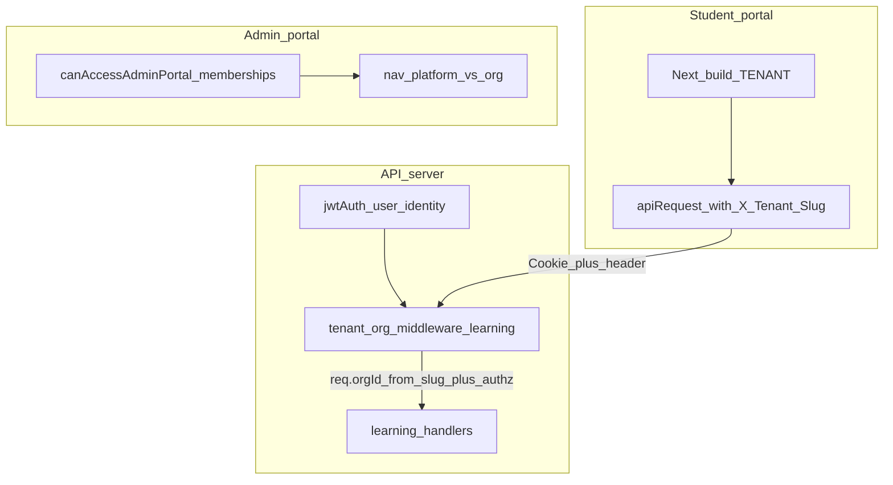

# Implementation Plan: Platform vs Org RBAC and Tenant-Scoped Learning

This document is the **execution blueprint** for work discussed across:

- **Student portal:** RR-branded UI showing SLMTS curriculum because org context for `/api/learning/*` comes from JWT `currentOrgId`, which defaults to SLMTS and can diverge from the tenant build (`NEXT_PUBLIC_TENANT` / `TENANT`).
- **Authority model:** Clarify **platform super admin** (`users.is_super_admin`) vs **org admin** (`user_organizations.roles` includes `admin` for a specific org), align **admin portal admission**, **navigation**, **middleware**, and **ad-hoc route checks** with that model.

Use this plan to split work across agents or PRs. Each **slice** is intended to merge independently where dependencies allow; follow the **slice order** when parallel work would conflict.

---

## Related references (read-only context)

| Topic | Location |
| ----- | -------- |
| Current merged behavior and layers | [implementation-status.md](./implementation-status.md) |
| JWT org defaults and governance | `server/modules/identity-access/storage.ts` (`getJwtSignClaimsForUser`) |
| Org context on requests | `server/shared/middleware/org-context.ts` |
| Role middleware | `server/shared/middleware/auth.ts` (`requireOrgRole`, `requireSuperAdmin`, `requireAdmin`) |
| Student tenant resolution | `apps/student-portal/src/lib/tenant.ts`, `apps/student-portal/src/config/tenants/index.ts` |
| Governance APIs | `server/routes/identity.routes.ts` (`/api/auth/admin/*`, `requireSuperAdmin`) |

---

## 1. Goals

### 1.1 Product goals

1. **Student learning APIs** resolve **which organization’s curriculum** using the **same tenant** the student portal build represents, not only JWT `currentOrgId`, so RR and SLMTS data cannot cross on the wrong skin.
2. **Admin portal admission:** allow access only if the user **`isSuperAdmin`** **or** has **`admin` in at least one organization** with **`active`** membership (membership-wide check, not only `orgRoles` for the JWT’s default org).
3. **Users / governance (platform):** only **`isSuperAdmin`** may use governance APIs and the **Users** UI (approve, reject, disable, enable, patch membership roles, grant/revoke super admin). Org admins must not see or call these surfaces.
4. **Org-scoped admin work:** mutating or reading org-sensitive admin surfaces should require **appropriate membership in `currentOrgId`** (e.g. `admin` for content/settings/batches as today). **Super admin must not implicitly inherit org `admin`/`instructor`** unless you explicitly keep a narrow exception (default recommendation: **no blanket bypass**).

### 1.2 Non-goals (unless later slices add them)

- Replacing `users.is_super_admin` with a role row (flag stays).
- New “support impersonation” or break-glass flows.
- Email notifications for membership approval.

---

## 2. Problem statement (as-built)

### 2.1 Student portal / learning

- Handlers under `server/routes/learning.routes.ts` use `requireOrgContext`, which sets `req.orgId` from **`req.user.currentOrgId`** (`server/shared/middleware/org-context.ts`).
- JWT `currentOrgId` is chosen in `getJwtSignClaimsForUser` with a **preference for active `slmts`** when present.
- Student portal `apiRequest` (`packages/api-client/src/index.ts`) does **not** send `X-Tenant-Slug`; hooks such as `useMyTrackProgress` call `/learning/my-progress` with no tenant header.
- Auto `switchOrg` in `apps/student-portal/src/app/(portal)/layout.tsx` only runs when `getTenantSwitchOrgId` returns an org id (active membership for tenant slug). **Super admins** may bypass pending UI but **not** switch org without an active membership row—JWT can remain SLMTS while UI is RR.

### 2.2 Admin portal / platform vs org

- `requireOrgRole` **bypasses all role checks** when `user.isSuperAdmin` (`server/shared/middleware/auth.ts`), so super admins behave as org admins/instructors for **every** `requireAdmin` / `requireInstructor` route in the current org context.
- Admin portal layout uses `user.isSuperAdmin || user.orgRoles?.includes("admin")` (`AdminLayout.tsx`, `AdminAuthPage.tsx`)—**`orgRoles` reflects only the JWT’s current org**, not “admin anywhere.”
- Navigation config passes a fixed `portalRoles: ['admin']` so **Users** appears for everyone who passed the layout gate; `UserList.tsx` blocks non–super-admins at page level only.

---

## 3. Target behavior (canonical rules)

### 3.1 Definitions

| Term | Meaning |
| ---- | ------- |
| **Platform super admin** | `users.is_super_admin === true`. Cross-org governance and Users module. |
| **Org admin** | `user_organizations.status === 'active'` and `roles` contains `'admin'` for that org. |
| **Tenant slug** | `slmts` \| `rr` (from portal env or header). |
| **Learning org context** | Organization whose **slug** matches the **student portal tenant** for the request, after authorization. |

### 3.2 Admin portal

| Check | Rule |
| ----- | ---- |
| May open admin portal | `isSuperAdmin` **OR** ∃ active membership with `'admin' ∈ roles` |
| Users / governance | `requireSuperAdmin` (already on `/api/auth/admin/*`) + hide nav + client route guard |
| Batches, Content, Audit (org), Settings | Authenticated + **`requireAdmin`** (and after slice 4, **no super-admin bypass** unless explicitly re-added per route) + valid `req.orgId` |

### 3.3 Student portal / learning

| Check | Rule |
| ----- | ---- |
| Org for `/api/learning/*` (and optionally other student-org reads) | Resolve from **`X-Tenant-Slug`** (must match portal tenant), map slug → `orgId`, verify user may access that org (**active membership** for that `orgId`, plus explicit **super-admin policy**—see slice 5). Set `req.orgId` from that resolution **after** `jwtAuth`. |

### 3.4 Super admin access to org data (policy choice — record in PR)

Pick **one** and implement consistently in slice 5 and slice 4:

- **A (recommended):** Super admin **without** active membership in org X **cannot** load or mutate org X data via org-scoped APIs (governance-only until they have membership or use a future impersonation feature).
- **B:** Super admin may access any canonical org by tenant header **without** membership (higher risk; document and audit).

Default this plan to **A** unless product overrides.

---

## 4. Architecture (target data flow)

---

## 5. Slices (execution units)

Each slice lists **primary files**, **acceptance criteria**, and **suggested verification**. Adjust commands to your CI scripts (`package.json`).

---

### Slice 0 — Documentation and contracts freeze (optional, small)

**Objective:** Lock vocabulary and policy (section 3.4) so parallel agents do not diverge.

**Deliverables**

- This file is the source of truth; add a one-line link from [docs/implementation/README.md](../README.md) and [multi-tenancy/README.md](./README.md) “Planned / in-flight work” pointing here.
- If policy B is chosen, amend section 3.4 before coding slice 5.

**Acceptance**

- Links resolve in the repo; no code changes required for slice 0 alone.

---

### Slice 1 — Server: `canAccessAdminPortal` primitive

**Objective:** Single server-side definition of “may use admin portal” = super admin **or** active org admin **anywhere**.

**Steps**

1. Add a pure helper in `server/modules/identity-access/` (e.g. `admin-portal-access.ts`) or methods on `IdentityStorage`:

   `function canAccessAdminPortal(input: { isSuperAdmin: boolean; memberships: MembershipRow[] }): boolean`

   - `true` if `isSuperAdmin`
   - else `memberships.some(m => m.status === 'active' && m.roles.includes('admin'))`

2. **`POST /api/auth/login`** response: include `canAccessAdminPortal: boolean` (compute from `listUserMembershipsWithOrgs` + user row `isSuperAdmin`). Keep existing `user` + `loginState` fields for backward compatibility.

3. **`GET /api/auth/me`**: add the same boolean on the JSON root (or under `user`—pick one shape and use consistently in portals).

4. **Google OAuth callback** (`identity.routes.ts` where `canAccessAdmin` is computed for `/admin` return path): replace `claims.orgRoles?.includes('admin')` with the **membership-based** helper using freshly loaded memberships for `oauthUser.id` (same data source as login).

**Primary files**

- `server/routes/identity.routes.ts`
- `server/modules/identity-access/storage.ts` (or new small module colocated with identity)

**Acceptance**

- Integration or unit tests: user with **admin only on RR**, JWT default org SLMTS as student → `canAccessAdminPortal === true`.
- User with only `student` everywhere and not super admin → `false`.

**Suggested tests**

- Extend `scripts/test/contracts/` or OAuth parity tests if present; smoke `api-smoke-test` admin login section if applicable.

**Depends on:** nothing  
**Blocks:** slice 2

---

### Slice 2 — Admin portal: admission + navigation

**Objective:** Align UI with membership-wide portal access; hide **Users** for non–super-admins.

**Steps**

1. **`AdminAuthPage.tsx`:** After login, compute `canAccess` using **`response.canAccessAdminPortal`** if present, else fallback to computing from `response.loginState.memberships` (and `response.user.isSuperAdmin`) so older APIs still work during rollout.

2. **`AdminLayout.tsx`:** Same rule replacing `user.orgRoles?.includes('admin')` only.

3. **`admin-navigation-config.ts`:** Refactor `getAdminNavigationForRole` to accept something like `{ isSuperAdmin: boolean; hasOrgAdminCapabilities: boolean }` or separate **platform** and **org** nav arrays:

   - **Users** item: only if `isSuperAdmin`
   - **Batches, Content, Audit Logs, Settings:** if `hasOrgAdminCapabilities` (active admin in any org) **or** `isSuperAdmin` **only if** product wants super admins to see org modules without org admin—**default:** require `hasOrgAdminCapabilities` **or** document that super admins always get org nav for UX (product call). Recommended: show org modules if `canAccessAdminPortal && (hasOrgAdminAnywhere || isSuperAdmin)` where for **strict** model, `isSuperAdmin` without any org admin membership might only see **Users**—confirm with product; if awkward, seed/dev super admins keep dual role.

4. **Deep links:** `/admin/users` direct URL for org-only admin should redirect to **unauthorized** or **admin home** with toast (optional polish).

**Primary files**

- `apps/admin-portal/src/components/auth/AdminAuthPage.tsx`
- `apps/admin-portal/src/components/layout/AdminLayout.tsx`
- `apps/admin-portal/src/lib/admin-navigation-config.ts`
- Optionally `apps/admin-portal/src/app/admin/users/page.tsx` (redirect wrapper)

**Acceptance**

- Org admin without super admin: **no** Users nav item; cannot use governance hooks successfully (403 already from API).
- Super admin with no admin membership: behavior per policy in 3.4 (either only Users, or Users + org modules—**document choice**).

**Depends on:** slice 1 (preferred for single source of truth); can prototype with client-only membership scan before slice 1 lands.

**Blocks:** none for student slices

---

### Slice 3 — Admin portal: client role guards vs JWT `orgRoles`

**Objective:** `useRoleGuard` and content page gates should not rely solely on JWT `orgRoles` when the question is “admin **in current org**.”

**Steps**

1. **`useRoleGuard.ts`:** For `requiredRoles` including `admin`, require:

   `user.isSuperAdmin && <productAllows>` **OR** membership row for `user.currentOrgId` with active + `admin` in roles

   Prefer reading `user.memberships` from `useAuth` (ensure `/auth/me` includes memberships—already does).

2. **`admin/content/page.tsx`** (and similar): same pattern for the “can edit content” gate.

**Primary files**

- `apps/admin-portal/src/hooks/useRoleGuard.ts`
- `apps/admin-portal/src/app/admin/content/page.tsx`

**Acceptance**

- User with admin on RR, JWT org SLMTS: after switch org to RR, content guard passes; before switch, fails (unless super admin per policy).

**Depends on:** slice 2 optional (nav); logically pairs with org switcher UX

---

### Slice 4 — Server: `requireOrgRole` super-admin bypass removal (strict org actions)

**Objective:** Super admin is **not** implicitly org admin/instructor for org-scoped mutation routes.

**Steps**

1. **Introduce** `requireOrgRoleStrict(...roles)` in `server/shared/middleware/auth.ts` — same as `requireOrgRole` but **without** the `if (user.isSuperAdmin) return next()` branch.

2. **Migrate** write/mutate routes that should be org-admin-only:

   - `server/routes/content.routes.ts` — all `requireAdmin` usages on POST/PUT/PATCH/DELETE
   - `server/routes/media.routes.ts`
   - `server/routes/batch.routes.ts` — routes using `requireAdmin` for mutations; **evaluate reads** separately

3. **Replace** `requireAdmin` import with `requireOrgRoleStrict('admin')` **or** redefine `requireAdmin` to strict and add `requireAdminAllowSuperAdmin` for the rare routes that still need bypass (prefer explicit second name).

4. **Ad-hoc checks** in `batch.routes.ts` (`user.isSuperAdmin` alongside instructor/admin for progress/evaluate): remove super-admin shortcut **or** replace with “super admin + active membership in org with instructor/admin” per policy 3.4.

5. **`requireOrgRole`:** Either delete bypass entirely, or keep **only** for a documented allowlist (discouraged).

**Primary files**

- `server/shared/middleware/auth.ts`
- `server/routes/content.routes.ts`
- `server/routes/media.routes.ts`
- `server/routes/batch.routes.ts`
- `server/routes/admin.routes.ts` — `requireAdmin` on directory/settings/audit: migrate to strict unless audit intentionally allows super-admin read without org admin (then split handlers).

**Acceptance**

- Automated tests: org admin passes; super admin **without** org `admin` on current org gets **403** on `POST /api/content/tracks` (example).
- Regression: org admin still 200.

**Suggested tests**

- New contract file under `scripts/test/contracts/`
- Update `require-org-role-alias` tests if export surface changes

**Depends on:** none technically; **product risk** if live operators rely on bypass—coordinate rollout.

**Blocks:** none for slice 5

---

### Slice 5 — Server + student portal: tenant-scoped learning org context

**Objective:** Fix RR UI showing SLMTS tracks by binding `req.orgId` for learning routes from **tenant slug** + authorization, not from JWT default alone.

**Steps**

1. **Middleware** (new file recommended): e.g. `server/shared/middleware/tenant-learning-org-context.ts`

   - Run **after** `jwtAuth` on `learningRouter` only (or `router.use` inside `learning.routes.ts` before handlers).
   - Read `X-Tenant-Slug` header; normalize with same allowlist as `server/modules/identity-access/tenant-context.ts` (`ALLOWED_TENANT_SLUGS`).
   - If missing or invalid → **403** with clear JSON message (forces client to always send header from student portal).
   - Resolve slug → `orgId` via `identityStorage.getOrganizationBySlug` or existing query.
   - **Authorize:** user has **active** membership for that `orgId` **OR** policy 3.4B for super admin (if product selects B).
   - Set `req.orgId` to resolved org id for downstream handlers.

2. **Order of middleware** on `learning.routes.ts`:

   - `jwtAuth` → **new tenant org resolver** → `requireOrgContext` (which should now see `req.orgId` set—**today** `attachOrgContext` sets from JWT; you must **either** set `req.orgId` in new middleware **instead of** `attachOrgContext` for this router, or **extend** `attachOrgContext` to prefer header when present—pick one pattern to avoid double sources).

   **Recommended:** For `learningRouter` only, **skip** `attachOrgContext` / replace with a learning-specific chain that sets `req.orgId` from tenant resolution only, and still attach `req.user` from JWT.

3. **Student portal client:** `apps/student-portal/src/lib/api.ts` — wrap `apiRequest` to merge header:

   `'X-Tenant-Slug': getCurrentTenantSlug()`

4. **Other student calls:** Any hook under `apps/student-portal` that calls org-sensitive learning endpoints must go through the wrapped client (or pass header per call).

5. **Layout auto-switch:** Keep as UX optimization; should become less critical once APIs are correct.

**Primary files**

- `server/routes/learning.routes.ts`
- New middleware under `server/shared/middleware/`
- `apps/student-portal/src/lib/api.ts`
- Possibly `server/modules/identity-access/tenant-context.ts` (shared slug parse helper)

**Acceptance**

- `scripts/test/smoke/rr-isolation-smoke.test.ts` extended: same cookie, `X-Tenant-Slug: rr` vs `slmts` returns correct track sets (mirror existing content isolation tests).
- Manual: RR portal shows RR org tracks (or empty if no RR curriculum), never SLMTS IDs.

**Depends on:** slice 4 **not** required; can parallelize with slice 2–4 if file conflicts avoided

**Blocks:** none

---

### Slice 6 — Tests, verification, and documentation updates

**Objective:** Lock behavior and update handoff docs.

**Steps**

1. **Contract tests**

   - Admin portal access boolean (slice 1).
   - Strict `requireOrgRole` (slice 4).
   - Learning tenant header (slice 5).

2. **Smoke**

   - Extend RR isolation smoke for `/api/learning/my-progress` with tenant headers.
   - Re-run `api-smoke-test` auth sections if touched.

3. **Docs**

   - Update [implementation-status.md](./implementation-status.md) with new slices and “merged” checkboxes when done.
   - Short entry in [architecture-decisions.md](./architecture-decisions.md): tenant header for learning; super-admin bypass removal rationale (ADR-style).

**Acceptance**

- CI green; docs reflect new behavior.

**Depends on:** slices 1–5 as applicable

---

## 6. Dependency matrix

| Slice | Depends on | Parallelizable with |
| ----- | ----------- | --------------------- |
| 0 | — | all |
| 1 | 0 optional | 4, 5 (different files—watch `identity.routes.ts` if 1 and 5 both touch) |
| 2 | 1 preferred | 4, 5 if 2 uses client-only fallback first |
| 3 | 2 soft | 4, 5 |
| 4 | — | 1, 2, 3, 5 (merge conflicts possible in `auth.ts` + routes—coordinate) |
| 5 | — | 1–4 with care (`identity.routes` overlap) |
| 6 | 1–5 | — |

**Merge conflict hotspots:** `server/routes/identity.routes.ts` (slices 1 and possibly 5 if login changes), `server/shared/middleware/auth.ts` (slice 4), `apps/student-portal/src/lib/api.ts` (slice 5).

---

## 7. Risk register

| Risk | Mitigation |
| ---- | ---------- |
| Super admins locked out of org tooling after slice 4 | Ensure dev seeds keep **active admin** membership where needed; document operational requirement |
| Breaking mobile/other clients calling learning API without header | Student-only contract; document breaking change; version API if needed |
| Duplicate org resolution logic drifting from `tenant-context.ts` | Extract shared `normalizeTenantSlug` / `parseXTenantSlug` helper |
| Google OAuth admin return still wrong | Slice 1 must update callback path |

---

## 8. Suggested agent assignment (example)

| Agent | Slices |
| ----- | ------ |
| A | 1 + 6 (tests for 1) |
| B | 2 + 3 |
| C | 4 |
| D | 5 + 6 (tests for 5) |
| E | 0 + doc updates in 6 |

Serialize **C** and **D** if both touch `jwtAuth` pipeline heavily; otherwise merge behind feature flags.

---

## 9. Completion checklist (repo-wide)

- [ ] `canAccessAdminPortal` on login + `/auth/me`; OAuth admin redirect uses membership scan
- [ ] Admin portal nav hides Users for non–super-admin
- [ ] AdminLayout / AdminAuthPage use `canAccessAdminPortal` or membership scan
- [ ] `useRoleGuard` / content gates use current org membership where appropriate
- [ ] `requireOrgRoleStrict` (or equivalent) on org mutation routes; ad-hoc super-admin shortcuts removed or justified
- [ ] Learning routes resolve `req.orgId` from `X-Tenant-Slug` + authz; student `apiRequest` sends header
- [ ] Tests and `implementation-status.md` updated

---

_End of plan._
