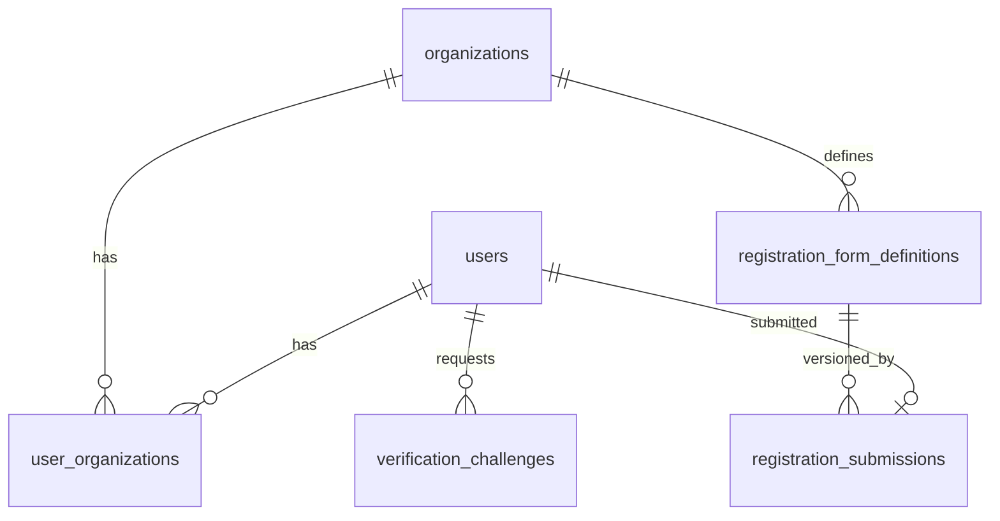

# Feature Spec: Authentication & Registration

**Document ID:** `user-onboarding/01`  
**Primary owner:** Registration & authentication agent  
**Product source:** [user-onboarding-feature-memo.md](../../product/user-onboarding-feature-memo.md) §6, §9.3, §10  
**Related specs:** [02-proxy](./02-proxy-registration-and-impersonation.md), [03-enrollment](./03-enrollment-features.md), [04-enablers](./04-onboarding-enablers.md)

---

## 1. Purpose

Deliver org-aware student registration with a required intake questionnaire, email and phone capture with verification, super-admin vetting (`pending` → `active` | `rejected`), and login that accepts **email or phone**. Google OAuth must follow the same intake and vetting path as local registration.

This feature replaces external Google Forms for new-student intake and establishes the **membership gate** that blocks enrollment workflow and full student learning until approval.

---

## 2. Product Context

Pathasalas run seasonal onboarding (~3×/year). Today, prospective students complete a **Google Form**; admins manually vet (calls, references) and approve outside the LMS. NaradaLMS already creates accounts with **pending** org membership and super-admin approval, but:

- Sign-up is **email/password only** (no phone, no intake form in-app).
- **Google OAuth** lands in pending membership without intake parity.
- **Login** is email-only.
- **Rejection** does not send email.
- Approval unlocks broad student portal access (enrollment gate is a separate spec).

This spec implements **Feature A** from the memo: intake in-app, verification, OAuth parity, reject email, login identifier expansion, and strict access for `pending` / `rejected`.

---

## 3. Current State

### 3.1 What exists

| Area                       | As-built                                                                                                                                    |
| -------------------------- | ------------------------------------------------------------------------------------------------------------------------------------------- |
| **Registration API**       | `POST /api/auth/register` — email, password, optional first/last name, `tenantSlug` (`slmts` | `rr`)                                        |
| **Membership on register** | Normal users → `user_organizations.status = pending`, `roles = ['student']` for resolved tenant                                             |
| **Bootstrap**              | Email matching `SUPER_ADMIN_EMAIL` → active SLMTS membership with `student` + `admin`                                                       |
| **Login**                  | `POST /api/auth/login` — Passport local, **email only**                                                                                     |
| **OAuth**                  | `GET /api/auth/google`, callback → JWT cookie; `resolveOAuthLogin` creates/links user + `requestMembership` (pending unless already active) |
| **Governance**             | Super-admin: `POST .../memberships/:id/approve`, `reject`, `disable`, `enable`; `PATCH .../roles`                                           |
| **Events**                 | `MembershipApproved`, `MembershipRejected` → audit log (no email)                                                                           |
| **Student UI**             | `StudentAuthPage` — login/register tabs; Google button with tenant state                                                                    |
| **Pending UX**             | `(portal)/pending-approval` when tenant membership ≠ `active`                                                                               |
| **Schema**                 | `users` (email unique, no phone); `user_organizations` with `pending` | `active` | `inactive` | `rejected`                                  |

### 3.2 Key files

| Layer           | Path                                                          |
| --------------- | ------------------------------------------------------------- |
| Routes          | `server/routes/identity.routes.ts`                            |
| Service         | `server/modules/identity-access/service.ts`                   |
| Storage         | `server/modules/identity-access/storage.ts`                   |
| Passport        | `server/auth/passport-config.ts`                              |
| JWT             | `server/auth/jwt.utils.ts`                                    |
| Schema          | `packages/types/src/schema.ts`                                |
| Student auth UI | `apps/student-portal/src/components/auth/StudentAuthPage.tsx` |
| Tenant helpers  | `apps/student-portal/src/lib/tenant.ts`                       |
| Admin users     | `apps/admin-portal/src/app/admin/users/page.tsx`              |

### 3.3 Gaps vs product

- No `phone` on `users`
- No verification tokens / OTP flow
- No registration form schema or stored responses
- OAuth does not require intake form before `pending` submission
- Login does not accept phone
- Reject does not trigger transactional email
- Vetting UI does not surface intake responses or proxy context (`managed-by`)

---

## 4. Future State

### 4.1 Registration (local)

1. User opens tenant student portal (`slmts` or `rr` build).
2. **Register** tab collects: email, password, phone (with country code), required **registration form** (org-specific fields), and verification step.
3. **At least one** of email or phone is verified (OTP) before submit is enabled.
4. On submit:
  - Create `users` row (local provider).
  - Create `user_organizations` for tenant org: `status = pending`, `roles = ['student']`.
  - Persist `registration_submissions` (form responses JSON + org + user).
  - Optional: record `registered_by_user_id` when submitted via proxy flow (see doc 02).
5. User sees confirmation; cannot access enrollment or student learning modules.

### 4.2 Google OAuth registration

1. User starts Google sign-in from tenant portal.
2. After OAuth identity is established:
  - If no completed intake for this org → show **same registration form** (phone + fields + verification).
  - On form submit → `pending` membership (same as local).
3. Existing Google user requesting second org → `request-membership` + intake if not already submitted for that org.

### 4.3 Super-admin vetting

- Super-admin reviews queue: form responses, email, phone, org, **managed-by** list (from doc 02).
- **Approve** → `active` membership; user may log in.
- **Reject** → `rejected` membership; **transactional email** sent (enabler doc 04).

### 4.4 Login

- Username field: **email OR phone** (normalized).
- Password unchanged for local accounts.
- Post-auth checks:
  - `rejected` → no portal access; show rejection message (email reference).
  - `pending` → pending-approval experience only.
  - `active` → portal per enrollment gate (doc 03) — default student landing becomes **Enrollment** when no active batch enrollment.

### 4.5 Role model

- Every approved member has `**student`** on membership (default).
- `instructor`, `admin` are **additive** via super-admin role patch (existing API).

---

## 5. User Stories

### Prospective student

| ID     | Story                                                                                                                                                                            |
| ------ | -------------------------------------------------------------------------------------------------------------------------------------------------------------------------------- |
| REG-01 | As a **prospective student**, I want to register on my pathasala’s portal with email, password, phone, and the org intake form, so that my application is recorded in one place. |
| REG-02 | As a **prospective student**, I want to verify my email or phone before submitting, so that admins can trust my contact details.                                                 |
| REG-03 | As a **prospective student**, I want to sign in with Google and complete the same intake form, so that I am not treated differently from password users.                         |
| REG-04 | As a **prospective student** with **pending** membership, I want a clear waiting state after login, so that I know vetting is in progress.                                       |
| REG-05 | As a **rejected** applicant, I want to be told my application was not approved (via email and on login), so that I do not keep retrying the portal.                              |

### Approved student

| ID     | Story                                                                                                                                |
| ------ | ------------------------------------------------------------------------------------------------------------------------------------ |
| REG-06 | As an **approved student**, I want to log in with email **or** phone, so that I can use the identifier I remember.                   |
| REG-07 | As an **approved student** without batch placement, I want to land on the Enrollment experience (doc 03), not full learning modules. |

### Super-admin

| ID     | Story                                                                                                                                 |
| ------ | ------------------------------------------------------------------------------------------------------------------------------------- |
| REG-08 | As a **super-admin**, I want to see pending registrations with full intake responses, so that I can vet offline and decide in-system. |
| REG-09 | As a **super-admin**, I want to approve or reject membership, so that only vetted users enter org workflows.                          |
| REG-10 | As a **super-admin**, I want rejection to email the applicant automatically, so that communication is consistent.                     |

### Org-admin / Instructor

| ID     | Story                                                                                                                               |
| ------ | ----------------------------------------------------------------------------------------------------------------------------------- |
| REG-11 | As an **org-admin**, I must **not** approve registrations (super-admin only), so that vetting stays centralized per product policy. |

---

## 6. Implementation Slices

### Slice A1 — Schema: phone, verification, registration submissions

| Field                   | Detail                                                       |
| ----------------------- | ------------------------------------------------------------ |
| **Goal**                | Persist phone, verification state, and intake responses.     |
| **Backend**             | Drizzle tables + Zod in `@narada/types`.                     |
| **Frontend**            | None (migration only).                                       |
| **Database**            | See §7.                                                      |
| **Permissions**         | N/A                                                          |
| **Validation**          | Phone E.164 normalization; email format; unique constraints. |
| **Acceptance criteria** | Migrations apply cleanly; types exported; seed unaffected.   |
| **Dependencies**        | None                                                         |
| **Risks**               | Backfill nullable phone for existing users.                  |

**Backend work:** Add columns/tables in `packages/types/src/schema.ts`; generate migration.

---

### Slice A2 — Verification API (OTP)

| Field                   | Detail                                                                                          |
| ----------------------- | ----------------------------------------------------------------------------------------------- |
| **Goal**                | Send and confirm OTP for email and/or phone before registration submit.                         |
| **Backend**             | `POST /api/auth/verification/send`, `POST /api/auth/verification/confirm` (see enabler doc 04). |
| **Frontend**            | Verification UI component on register form.                                                     |
| **Database**            | `verification_challenges`                                                                       |
| **Permissions**         | Public (rate-limited)                                                                           |
| **Validation**          | Cooldown between sends; max attempts; expiry (e.g. 10 min).                                     |
| **Acceptance criteria** | Confirm returns `verificationToken` usable once on register; at least one channel verified.     |
| **Dependencies**        | A1, enabler E1                                                                                  |
| **Risks**               | SMS cost / deliverability — implementation assumption                                           |

---

### Slice A3 — Registration form schema (org-specific)

| Field                   | Detail                                                                                                     |
| ----------------------- | ---------------------------------------------------------------------------------------------------------- |
| **Goal**                | Serve org-specific field definitions; validate responses server-side.                                      |
| **Backend**             | `GET /api/auth/registration-form?tenantSlug=` returns JSON schema; register body includes `formResponses`. |
| **Frontend**            | Dynamic form renderer from schema (enabler E3).                                                            |
| **Database**            | `registration_form_definitions` (org_id, version, schema jsonb)                                            |
| **Permissions**         | Public read for schema; responses written on register                                                      |
| **Validation**          | Zod generated from stored schema; required fields per org                                                  |
| **Acceptance criteria** | SLMTS and RR definitions load; invalid payload returns 400 with field errors                               |
| **Dependencies**        | A1, enabler E3                                                                                             |
| **Risks**               | Field list TBD from PDFs — use placeholder schema until stakeholder sign-off                               |

---

### Slice A4 — Extend `POST /api/auth/register`

| Field                   | Detail                                                                                            |
| ----------------------- | ------------------------------------------------------------------------------------------------- |
| **Goal**                | Full registration payload with verification + form + pending membership.                          |
| **Backend**             | Extend `IdentityService.registerUser`; store submission; consume verification token.              |
| **Frontend**            | Update `StudentAuthPage` register tab                                                             |
| **Database**            | Insert `registration_submissions`                                                                 |
| **Permissions**         | Public, rate-limited                                                                              |
| **Validation**          | Email unique; phone unique (if provided); password min 8; verification token valid; form complete |
| **Acceptance criteria** | Contract test: register → pending membership + stored responses; duplicate email 409              |
| **Dependencies**        | A1–A3                                                                                             |
| **Notes**               | Keep `SUPER_ADMIN_EMAIL` bootstrap behavior                                                       |

---

### Slice A5 — Login with email or phone

| Field                   | Detail                                                                                              |
| ----------------------- | --------------------------------------------------------------------------------------------------- |
| **Goal**                | `identifier` field accepts email or E.164 phone.                                                    |
| **Backend**             | `authenticateLocal(identifier, password)` resolves user by email OR phone; update Passport strategy |
| **Frontend**            | Login label “Email or phone”; input type `text`                                                     |
| **Validation**          | Normalize identifier before lookup                                                                  |
| **Acceptance criteria** | User with only phone on file can log in; wrong password 401                                         |
| **Dependencies**        | A1                                                                                                  |
| **Risks**               | Ambiguous identifiers — prefer email match first, then phone                                        |

---

### Slice A6 — OAuth + intake parity

| Field                   | Detail                                                                                                                           |
| ----------------------- | -------------------------------------------------------------------------------------------------------------------------------- |
| **Goal**                | Google users cannot get `pending` membership without completed intake for tenant.                                                |
| **Backend**             | Callback issues limited session OR redirects to `/register/complete` with OAuth cookie; `POST /api/auth/register/oauth-complete` |
| **Frontend**            | Post-OAuth intake page (reuse form from A3)                                                                                      |
| **Validation**          | Same as A4 minus password                                                                                                        |
| **Acceptance criteria** | `oauth-membership-parity` contract extended; new user → pending only after form submit                                           |
| **Dependencies**        | A3, A4                                                                                                                           |
| **Risks**               | Multi-step UX — draft submission in DB if user abandons mid-flow                                                                 |

---

### Slice A7 — Rejection email

| Field                   | Detail                                                                      |
| ----------------------- | --------------------------------------------------------------------------- |
| **Goal**                | On reject, send email to user.                                              |
| **Backend**             | Subscribe handler on `MembershipRejected` (or call from `rejectMembership`) |
| **Frontend**            | None                                                                        |
| **Dependencies**        | Enabler E2                                                                  |
| **Acceptance criteria** | Reject in admin → email sent (dev: log sink); audit still written           |
| **Notes**               | Approve email optional / out of scope v1                                    |

---

### Slice A8 — Super-admin vetting UI (intake-aware)

| Field                   | Detail                                                                                  |
| ----------------------- | --------------------------------------------------------------------------------------- |
| **Goal**                | Pending queue shows intake JSON, phone, managed-by context.                             |
| **Backend**             | Extend `GET /api/auth/admin/users` or `GET .../users/:id` with `registrationSubmission` |
| **Frontend**            | Admin users page: expandable intake viewer; approve/reject actions (existing)           |
| **Permissions**         | `requireSuperAdmin`                                                                     |
| **Acceptance criteria** | Super-admin sees responses for pending user; org-admin cannot access route              |
| **Dependencies**        | A4                                                                                      |
| **Integration**         | Displays `managedBy` from doc 02 when present                                           |

---

### Slice A9 — Pending / rejected portal UX

| Field                   | Detail                                                                                           |
| ----------------------- | ------------------------------------------------------------------------------------------------ |
| **Goal**                | Hard block enrollment and learning for non-active membership.                                    |
| **Backend**             | Ensure APIs return 403 for enrollment endpoints when membership not active (doc 03 adds routes)  |
| **Frontend**            | Enhance `pending-approval`; add `rejected` route or state on auth                                |
| **Acceptance criteria** | Pending user cannot call enrollment preference APIs; rejected user redirected from portal layout |
| **Dependencies**        | A4, portal gate enabler E4 (partial)                                                             |

---

## 7. Data Model / Schema Impact

### 7.1 `users` (alter)

| Column               | Type                                                            | Notes                                       |
| -------------------- | --------------------------------------------------------------- | ------------------------------------------- |
| `phone`              | `varchar`, nullable → eventually required for new registrations | E.164 normalized; **unique** where not null |
| `phone_country_code` | `varchar(8)` optional                                           | If stored separately from E.164             |
| `email_verified_at`  | `timestamptz` nullable                                          | Set when email OTP confirmed                |
| `phone_verified_at`  | `timestamptz` nullable                                          | Set when phone OTP confirmed                |

**Implementation assumption:** Existing users keep `phone` null until profile update.

### 7.2 `registration_form_definitions` (new)

| Column                     | Type                                      |
| -------------------------- | ----------------------------------------- |
| `id`                       | uuid PK                                   |
| `org_id`                   | uuid FK → organizations                   |
| `version`                  | integer                                   |
| `schema`                   | jsonb (JSON Schema or internal field DSL) |
| `is_active`                | boolean                                   |
| `created_at`, `updated_at` | timestamptz                               |

Unique: `(org_id, version)`; one `is_active` per org (partial unique index).

### 7.3 `registration_submissions` (new)

| Column                  | Type                        |
| ----------------------- | --------------------------- |
| `id`                    | uuid PK                     |
| `user_id`               | varchar FK → users          |
| `org_id`                | uuid FK                     |
| `form_definition_id`    | uuid FK                     |
| `responses`             | jsonb                       |
| `submitted_at`          | timestamptz                 |
| `registered_by_user_id` | varchar FK nullable (proxy) |
| `verification_snapshot` | jsonb optional              |

Unique: one submission per `(user_id, org_id)` for v1.

### 7.4 `verification_challenges` (new)

| Column          | Type                                |
| --------------- | ----------------------------------- |
| `id`            | uuid PK                             |
| `channel`       | `email` | `phone`                   |
| `target`        | varchar (normalized email or E.164) |
| `code_hash`     | varchar                             |
| `expires_at`    | timestamptz                         |
| `consumed_at`   | timestamptz nullable                |
| `attempt_count` | integer                             |
| `created_at`    | timestamptz                         |

### 7.5 `user_organizations` (no enum change)

Continue: `pending` | `active` | `inactive` | `rejected`.

---

## 8. API / Service Layer

Align with `identity.routes.ts` patterns: Zod `validateRequest`, `authLimiter`, `catchAsync`.

| Method | Path                                      | Auth                  | Purpose                                                    |
| ------ | ----------------------------------------- | --------------------- | ---------------------------------------------------------- |
| `GET`  | `/api/auth/registration-form`             | Public                | Active form schema for tenant                              |
| `POST` | `/api/auth/verification/send`             | Public                | Start OTP                                                  |
| `POST` | `/api/auth/verification/confirm`          | Public                | Verify OTP → short-lived token                             |
| `POST` | `/api/auth/register`                      | Public                | **Extended** body: phone, formResponses, verificationToken |
| `POST` | `/api/auth/register/oauth-complete`       | JWT partial / session | Complete intake after Google                               |
| `POST` | `/api/auth/login`                         | Public                | Body: `identifier`, `password` (rename from email)         |
| `GET`  | `/api/auth/google`                        | Public                | Unchanged entry                                            |
| `GET`  | `/api/auth/google/callback`               | Public                | Redirect to intake if needed                               |
| `GET`  | `/api/auth/me`                            | jwtAuth               | Include phone, verification flags                          |
| `POST` | `/api/auth/admin/memberships/:id/approve` | super-admin           | Existing                                                   |
| `POST` | `/api/auth/admin/memberships/:id/reject`  | super-admin           | Existing + triggers email                                  |
| `GET`  | `/api/auth/admin/users`                   | super-admin           | **Extended** with submission summary                       |
| `GET`  | `/api/auth/admin/users/:userId`           | super-admin           | Full submission + memberships                              |

**Service additions** (`IdentityService` or `RegistrationService`):

- `sendVerificationChallenge(channel, target)`
- `confirmVerificationChallenge(id, code)`
- `registerUserWithIntake(payload)`
- `completeOAuthRegistration(userId, orgId, payload)`
- `resolveUserByLoginIdentifier(identifier)`

---

## 9. UI / UX Requirements

### Student portal — Register

| Element      | Requirement                                                                       |
| ------------ | --------------------------------------------------------------------------------- |
| Fields       | Email, password, phone (country + number), dynamic intake form                    |
| Verification | Step or inline: “Verify email” / “Verify phone”; disable Submit until ≥1 verified |
| Submit       | Clear copy: account created, **pending approval**                                 |
| Errors       | Inline field errors from API; rate-limit message on OTP                           |
| Tenant       | Branding from `getTenantConfig()`; `X-Tenant-Slug` on API calls                   |

### Student portal — Login

| Element    | Requirement                                                          |
| ---------- | -------------------------------------------------------------------- |
| Identifier | Label “Email or phone number”                                        |
| OAuth      | Google button unchanged; handle redirect to complete intake          |
| Rejected   | If membership `rejected`, show message + support contact (no portal) |

### Student portal — Pending

| Element | Requirement                                    |
| ------- | ---------------------------------------------- |
| Page    | `/pending-approval` — explain vetting timeline |
| Nav     | No learning links; no enrollment actions       |

### Admin portal — Users (super-admin)

| Element        | Requirement                                          |
| -------------- | ---------------------------------------------------- |
| Pending filter | Default or tab for `pending`                         |
| Detail         | Read-only intake responses (formatted); phone; email |
| Actions        | Approve / Reject (existing buttons)                  |
| Proxy context  | Section “Registered by” / “Managed by” (from doc 02) |

---

## 10. Permissions & Access Control

| Action                        | Prospective | Pending        | Active student         | Org-admin | Super-admin |
| ----------------------------- | ----------- | -------------- | ---------------------- | --------- | ----------- |
| View registration form schema | ✓           | —              | —                      | —         | ✓           |
| Submit registration           | ✓           | —              | —                      | —         | —           |
| Send OTP                      | ✓           | —              | —                      | —         | —           |
| Login                         | —           | ✓ (pending UX) | ✓                      | ✓         | ✓           |
| Access enrollment workflow    | —           | ✗              | ✓ (doc 03)             | —         | ✓           |
| Approve/reject membership     | —           | ✗              | ✗                      | ✗         | ✓           |
| View intake responses         | —           | ✗              | Own only (optional v1) | ✗         | ✓           |

**Server enforcement:** All governance routes keep `requireSuperAdmin`. Registration routes public with rate limits.

---

## 11. Validation & Business Rules

| Rule                                                | Type                          | Notes                                                 |
| --------------------------------------------------- | ----------------------------- | ----------------------------------------------------- |
| All required form fields present                    | Blocking                      | Per org schema                                        |
| At least one of email/phone verified at submit      | Blocking                      |                                                       |
| Email unique globally                               | Blocking                      | Existing                                              |
| Phone unique globally (when set)                    | Blocking                      |                                                       |
| Password ≥ 8 characters                             | Blocking                      | Existing                                              |
| Tenant org must exist and be active                 | Blocking                      |                                                       |
| Cannot register if active membership exists for org | Blocking                      | Return clear error                                    |
| Rejected membership re-register                     | **Implementation assumption** | v1: block re-register same org; super-admin may reset |
| Pending user cannot access enrollment APIs          | Blocking                      | 403                                                   |
| Rejected user cannot access portal                  | Blocking                      |                                                       |
| Every new membership defaults `roles: ['student']`  | Invariant                     |                                                       |
| Super-admin bootstrap email                         | Exception                     | Active SLMTS admin membership                         |

---

## 12. Edge Cases

| Scenario                                                        | Expected behavior                                                                                                                         |
| --------------------------------------------------------------- | ----------------------------------------------------------------------------------------------------------------------------------------- |
| User verifies phone, submits with different email than verified | **Assumption:** verification token binds to specific channel targets; mismatch → 400                                                      |
| Google account email matches existing local user                | Link provider or prompt to log in with password — follow existing OAuth linking                                                           |
| User completes OAuth but abandons intake                        | No `pending` membership until submit; limited session expires                                                                             |
| User has active membership in org A, registers in org B         | `request-membership` + intake for B only                                                                                                  |
| Duplicate phone across family members                           | **Product:** phone is student contact; ops may share — **assumption:** unique phone per user account (document conflict for stakeholders) |
| Super-admin rejects after approve                               | Use `disable` flow (existing), not reject                                                                                                 |
| User logs in with phone before approval                         | Pending UX same as email                                                                                                                  |

---

## 13. Integration Points

| Partner spec      | Integration                                                                                                           |
| ----------------- | --------------------------------------------------------------------------------------------------------------------- |
| **02 Proxy**      | `registered_by_user_id` on submission; vetting UI shows managed-by; Register another user calls same register service |
| **03 Enrollment** | Only `active` membership may access enrollment-period APIs and student Enrollment page                                |
| **04 Enablers**   | OTP service (E1), rejection email (E2), form renderer (E3), portal access resolver (E4) for post-approval landing     |
| **Multi-tenancy** | Reuse `resolveTenantSlugForRequest`, `X-Tenant-Slug`, `user_organizations` per org                                    |

---

## 14. Acceptance Criteria

### REG-01 – REG-03 (Registration)

- SLMTS and RR tenants show distinct required fields from API schema.
- Submit without verification → 400.
- Submit with valid verification + form → `pending` membership + row in `registration_submissions`.
- Google new user → intake screen → same outcome as local.

### REG-04 – REG-05 (States)

- Pending login → `/pending-approval`; no batch/enrollment API success.
- Reject → membership `rejected`; email received; login shows rejection state.

### REG-06 – REG-07 (Approved)

- Login works with email and with phone.
- Approved user without batch → Enrollment landing (doc 03), not `/my-learning` full modules.

### REG-08 – REG-10 (Super-admin)

- Pending list shows intake summary.
- Approve → `active`; user can log in.
- Reject → audit + email.

### Contract tests (extend existing)

- `passport-local-membership-auth.test.ts` — identifier login
- `oauth-membership-parity.test.ts` — intake required
- New: `registration-intake.test.ts`

---

## 15. Open Questions / Implementation Assumptions

| Item                                         | Type       | Notes                                                         |
| -------------------------------------------- | ---------- | ------------------------------------------------------------- |
| SLMTS / RR field lists from PDFs             | Open       | Seed v1 with minimal placeholder schema; expand before launch |
| SMS provider for phone OTP                   | Assumption | Twilio or similar via env config                              |
| Re-register after reject                     | Assumption | Block without super-admin reset                               |
| Phone uniqueness                             | Assumption | One account per phone globally                                |
| Approve notification email                   | Assumption | Out of scope v1 (reject only per memo)                        |
| `inactive` vs `rejected` for former students | Open       | Use existing `inactive` for ops disable                       |

---

**End of document**