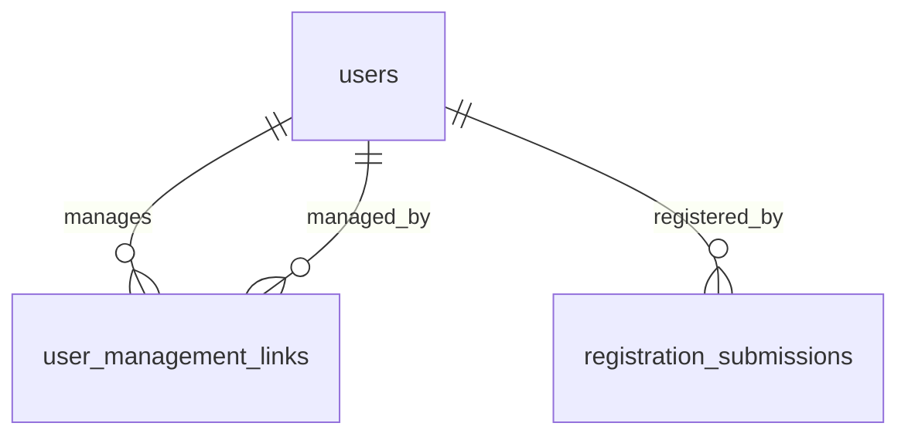

# Feature Spec: Proxy Registration & Impersonation

**Document ID:** `user-onboarding/02`  
**Primary owner:** Proxy & impersonation agent  
**Product source:** [user-onboarding-feature-memo.md](../../product/user-onboarding-feature-memo.md) §7, §10, §11.2  
**Related specs:** [01-auth](./01-authentication-and-registration.md), [03-enrollment](./03-enrollment-features.md), [04-enablers](./04-onboarding-enablers.md)

---

## 1. Purpose

Enable any **active** org member to register another person (proxy registration), model directional **manages / managed-by** relationships, and allow managers (and super-admins) to **Login as** managed users to complete enrollment actions on their behalf—with clear acting-as UX and audit trails.

Proxy-created accounts still follow **pending → super-admin approval** before the manager may impersonate.

---

## 2. Product Context

Families and helpers often complete forms and portal steps for others. The product rejects a rigid parent–child entity in favor of explicit, directional, many-to-many links:

- **A manages B** → A may register B and Login as B.
- **B managed-by A** → inverse list on B’s profile.
- Not symmetric; no automatic reverse link; no cap on managed accounts.
- Super-admin maintains links from user management.

Example journey: parent approved → registers father and child → after each is approved, **Login as** each during **batch-enrollment** to submit 1st/2nd choices.

---

## 3. Current State

| Area | As-built |
|------|----------|
| **Proxy relationships** | **Not implemented** — no `manages` table |
| **Register another user** | **Not implemented** |
| **Login as** | **Not implemented** |
| **Registration** | Self-service only via `POST /api/auth/register` |
| **User admin** | Super-admin `GET /api/auth/admin/users`, membership governance |
| **Audit** | `MembershipApproved/Rejected` logged; no impersonation events |
| **Student nav** | No Register another user / Login as entries |

**Key files today:**

- `server/modules/identity-access/service.ts` — registration
- `server/routes/identity.routes.ts` — auth routes
- `apps/admin-portal/src/app/admin/users/page.tsx` — user list
- `apps/student-portal/src/app/(portal)/layout.tsx` — portal shell

---

## 4. Future State

### 4.1 Relationship model

- Table `user_management_links`: `manager_user_id`, `managed_user_id`, `created_at`, `created_by`.
- Unique `(manager_user_id, managed_user_id)`.
- Directional only; deleting link removes Login as access, not the managed account.

### 4.2 Register another user

- Available to users with **active** membership in current tenant (including those on Enrollment-only student UI).
- Flow: same intake as doc 01 + optional auto-link manager → new user.
- New user: `pending` membership; submission stores `registered_by_user_id`.
- Super-admin vetting shows proxy context.

### 4.3 Login as

| Actor | Scope |
|-------|-------|
| Manager | Users they **manage** (searchable list) |
| Super-admin | **Any** user |

- Session acts as target user for student portal (per org context).
- Banner: “Acting as {name}” + **Exit** to restore manager session.
- All impersonation start/stop audited.

### 4.4 Super-admin user management

On user profile:

- Lists **Manages** and **Managed by**.
- Add/remove links on either side (super-admin only).

---

## 5. User Stories

| ID | Story |
|----|-------|
| PRX-01 | As an **approved student** on Enrollment-only UI, I want **Register another user**, so that I can enroll family members without them having accounts yet. |
| PRX-02 | As a **manager**, I want the person I registered to go through the same super-admin vetting, so that governance stays centralized. |
| PRX-03 | As a **manager**, after my managed user is **approved**, I want **Login as** them, so that I can submit batch preferences during batch-enrollment. |
| PRX-04 | As a **super-admin**, I want to **Login as** any user, so that I can support troubleshooting. |
| PRX-05 | As a **super-admin**, I want to add/remove manages and managed-by links on a profile, so that I can fix mistakes without a parent–child model. |
| PRX-06 | As a **managed user**, I want impersonation to be visible in audit logs, so that actions taken on my behalf are traceable. |
| PRX-07 | As the **system**, I must not grant Login as for pending/rejected managed users, so that managers cannot bypass vetting. |

---

## 6. Implementation Slices

### Slice P1 — `user_management_links` schema

| Field | Detail |
|-------|--------|
| **Goal** | Persist directional manages edges. |
| **Backend** | Drizzle + migration |
| **Database** | See §7 |
| **Acceptance criteria** | FK to users; unique pair; indexes on both user ids |
| **Dependencies** | None |

---

### Slice P2 — Management link CRUD (super-admin)

| Field | Detail |
|-------|--------|
| **Goal** | Super-admin can add/remove links from admin user detail. |
| **Backend** | `POST/DELETE /api/auth/admin/users/:userId/manages/:targetUserId`, `.../managed-by/...` |
| **Frontend** | Admin users page: dual lists + add user picker |
| **Permissions** | `requireSuperAdmin` |
| **Validation** | Cannot link user to self; idempotent create |
| **Acceptance criteria** | Add link → manager can see target in manages list API |
| **Dependencies** | P1 |

---

### Slice P3 — Register another user API

| Field | Detail |
|-------|--------|
| **Goal** | Authenticated active member registers a new user with intake. |
| **Backend** | `POST /api/auth/proxy/register` — wraps doc 01 register + creates link |
| **Frontend** | Student portal page `/register-another` (or modal) |
| **Permissions** | `jwtAuth` + active membership for tenant org |
| **Validation** | Same as register + manager must be active |
| **Acceptance criteria** | Creates pending user, link `manager→new`, submission has `registered_by_user_id` |
| **Dependencies** | P1, doc 01 A4 |
| **Notes** | Does **not** auto-approve managed user |

---

### Slice P4 — List managed users

| Field | Detail |
|-------|--------|
| **Goal** | Manager retrieves searchable list for Login as picker. |
| **Backend** | `GET /api/auth/proxy/managed-users?q=` |
| **Frontend** | Login as dialog |
| **Permissions** | Active membership; returns only managed users with **active** membership (for impersonation) |
| **Acceptance criteria** | Super-admin uses separate `GET /api/auth/admin/impersonation-targets` with broader scope |
| **Dependencies** | P1 |

---

### Slice P5 — Login as session (core)

| Field | Detail |
|-------|--------|
| **Goal** | Start/stop impersonation with secure session handling. |
| **Backend** | `POST /api/auth/impersonate/start` `{ targetUserId }`, `POST .../stop` |
| **Frontend** | Acting-as banner; store `impersonatorUserId` in session extension |
| **Permissions** | Manager: must manage target; super-admin: any; target must be **active** member for student portal impersonation |
| **Validation** | Cannot impersonate self; cannot nest impersonation (implementation assumption) |
| **Acceptance criteria** | After start, `GET /auth/me` returns target user + `actingAs: { impersonatorId, startedAt }`; stop restores manager |
| **Dependencies** | P4, enabler E5 (JWT claims) |
| **Risks** | Security review required |

**Recommended session approach (implementation assumption):**

- Reissue JWT with `sub = targetUserId`, `impersonatorId`, `impersonationSessionId`.
- Or parallel cookie `impersonation_token` — pick one pattern in enabler E5.

---

### Slice P6 — Impersonation audit

| Field | Detail |
|-------|--------|
| **Goal** | Log start/stop and optionally sensitive mutations under impersonation. |
| **Backend** | `IMPERSONATION_STARTED`, `IMPERSONATION_ENDED` audit actions; include `impersonatorId` on mutations when claim present |
| **Dependencies** | P5, `system-admin` audit service |
| **Acceptance criteria** | Audit row for each start/stop with actor + target |

---

### Slice P7 — Student portal UX

| Field | Detail |
|-------|--------|
| **Goal** | Nav entries and flows for proxy features. |
| **Frontend** | AppShell: “Register another user”, “Login as”; banner component |
| **Gate** | Show when membership `active` (student gate for learning does not hide these — memo §9.1) |
| **Acceptance criteria** | Manager completes register-another + login-as + exit; banner visible throughout |
| **Dependencies** | P3, P5, enabler E6 (nav) |

---

## 7. Data Model / Schema Impact

### `user_management_links` (new)

| Column | Type | Notes |
|--------|------|-------|
| `id` | uuid PK | |
| `manager_user_id` | varchar FK → users | |
| `managed_user_id` | varchar FK → users | |
| `created_by` | varchar FK → users | super-admin or system on proxy register |
| `created_at` | timestamptz | |

Constraints:

- `UNIQUE (manager_user_id, managed_user_id)`
- `CHECK (manager_user_id <> managed_user_id)`
- Indexes on `manager_user_id`, `managed_user_id`

### `registration_submissions` (from doc 01)

- `registered_by_user_id` — set on proxy register.

### Optional: `impersonation_sessions` (new)

| Column | Type |
|--------|------|
| `id` | uuid |
| `impersonator_user_id` | varchar |
| `target_user_id` | varchar |
| `started_at` | timestamptz |
| `ended_at` | timestamptz nullable |
| `ip_address` | varchar optional |

**Implementation assumption:** Use DB table for auditability vs JWT-only.

---

## 8. API / Service Layer

New routes under `identity.routes.ts` or `server/routes/proxy.routes.ts` mounted at `/api/auth/proxy` and `/api/auth/impersonate`.

| Method | Path | Auth | Purpose |
|--------|------|------|---------|
| `POST` | `/api/auth/proxy/register` | jwtAuth + active org membership | Proxy registration |
| `GET` | `/api/auth/proxy/managed-users` | jwtAuth | Manager’s managed list |
| `POST` | `/api/auth/impersonate/start` | jwtAuth | Begin impersonation |
| `POST` | `/api/auth/impersonate/stop` | jwtAuth | End impersonation |
| `POST` | `/api/auth/admin/users/:id/manages/:targetId` | super-admin | Add link |
| `DELETE` | `/api/auth/admin/users/:id/manages/:targetId` | super-admin | Remove link |
| `POST` | `/api/auth/admin/users/:id/managed-by/:managerId` | super-admin | Add inverse link |
| `DELETE` | `/api/auth/admin/users/:id/managed-by/:managerId` | super-admin | Remove inverse |
| `GET` | `/api/auth/admin/impersonation-targets` | super-admin | Search users for Login as |

**Service:** `ProxyService` in `server/modules/identity-access/proxy.service.ts` (or new `proxy-access` module).

---

## 9. UI / UX Requirements

### Student portal

| Screen | Requirements |
|--------|----------------|
| **Register another user** | Full intake form (reuse doc 01 renderer); success: “Pending approval for {name}” |
| **Login as** | Modal: search managed users (name, email, phone); select → confirm dialog warning |
| **Acting-as banner** | Sticky top; “Viewing as {first} {last}”; **Exit** button; distinct color |
| **Nav visibility** | Register another user + Login as visible for **active** membership even on Enrollment-only layout |

### Admin portal (super-admin)

| Screen | Requirements |
|--------|----------------|
| User detail | Two columns: **Manages** / **Managed by** with add/remove |
| Login as | Admin-only action on user row (super-admin) |

---

## 10. Permissions & Access Control

| Action | Active student | Manager | Super-admin |
|--------|----------------|---------|-------------|
| Register another user | ✓ | ✓ | ✓ (if active member) |
| Login as managed user | — | ✓ (manages + target active) | ✓ (any active target) |
| Login as pending managed | — | ✗ | ✗ |
| Edit manages links | — | ✗ | ✓ |
| Impersonate during API calls | — | JWT as target; audit impersonator | Same |

**Server:** Every impersonated request must carry impersonator id for audit (middleware).

---

## 11. Validation & Business Rules

| Rule | Type |
|------|------|
| Manager must have `active` membership in tenant org for proxy register | Blocking |
| Proxy-created user always `pending` until super-admin approve | Blocking |
| No self-management link | Blocking |
| Duplicate link create | Idempotent success |
| Login as requires target `active` membership in current tenant | Blocking |
| No impersonation chain | Blocking (assumption) |
| Managing A does not imply A manages B’s other managers | Invariant |

---

## 12. Edge Cases

| Scenario | Behavior |
|----------|----------|
| Manager registers user; super-admin rejects | No Login as; link may remain for future re-registration (assumption: keep link) |
| A manages B, B manages C | A cannot Login as C unless explicit A→C link |
| Super-admin removes link during active impersonation | Next API call fails; force stop |
| Manager registers same email twice | Doc 01 duplicate email error |
| Cross-org managed user | Login as sets JWT org context for **current tenant**; target must have membership in that org (assumption) |
| Instructor impersonation | Impersonation is for **student portal** flows; admin portal impersonation out of scope v1 |

---

## 13. Integration Points

| Spec | Integration |
|------|-------------|
| **01 Auth** | Reuse `registerUserWithIntake`; vetting UI shows `registered_by` and managed-by lists |
| **03 Enrollment** | Manager uses Login as during `batch-enrollment` to POST preferences as target user |
| **04 Enablers** | JWT impersonation claims (E5), nav (E6), audit pattern (E7) |
| **Portal gate** | Register another user / Login as remain available when student learning gate fails (memo §9.1) |

---

## 14. Acceptance Criteria

- [ ] Active student can open Register another user and create pending account + management link.
- [ ] Pending managed user cannot be impersonated (403).
- [ ] After approve, manager sees user in Login as list.
- [ ] Login as → `auth/me` shows target + acting-as metadata; Exit restores manager.
- [ ] Super-admin can add/remove links on admin user page.
- [ ] Super-admin can Login as any active user.
- [ ] Audit log contains impersonation start/stop entries.
- [ ] Contract test: proxy register + impersonate preference (with doc 03).

---

## 15. Open Questions / Implementation Assumptions

| Item | Type |
|------|------|
| JWT vs server-side impersonation session store | Assumption — prefer DB-backed session id in JWT |
| Keep management link after reject | Assumption — yes |
| Cross-org proxy register | Assumption — register targets **current tenant** only |
| Auto-create manages link on approve | Assumption — link created at register time, not approve |
| Admin portal Login as | Assumption — out of scope v1 |

---

**End of document**
