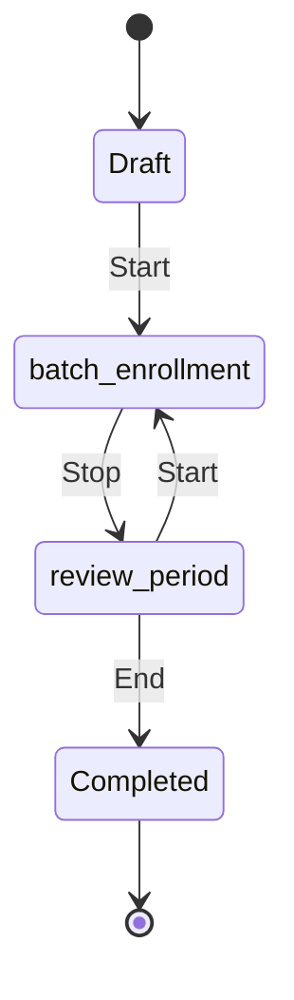
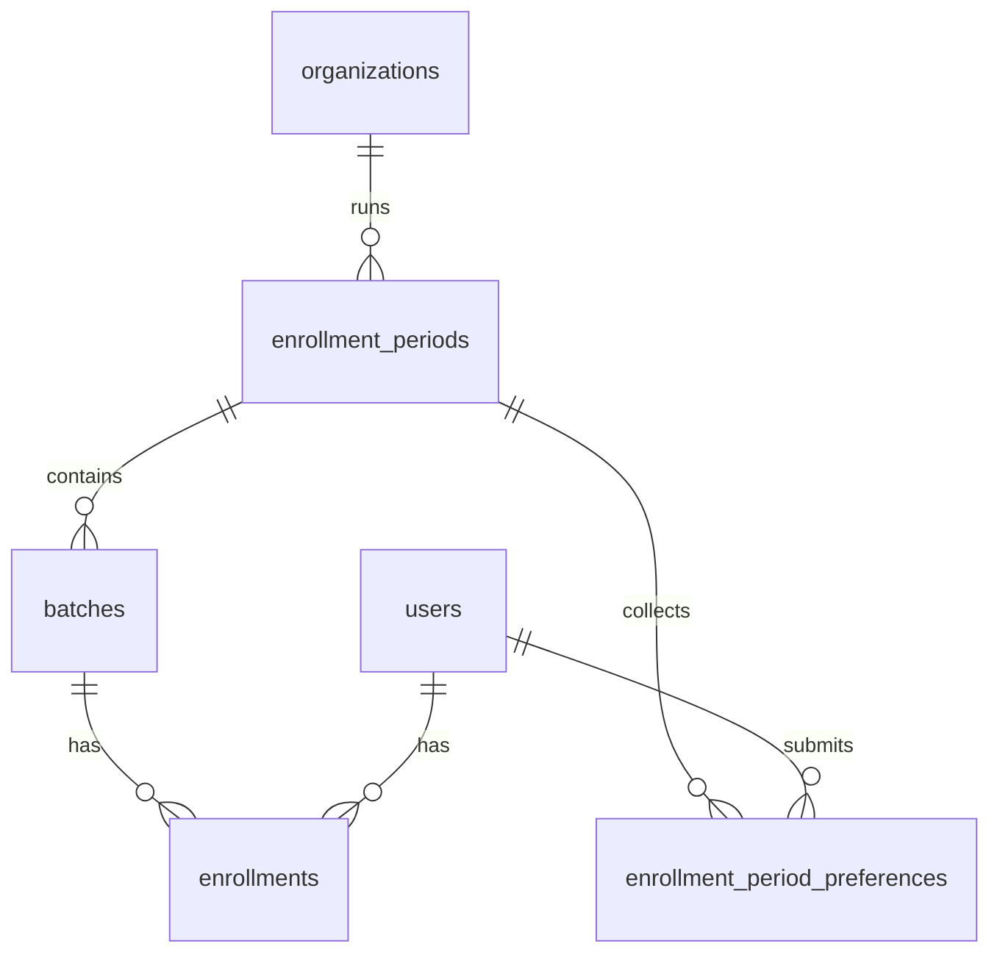

# Feature Spec: Enrollment Features

**Document ID:** `user-onboarding/03`  
**Primary owner:** Enrollment-period agent  
**Product source:** [user-onboarding-feature-memo.md](../../product/user-onboarding-feature-memo.md) §8, §9, §11  
**Related specs:** [01-auth](./01-authentication-and-registration.md), [02-proxy](./02-proxy-registration-and-impersonation.md), [04-enablers](./04-onboarding-enablers.md)

---

## 1. Purpose

Model **enrollment-period** as a first-class org-scoped entity with manual phase control (**Draft → batch-enrollment → review-period → Completed**), student **1st / 2nd** batch preferences, org-admin assignment during review, and **End** validations that activate batches and open the **student learning portal gate** for assigned students.

Replaces the preference Google Form and aligns batch lifecycle with operational onboarding.

---

## 2. Product Context

After vetting, new students need batch placement each cycle. Today preferences and assignments happen outside the LMS. The enrollment-period entity:

- Allows **many** periods per org over time; **one active** at a time (`Draft`, `batch-enrollment`, or `review-period`).
- Uses **display-only** metadata dates; phase changes via **Start / Stop / End** buttons only.
- Stores **latest** 1st/2nd choices + timestamp (no history).
- Separates **preferences** from **placement** (admin assigns final batch).
- **End** flips batches to `active` and satisfies the student portal gate with existing `enrollments`.

---

## 3. Current State

| Area | As-built |
|------|----------|
| **Batches** | `batches` table — no `status` or `enrollment_period_id` |
| **Enrollments** | `enrollments` — `active` \| `dropped` \| `completed`; one active per student per org |
| **Batch APIs** | `server/routes/batch.routes.ts` — CRUD, enroll, drop, co-instructors |
| **Admin UI** | `apps/admin-portal/src/app/admin/batches/` — `BatchList`, detail with matrix |
| **Enrollment period** | **Not implemented** |
| **Preferences** | **Not implemented** |
| **Student Enrollment page** | **Not implemented** — students land on `/my-learning` |
| **Portal gate** | Partial: `getAvailableChapters` empty without enrollment; **no** route-level block; chapter bundle lacks enrollment check |
| **Instructor exception** | Instructor routes use `useRoleGuard`; learning APIs tenant-scoped |

**Key files:**

- `packages/types/src/schema.ts` — `batches`, `enrollments`
- `server/modules/batch-cohort/service.ts`
- `server/modules/learning-delivery/service.ts`
- `apps/student-portal/src/app/(portal)/my-learning/page.tsx`
- `apps/student-portal/src/app/(portal)/layout.tsx`

---

## 4. Future State

### 4.1 Enrollment-period lifecycle



| Status | Admin | Student (no active batch enrollment) |
|--------|-------|--------------------------------------|
| **Draft** | Create metadata + enrollment batches (`enrolling`); **Start** | See period info; **cannot** submit choices |
| **batch-enrollment** | Monitor; **Stop** | Pick **1st** / **2nd** choice; edit until Stop |
| **review-period** | Assign students; **Start** reopen; **End** | Read-only choices |
| **Completed** | Read-only history | Period closed; gate via assignment |

### 4.2 Enrollment batches

- Batches linked to `enrollment_period_id`.
- While period not **Completed**: `batches.status = enrolling`.
- On **End**: all batches on period → `status = active`.

### 4.3 Student portal gate (canonical)

For each org:

```
IF membership.status = active
   AND EXISTS enrollment (status=active) IN batch (status=active) IN org
THEN full student modules (My Learning, chapters, ...)
ELSE Enrollment page + Register another user + Login as (per other specs)
```

**Instructor modules:** Available when user has `instructor` role regardless of student gate.

**Assignments during review-period:** May create enrollments on `enrolling` batches but learning UI stays closed until **End**.

### 4.4 End validations

| Rule | Type |
|------|------|
| Each batch has `trackId` | Blocking |
| Each batch has `primaryInstructorId` | Blocking |
| Each batch has ≥1 co-instructor | Blocking |
| Each batch has ≥1 student assigned (active enrollment) | Blocking |
| Any batch with <5 students | Warning (non-blocking) |
| Every vetted student assigned | **Not** required |

---

## 5. User Stories

### Approved student (prospective placement)

| ID | Story |
|----|-------|
| ENR-01 | As an **approved student** without batch placement, I want an **Enrollment** page, so that I know what to do during onboarding. |
| ENR-02 | As a **approved student**, during **batch-enrollment**, I want to set **1st and 2nd** batch choices, so that admins know my preferences. |
| ENR-03 | As a **approved student**, I want to edit choices until admin **Stop**s, so that I can change my mind. |
| ENR-04 | As a **approved student** in **review-period**, I want read-only choices, so that I understand the window closed. |
| ENR-05 | As a **assigned student** after **End**, I want full **My Learning** access, so that I can study. |
| ENR-06 | As an **unassigned student** after **Completed**, I stay on Enrollment until a future period or admin exception. |

### Org-admin / Super-admin

| ID | Story |
|----|-------|
| ENR-07 | As an **org-admin**, I want to create and run enrollment-periods, so that I replace Google Forms. |
| ENR-08 | As an **org-admin**, I want dashboards of preferences, so that I can plan assignments. |
| ENR-09 | As an **org-admin**, I want to assign students to batches in review-period, so that I finalize placement. |
| ENR-10 | As an **org-admin**, I want **End** to validate batch readiness, so that we do not go live with incomplete batches. |

### Instructor

| ID | Story |
|----|-------|
| ENR-11 | As an **instructor** without student batch, I still access instructor tools, so that I can teach even if not placed as a student. |

### Returning / advanced student

| ID | Story |
|----|-------|
| ENR-12 | As a **returning student**, I may be assigned via batch management without enrollment-period UI, so that ops can skip preference forms. |
| ENR-13 | As a **placed student** during a new period, I may view new batches read-only but not select again. |

### Managed user (via proxy)

| ID | Story |
|----|-------|
| ENR-14 | As a **manager**, I want to Login as a managed user during batch-enrollment, so that I can submit their choices (doc 02). |

---

## 6. Implementation Slices

### Slice E1 — Schema: enrollment_period, batch status, preferences

| Field | Detail |
|-------|--------|
| **Goal** | Tables and enums for period + preferences + batch lifecycle |
| **Backend** | Drizzle migration |
| **Acceptance criteria** | Backfill existing batches to `active`, `enrollment_period_id` null |
| **Dependencies** | None |

See §7.

---

### Slice E2 — Enrollment period admin CRUD

| Field | Detail |
|-------|--------|
| **Goal** | Org-admin creates/lists/updates periods in **Draft** |
| **Backend** | `server/modules/enrollment-period/` — service + storage |
| **Routes** | `/api/admin/enrollment-periods` (org-scoped) |
| **Frontend** | Admin **Enrollments** section: list + create wizard step 1 (metadata) |
| **Permissions** | `requireOrgRole('admin')` or super-admin with org context |
| **Validation** | Only one active period per org (DB partial unique index) |
| **Acceptance criteria** | Cannot create second active period while one exists |
| **Dependencies** | E1 |

---

### Slice E3 — Enrollment batches under period

| Field | Detail |
|-------|--------|
| **Goal** | Create batches tied to period with `status=enrolling` |
| **Backend** | Extend batch create OR dedicated `POST .../enrollment-periods/:id/batches` |
| **Frontend** | Wizard step 2 — batch list (reuse batch fields: code, name, track, instructors, schedule display fields) |
| **Validation** | Period must be Draft or batch-enrollment (editing rules TBD — assumption: editable in Draft only) |
| **Dependencies** | E2, existing `batch-cohort` |

---

### Slice E4 — Phase transitions (Start / Stop / End)

| Field | Detail |
|-------|--------|
| **Goal** | Implement state machine with validations |
| **Backend** | `POST .../enrollment-periods/:id/start`, `stop`, `end` |
| **Frontend** | Admin period detail: phase buttons + confirmation modals |
| **End validations** | §4.4 |
| **Acceptance criteria** | End → period Completed + batches active; cannot End from Draft |
| **Dependencies** | E2, E3 |

---

### Slice E5 — Student preferences API

| Field | Detail |
|-------|--------|
| **Goal** | Upsert 1st/2nd choice during batch-enrollment |
| **Backend** | `PUT /api/learning/enrollment-preferences` or `/api/student/enrollment-period/preferences` |
| **Permissions** | Active membership + period status = batch-enrollment + target is self (or impersonation) |
| **Validation** | Both batches on same period; 1st ≠ 2nd optional? **Assumption:** may be same batch allowed for 1st and 2nd — product silent; default allow different batches only |
| **Storage** | Latest row per user per period; `updated_at` |
| **Dependencies** | E1, E4 (period in correct phase) |

---

### Slice E6 — Student Enrollment page

| Field | Detail |
|-------|--------|
| **Goal** | UI for period info, batch list, preference form or read-only |
| **Frontend** | `apps/student-portal/src/app/(portal)/enrollment/page.tsx` |
| **States** | No active period; Draft (info only); batch-enrollment (form); review-period (frozen); Completed (message); already placed (read-only or redirect) |
| **Dependencies** | E5, enabler E4 gate resolver |
| **Acceptance criteria** | Pending user cannot access (redirect) |

---

### Slice E7 — Admin assignment dashboard

| Field | Detail |
|-------|--------|
| **Goal** | Visibility + assign during review-period (and batch-enrollment read-only assign optional) |
| **Backend** | `GET .../enrollment-periods/:id/dashboard`; reuse `POST /api/batches/:id/enrollments` |
| **Frontend** | Tables: students without choices, per-batch 1st/2nd counts, assign dropdown |
| **Dependencies** | E4, E5, batch enroll API |
| **Note** | Assignment creates `enrollments` on `enrolling` batches |

---

### Slice E8 — Portal gate enforcement

| Field | Detail |
|-------|--------|
| **Goal** | Single resolver drives layout + learning APIs |
| **Backend** | `resolveStudentPortalAccess(userId, orgId)`; enforce on learning routes + chapter bundle |
| **Frontend** | `(portal)/layout.tsx` redirect non-instructor student routes to `/enrollment` |
| **Dependencies** | E1 batch status, enabler E4 |
| **Acceptance criteria** | User with enrolling-batch enrollment cannot open chapter until End |

---

### Slice E9 — Exceptions: direct batch assignment

| Field | Detail |
|-------|--------|
| **Goal** | Returning/advanced path via existing batch management |
| **Backend** | Allow enroll on `active` batches outside period; gate opens immediately |
| **Frontend** | No change to batch UI beyond status badge |
| **Dependencies** | E8 |
| **Acceptance criteria** | Assign active batch → user gets full portal without period participation |

---

### Slice E10 — Already-placed student read-only view

| Field | Detail |
|-------|--------|
| **Goal** | During new period, placed students see batches read-only |
| **Backend** | API flag `canSubmitPreferences: false` when active enrollment exists |
| **Frontend** | Enrollment page read-only mode |
| **Dependencies** | E6, E8 |

---

## 7. Data Model / Schema Impact

### `enrollment_periods` (new)

| Column | Type | Notes |
|--------|------|-------|
| `id` | uuid PK | |
| `org_id` | uuid FK | |
| `name` | text | e.g. "Vedam 2026 – Spring" |
| `status` | varchar | `draft`, `batch_enrollment`, `review_period`, `completed` |
| `batch_enrollment_start` | date nullable | display only |
| `batch_enrollment_end` | date nullable | display only |
| `review_window_start` | date nullable | display only |
| `review_window_end` | date nullable | display only |
| `orientation_at` | timestamptz nullable | display only |
| `batch_start_date` | date nullable | display only |
| `started_at` | timestamptz nullable | audit |
| `stopped_at` | timestamptz nullable | |
| `ended_at` | timestamptz nullable | |
| `created_by` | varchar FK | |
| `created_at`, `updated_at` | timestamptz | |

**Index:** partial unique on `(org_id)` WHERE `status IN ('draft','batch_enrollment','review_period')`.

### `batches` (alter)

| Column | Type |
|--------|------|
| `enrollment_period_id` | uuid FK nullable |
| `status` | varchar — `enrolling`, `active` (default `active` for legacy) |
| `schedule_display` | jsonb optional | multi-timezone display strings for student list v1 |

### `enrollment_period_preferences` (new)

| Column | Type |
|--------|------|
| `id` | uuid PK |
| `enrollment_period_id` | uuid FK |
| `user_id` | varchar FK |
| `first_choice_batch_id` | integer FK → batches |
| `second_choice_batch_id` | integer FK → batches |
| `updated_at` | timestamptz |

Unique: `(enrollment_period_id, user_id)`.

### `enrollments` (unchanged semantics)

Active enrollment in **active** batch satisfies gate.



---

## 8. API / Service Layer

Mount under `/api/admin/enrollment-periods` (admin) and `/api/student/enrollment-period` or learning namespace (student).

### Admin (org context)

| Method | Path | Purpose |
|--------|------|---------|
| `GET` | `/api/admin/enrollment-periods` | List for org (filter active/history) |
| `POST` | `/api/admin/enrollment-periods` | Create Draft |
| `GET` | `/api/admin/enrollment-periods/:id` | Detail + batches |
| `PATCH` | `/api/admin/enrollment-periods/:id` | Metadata (Draft only) |
| `POST` | `/api/admin/enrollment-periods/:id/start` | → batch_enrollment |
| `POST` | `/api/admin/enrollment-periods/:id/stop` | → review_period |
| `POST` | `/api/admin/enrollment-periods/:id/end` | → completed + validations |
| `GET` | `/api/admin/enrollment-periods/:id/dashboard` | Preference stats + unassigned students |
| `POST` | `/api/admin/enrollment-periods/:id/batches` | Create enrolling batch |

### Student (tenant learning context)

| Method | Path | Purpose |
|--------|------|---------|
| `GET` | `/api/student/enrollment-period/current` | Active period + UI flags for tenant org |
| `PUT` | `/api/student/enrollment-period/preferences` | Upsert 1st/2nd |
| `GET` | `/api/student/portal-access` | Gate resolver output (optional; may be part of `/auth/me`) |

Reuse existing:

- `POST /api/batches/:id/enrollments` — assignment (admin/instructor+)
- `GET /api/batches/:id/enrollments`

**New module:** `server/modules/enrollment-period/` (recommended) to avoid bloating `batch-cohort`.

---

## 9. UI / UX Requirements

### Admin — Enrollments module (new nav item)

| Screen | Content |
|--------|---------|
| **List** | Cards/table: name, status badge, date range display, actions |
| **Create wizard** | Step 1 metadata → Step 2 batches → save Draft |
| **Detail** | Metadata edit (Draft); batch table; phase buttons; dashboard tab in review |
| **End modal** | Show blocking errors + warnings (<5 students) |

Place in `admin-navigation-config.ts` next to Batches.

### Student — Enrollment page

| State | UI |
|-------|-----|
| No active period | Explain wait for next cycle; link to profile |
| Draft | Period name + dates; “Choices not open yet” |
| batch-enrollment | Batch cards (all batches, all timezones shown); 1st/2nd selectors; Save; last updated time |
| review-period | Frozen choices display |
| Completed, unassigned | Message + contact admin |
| Has active batch enrollment | Redirect to My Learning OR read-only period view (ENR-13) |

### Student — Nav / gate

- Default landing for gated students: `/enrollment` not `/my-learning`.
- My Learning hidden from nav when gate closed.
- Instructor nav unchanged.

---

## 10. Permissions & Access Control

| Action | Pending | Active student | Org-admin | Super-admin |
|--------|---------|----------------|-----------|-------------|
| View current period (public info) | ✗ | ✓ | ✓ | ✓ |
| Submit preferences | ✗ | ✓ (batch-enrollment) | ✗ | ✗ |
| Manage periods | ✗ | ✗ | ✓ | ✓ |
| Start/Stop/End | ✗ | ✗ | ✓ | ✓ |
| Assign to batch | ✗ | ✗ | ✓ | ✓ |
| Direct assign active batch | ✗ | ✗ | ✓ | ✓ |

**Learning APIs:** Require active enrollment in **active** batch for student content (except instructor paths).

---

## 11. Validation & Business Rules

| Rule | Type |
|------|------|
| One active enrollment-period per org | Blocking (DB) |
| Completed period cannot restart | Blocking |
| Preferences only in batch-enrollment | Blocking |
| Preferences editable until Stop | Blocking |
| 1st/2nd must reference batches on same period | Blocking |
| End only from review-period | Blocking |
| End batch validations (track, instructors, students) | Blocking / warn |
| Not all students must be assigned | Allowed |
| Student with active enrollment in active batch → gate open | Invariant |
| Enrollment on enrolling batch does not open gate | Invariant until End |

---

## 12. Edge Cases

| Scenario | Behavior |
|----------|----------|
| Admin **Start** from review-period | Reopens batch-enrollment; students edit again |
| Student submits only 1st choice | **Assumption:** 2nd optional or both required — default **both required** before save |
| Batch deleted with preferences pointing to it | Block delete or cascade clear preferences |
| End with 0 students in one batch | Blocking per memo |
| User in two orgs | Independent periods and gates per org |
| Impersonation preference submit | Audit impersonator; same rules as student |
| Chapter API direct URL while gated | 403 from server |

---

## 13. Integration Points

| Spec | Integration |
|------|-------------|
| **01 Auth** | Only `active` membership; pending blocked |
| **02 Proxy** | Login as for preference submission |
| **04 Enablers** | `resolveStudentPortalAccess` (E4), nav (E6) |
| **batch-cohort** | Reuse enroll/drop; extend batch model |
| **learning-delivery** | Gate chapter bundle + my-progress scope |

---

## 14. Acceptance Criteria

### Period lifecycle

- [ ] Create Draft period + enrolling batches.
- [ ] Cannot create second active period.
- [ ] Start → students can save preferences; Stop → frozen.
- [ ] End passes validations → Completed + batches `active`.

### Student

- [ ] Gated approved student lands on Enrollment.
- [ ] After End + assignment, My Learning accessible.
- [ ] Assign during review without End → still gated.

### Admin

- [ ] Dashboard shows choice counts per batch.
- [ ] Assign student creates enrollment on enrolling batch.

### Instructor

- [ ] Instructor without student enrollment still reaches `/instructor/*`.

### Regression

- [ ] Direct assign to active batch bypasses period (ENR-12).

---

## 15. Open Questions / Implementation Assumptions

| Item | Type |
|------|------|
| 1st and 2nd must differ | Assumption — yes |
| Batch metadata fields for schedule display | Assumption — jsonb on batch until scheduling module exists |
| Edit batches after Draft | Assumption — only in Draft |
| Org-admin on RR vs SLMTS | Both use same APIs with org context |
| Preference API namespace | Assumption — `/api/student/enrollment-period/*` with tenant middleware |

---

**End of document**
