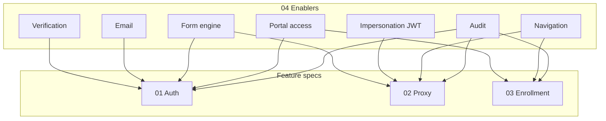

# Feature Spec: Onboarding Enablers (Cross-Cutting)

**Document ID:** `user-onboarding/04`  
**Primary owner:** Platform / foundation agent (or first agent in build order)  
**Product source:** [user-onboarding-feature-memo.md](../../product/user-onboarding-feature-memo.md) §12–13  
**Related specs:** [01-auth](./01-authentication-and-registration.md), [02-proxy](./02-proxy-registration-and-impersonation.md), [03-enrollment](./03-enrollment-features.md)

---

## 1. Purpose

Provide shared infrastructure that **three feature specs depend on** but should not duplicate: verification (OTP), transactional email, registration form schema engine, student portal access resolution, impersonation session claims, navigation/shell updates, and audit conventions.

This document has **no standalone product surface**; it defines contracts other agents must consume.

---

## 2. Product Context

The onboarding memo assumes capabilities the codebase lacks today:

- Email on **reject**
- **Phone/email verification** before registration submit
- **Configurable intake** per org (SLMTS vs RR)
- **Student portal gate** = active membership + active enrollment in active batch
- **Login as** with audit trail

Enablers implement these once, behind stable interfaces.

---

## 3. Current State

| Capability | Status |
|------------|--------|
| Email sending | **No** transactional email module found |
| OTP / verification | **Not implemented** |
| Dynamic forms | **Not implemented** |
| Portal gate helper | **Partial** — tenant membership in `tenant-session.ts`; learning partial checks |
| Impersonation JWT fields | **Not implemented** |
| Student nav for Enrollment | **Not implemented** — `packages/ui` navigation config |
| Audit for governance | **Yes** — `system-admin` subscribes to membership events |

**Key files:**

- `server/modules/system-admin/events.ts` — audit subscribers
- `server/modules/system-admin/service.ts` — `logAction`
- `apps/student-portal/src/lib/tenant-session.ts`
- `packages/ui/src/lib/navigation-config.ts`
- `server/shared/events/event-bus.ts`

---

## 4. Future State

| Enabler ID | Deliverable | Consumers |
|------------|-------------|-----------|
| **E1** | Verification service + public API | Doc 01 A2 |
| **E2** | Email service + rejection template | Doc 01 A7 |
| **E3** | Registration form schema registry + renderer package | Doc 01 A3, 02 P3 |
| **E4** | `resolveStudentPortalAccess()` + middleware hook | Doc 01 A9, 03 E8 |
| **E5** | Impersonation JWT claims + middleware | Doc 02 P5 |
| **E6** | Student/admin navigation updates | Doc 02 P7, 03 E6 |
| **E7** | Audit action catalog extensions | Doc 02 P6, all governance |

---

## 5. User Stories

| ID | Story |
|----|-------|
| ENB-01 | As a **platform engineer**, I want one verification API, so that auth and proxy register do not fork OTP logic. |
| ENB-02 | As a **super-admin**, I want rejection emails sent reliably, so that applicants are notified without manual mail. |
| ENB-03 | As a **student**, I want consistent nav that hides learning until I am placed, so that I am not confused. |
| ENB-04 | As a **security reviewer**, I want impersonation audited, so that Login as is traceable. |

---

## 6. Implementation Slices

### Slice E1 — Verification service

| Field | Detail |
|-------|--------|
| **Goal** | Channel-agnostic OTP send/confirm |
| **Module** | `server/modules/verification/` |
| **API** | `POST /api/auth/verification/send`, `confirm` (owned by doc 01 routes, logic here) |
| **Interface** | `VerificationService.send({ channel, target })`, `confirm({ challengeId, code }) → { verificationToken }` |
| **Token** | Short-lived JWT or opaque token bound to channel targets; single-use on register |
| **Providers** | Email: SMTP or SendGrid; SMS: Twilio — **implementation assumption** |
| **Acceptance criteria** | Rate limit; hashed codes; expiry; contract tests with mock provider |
| **Dependencies** | `verification_challenges` table (doc 01 A1) |

---

### Slice E2 — Transactional email

| Field | Detail |
|-------|--------|
| **Goal** | Send templated emails from event handlers |
| **Module** | `server/modules/notifications/` or `server/shared/email/` |
| **Interface** | `EmailService.send({ to, templateId, variables })` |
| **Templates** | `membership-rejected` (required v1); optional `membership-approved` later |
| **Integration** | Subscribe `MembershipRejected` in notifications module OR extend `system-admin/events.ts` to call EmailService |
| **Config** | `SMTP_*` or `SENDGRID_API_KEY`, `EMAIL_FROM` |
| **Acceptance criteria** | Dev mode logs to console; test asserts handler invoked on reject |
| **Dependencies** | None |

**Template variables (reject):**

- `firstName`, `orgName`, `supportEmail` (tenant config)

---

### Slice E3 — Registration form schema engine

| Field | Detail |
|-------|--------|
| **Goal** | Define, validate, and render org-specific intake |
| **Backend** | `RegistrationFormService.getActiveSchema(orgSlug)`, `validateResponses(schema, json)` |
| **Shared types** | `@narada/types` — export `RegistrationFieldDefinition` Zod discriminated union |
| **Frontend** | `packages/ui/src/components/registration-form/` — maps schema → shadcn fields |
| **Seed** | Migration or seed script: v1 SLMTS + RR placeholder schemas |
| **Acceptance criteria** | Invalid field type in schema fails CI; renderer shows required fields |
| **Dependencies** | `registration_form_definitions` table |

**Implementation assumption:** v1 uses internal JSON field DSL (not full JSON Schema) for smaller bundle.

---

### Slice E4 — Student portal access resolver

| Field | Detail |
|-------|--------|
| **Goal** | Single function for gate decisions |
| **Module** | `server/modules/portal-access/` or `identity-access/portal-access.ts` |
| **Signature** | `resolveStudentPortalAccess({ userId, orgId }): PortalAccess` |

```typescript
// Implementation assumption — types in @narada/types
type PortalAccess = {
  membershipStatus: MembershipStatus;
  canAccessStudentLearning: boolean;
  canAccessEnrollmentWorkflow: boolean;
  canRegisterAnotherUser: boolean;
  canLoginAs: boolean;
  reason?: 'pending' | 'rejected' | 'no_active_batch' | 'active';
  activeEnrollment?: { batchId: number; batchStatus: string };
};
```

| **Rules** | |
|-----------|--|
| `canAccessStudentLearning` | active membership AND active enrollment in batch where `batch.status = 'active'` |
| `canAccessEnrollmentWorkflow` | active membership AND (active period exists OR user unassigned) |
| `canRegisterAnotherUser` | active membership |
| `canLoginAs` | active membership AND (manages ≥1 OR super-admin) — delegate manages check to ProxyService |

**Exposure:**

- Extend `GET /api/auth/me` with `portalAccess` per requested tenant (from `X-Tenant-Slug`)
- Middleware: `requireStudentLearningAccess` on `/api/learning/*` student routes

**Frontend:**

- `usePortalAccess()` hook wrapping `/auth/me`
- `(portal)/layout.tsx` uses hook for redirects

**Acceptance criteria** | Matches memo §9.1 truth table; contract tests for each state |

**Dependencies** | Batch `status` column (doc 03 E1); optional stub until enrollment period exists |

---

### Slice E5 — Impersonation session claims

| Field | Detail |
|-------|--------|
| **Goal** | JWT carries impersonation metadata; middleware attaches to `req.user` |
| **Files** | `server/auth/jwt.utils.ts`, `jwt-auth.middleware.ts` |
| **Claims** | `impersonatorUserId?`, `impersonationSessionId?` |
| **Middleware** | `attachImpersonationContext` — sets `res.locals.impersonatorId` for audit |
| **Acceptance criteria** | Stop clears claims; nested impersonation rejected |
| **Dependencies** | `impersonation_sessions` table (doc 02) |

---

### Slice E6 — Navigation & shell

| Field | Detail |
|-------|--------|
| **Goal** | Nav items match access flags |
| **Student** | Add **Enrollment** route; hide My Learning when `!canAccessStudentLearning`; show Register another user / Login as when flags true |
| **Admin** | Add **Enrollments** section |
| **Files** | `packages/ui/src/lib/navigation-config.ts`, student `(portal)/layout.tsx`, `AppShell` props |
| **Acceptance criteria** | Gated user sees Enrollment only + proxy links; instructor sees instructor nav |
| **Dependencies** | E4 |

---

### Slice E7 — Audit catalog extensions

| Field | Detail |
|-------|--------|
| **Goal** | Standard actions for new flows |
| **Actions** | `IMPERSONATION_STARTED`, `IMPERSONATION_ENDED`, `ENROLLMENT_PERIOD_STARTED`, `STOPPED`, `ENDED`, `PREFERENCE_UPDATED`, `PROXY_REGISTRATION` |
| **Pattern** | Publish domain events OR call `adminService.logAction` from services |
| **Acceptance criteria** | Each action documented in `system-admin` README |
| **Dependencies** | None |

---

## 7. Data Model / Schema Impact

Enablers **reuse** tables defined in other docs:

| Table | Defined in |
|-------|------------|
| `verification_challenges` | Doc 01 |
| `registration_form_definitions` | Doc 01 |
| `impersonation_sessions` | Doc 02 (optional) |

**No exclusive tables** unless `email_outbox` desired for retry — **implementation assumption:** synchronous send v1 with logging; queue later.

---

## 8. API / Service Layer

| Service | Methods |
|---------|---------|
| `VerificationService` | `sendChallenge`, `confirmChallenge`, `consumeVerificationToken` |
| `EmailService` | `sendTemplate` |
| `RegistrationFormService` | `getActiveDefinition`, `validateResponses` |
| `PortalAccessService` | `resolveStudentPortalAccess` |
| `ImpersonationService` | (doc 02) uses E5 claims |

**Extended response:** `GET /api/auth/me` includes:

```json
{
  "user": { ... },
  "memberships": [ ... ],
  "portalAccess": {
    "canAccessStudentLearning": false,
    "canAccessEnrollmentWorkflow": true,
    ...
  }
}
```

---

## 9. UI / UX Requirements

### Acting-as banner (component)

| Element | Spec |
|---------|------|
| Placement | Above `AppShell` header |
| Content | “You are viewing as {name}” + **Exit impersonation** |
| Style | High-contrast warning band (tenant-safe) |

### Registration form renderer

| Element | Spec |
|---------|------|
| Field types | text, email, phone, number, select, radio, checkbox, textarea, date |
| Sections | Optional headings from schema |
| Accessibility | Labels, `aria-invalid`, error text from server |

### Email (reject)

| Element | Spec |
|---------|------|
| Subject | “Update on your {orgName} registration” |
| Body | Plain + HTML; no internal vetting notes |

---

## 10. Permissions & Access Control

Enablers do not introduce new roles; they **centralize checks** used by feature docs.

| Check | Location |
|-------|----------|
| Learning API gate | `requireStudentLearningAccess` middleware |
| Portal nav | Client reads `portalAccess` from server (do not reimplement gate in UI only) |
| Email on reject | Server-side only on super-admin reject |

---

## 11. Validation & Business Rules

| Rule | Owner |
|------|-------|
| Verification token single-use | E1 |
| Email only to user's registered email on reject | E2 |
| Form validation matches active schema version at submit | E3 |
| Gate resolver is source of truth for learning access | E4 |
| UI nav must not show learning link if server says false | E6 |

---

## 12. Edge Cases

| Scenario | Enabler behavior |
|----------|------------------|
| Email provider down on reject | Log error; membership still rejected; retry job **out of scope v1** |
| OTP brute force | Lock challenge after N attempts |
| Schema version changes mid-flight | Submit stores `form_definition_id` used at render time |
| Super-admin on student portal | `canAccessStudentLearning` may be true via bypass **implementation assumption:** super-admin not bypassing student gate unless product says so — **memo:** gate is batch-based; super-admin follows same student UI unless impersonating |

**Clarification (assumption):** Super-admin does **not** auto-bypass student learning gate; they use admin portal or impersonation.

---

## 13. Integration Points



| Feature | Enablers required |
|---------|-------------------|
| 01 Auth | E1, E2, E3, E4 (partial) |
| 02 Proxy | E3, E5, E6, E7 |
| 03 Enrollment | E4, E6, E7 |

---

## 14. Acceptance Criteria

- [ ] E1: OTP send/confirm works in dev with console provider.
- [ ] E2: Reject membership triggers email (or dev log).
- [ ] E3: SLMTS and RR schemas render in Storybook or test page.
- [ ] E4: `resolveStudentPortalAccess` unit tests cover memo §9.1 matrix.
- [ ] E5: JWT after impersonate includes `impersonatorUserId`; stop removes it.
- [ ] E6: Gated student nav shows Enrollment, not My Learning.
- [ ] E7: New audit action types appear in admin logs UI filter.

---

## 15. Open Questions / Implementation Assumptions

| Item | Type |
|------|------|
| Email provider choice | Assumption — SendGrid or SMTP |
| SMS for phone OTP | Assumption — required for launch |
| `email_outbox` queue | Assumption — defer |
| JSON Schema vs custom DSL | Assumption — custom DSL v1 |
| Super-admin student gate bypass | Assumption — no bypass |
| Package name for notifications | Assumption — `server/modules/notifications/` |

---

## Ownership boundary (do not duplicate)

| Concern | Owner doc |
|---------|-----------|
| Register API body, OAuth parity | 01 |
| Management links, Login as routes | 02 |
| Enrollment-period entities, preferences, End | 03 |
| OTP/email/form/gate/nav infrastructure | **04 (this doc)** |

---

**End of document**
