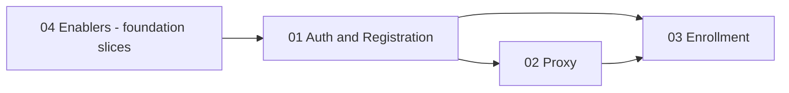

# User Onboarding — Implementation Specs

**Entry point:** Start here for onboarding implementation (build order, dependencies, doc map).

**Source of truth (product):** [user-onboarding-feature-memo.md](../../product/user-onboarding-feature-memo.md)  
**Narrative archive:** [user-onboarding-raw-context.md](../../product/user-onboarding-raw-context.md)  
**Status:** Ready for parallel agent implementation (docs only; code not started)
---

## Documents in this folder

| # | Document | Primary ownership |
|---|----------|-------------------|
| 1 | [01-authentication-and-registration.md](./01-authentication-and-registration.md) | Org-aware intake, email/phone + verification, local + Google registration parity, login identifier, super-admin vetting, membership `pending` / `active` / `rejected` |
| 2 | [02-proxy-registration-and-impersonation.md](./02-proxy-registration-and-impersonation.md) | `manages` / `managed-by` edges, Register another user, Login as, super-admin relationship admin |
| 3 | [03-enrollment-features.md](./03-enrollment-features.md) | `enrollment_period`, batch lifecycle (`enrolling` / `active`), preferences, phase controls, admin Enrollments module, student Enrollment page, portal gate |
| 4 | [04-onboarding-enablers.md](./04-onboarding-enablers.md) | Cross-cutting: verification service, transactional email, portal gate resolver, form schema infrastructure, shared nav/shell, audit patterns |

**Do not duplicate ownership:** Each slice appears in exactly one primary document. Cross-doc dependencies are listed under **Integration Points** in each spec and summarized below.

---

## Recommended build order

| Phase | Work | Rationale |
|-------|------|-----------|
| **0** | Enablers: verification OTP API, email sender, `studentPortalAccess` resolver stub, migration conventions | Auth and enrollment both depend on these |
| **1** | Auth & Registration (schema + register + vetting + login identifier) | Membership gate is prerequisite for proxy and enrollment |
| **2a** | Proxy (relationship table + Register another user) | Can parallel with 2b after phase 1 register API is stable |
| **2b** | Enrollment (period entity + admin draft) | Can start after phase 1; student flows need active membership |
| **3** | Login as + acting-as UX | Depends on relationships + stable JWT/session |
| **4** | Enrollment student UX + preferences + End | Depends on period admin + gate resolver |
| **5** | Portal gate enforcement (student learning routes) | Depends on batch `status` + enrollment check |

---

## Cross-feature dependency matrix

| Consumer | Depends on | Contract |
|----------|------------|----------|
| Proxy registration | Auth register API | Same intake payload + `registeredByUserId` + optional `managedByUserId` |
| Login as | Auth session/JWT | Impersonation claims + restore manager session |
| Enrollment student UI | Auth active membership | `user_organizations.status = active` for tenant |
| Enrollment preferences | Auth + (optional) proxy | Manager acts via Login as |
| Portal gate | Auth active membership + Enrollment End | `hasActiveEnrollmentInActiveBatch(orgId)` |
| Rejection email | Auth reject membership | `MembershipRejected` event → email enabler |
| Super-admin vetting UI | Auth + form responses | Read `registration_submissions` |

---

## Shared architecture (all agents)

| Area | Pattern in repo |
|------|-----------------|
| API | Express routers under `server/routes/`; domain logic in `server/modules/<domain>/` |
| Schema | Drizzle in `packages/types/src/schema.ts`; migrations in `migrations/` |
| Auth session | JWT in HttpOnly `auth_token`; `GET /api/auth/me`; tenant via `X-Tenant-Slug` on student portal |
| Org context | `jwtAuth` → `requireOrgContext` (JWT `currentOrgId`) for org-scoped admin APIs |
| Learning APIs | `attachLearningTenantOrgContext` — active membership for tenant slug, no super-admin bypass |
| Student portal | Next.js 15 App Router; client guards in `(portal)/layout.tsx` |
| Admin portal | `AdminLayout` + `canAccessAdminPortal`; super-admin-only `/admin/users` |
| Events | `eventBus` + `system-admin` audit subscribers |

---

## Major risks

| Risk | Mitigation |
|------|------------|
| Login-as security (session fixation, privilege escalation) | Dedicated impersonation token or nested session record; short TTL; audit every start/stop; banner in UI |
| Phone uniqueness / login identifier | Normalize E.164; unique index on `users.phone`; login resolver tries email then phone |
| OAuth + multi-step intake | Persist draft submission server-side; resume after Google callback |
| Portal gate partial today | Enforcer doc owns single `resolveStudentPortalAccess()` used by layout + learning APIs |
| Batch `status` migration | Backfill existing batches to `active`; new enrollment-period batches start as `enrolling` |
| Form schema drift (SLMTS vs RR) | Versioned JSON schema per org slug; enabler doc owns engine |

---

## Out of scope (all docs)

WhatsApp/Zoom automation, waitlist, automated date-driven phase transitions, choice history beyond latest + timestamp, hard kid/adult batch filters, parent–child entity, org-admin registration vetting.

---

**Next step for implementers:** Read [04-onboarding-enablers.md](./04-onboarding-enablers.md) foundation slices, then your primary feature doc end-to-end before coding.
