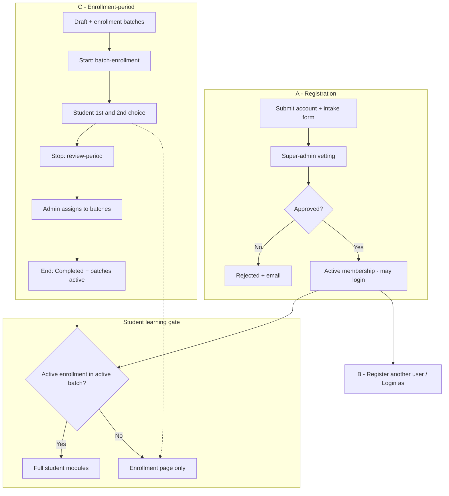
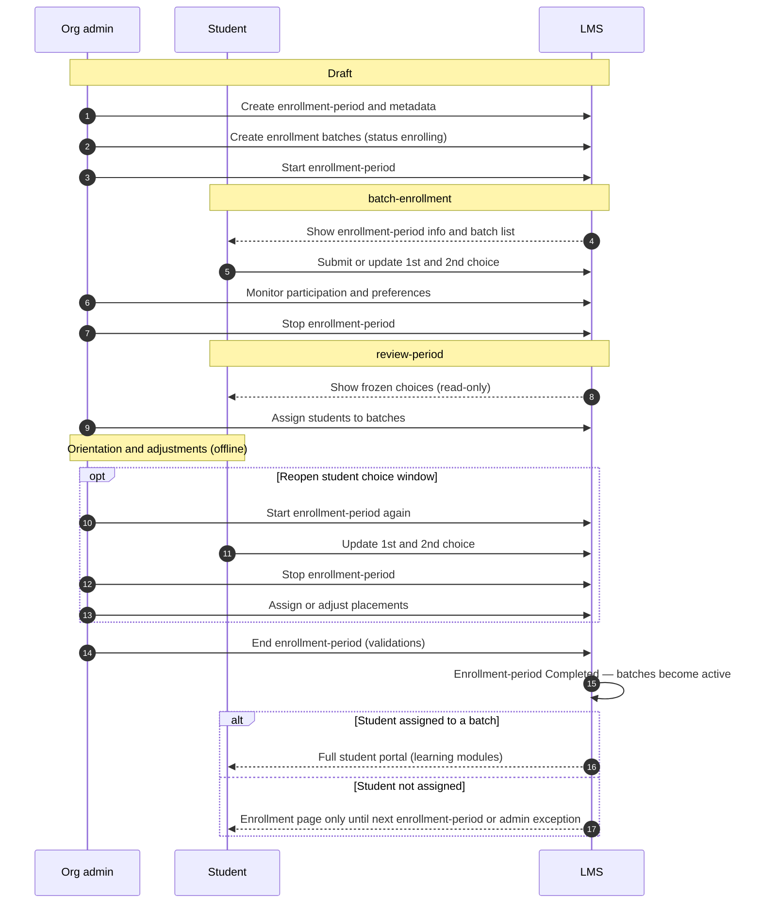

# NaradaLMS — User Onboarding Feature Memo

**Document type:** Product specification (future state)  
**Audience:** Business stakeholders, technical architects, developers  
**Status:** Draft for review  
**Scope:** End-to-end user onboarding for pathasala organizations (SLMTS, RR today; additional orgs later)

**Companion doc:** [user-onboarding-raw-context.md](./user-onboarding-raw-context.md) — narrative archive of original explanations (not the formal spec).

---

## 1. Executive summary

NaradaLMS today supports **account registration**, **super-admin membership approval**, and **batch/enrollment management**, but it does **not** model how pathasalas onboard students each cycle: intake questionnaires, vetting, enrollment windows, ranked batch preferences, admin placement, and proxy participation.

This memo defines the **future-state onboarding system** in three coordinated capabilities:


| #     | Capability                        | Summary                                                                                                                                                             |
| ----- | --------------------------------- | ------------------------------------------------------------------------------------------------------------------------------------------------------------------- |
| **A** | **Registration & authentication** | Org-aware intake at sign-up; super-admin vetting; email + phone with verification; Google OAuth parity; approve/reject with email on reject                         |
| **B** | **Account management**            | Directional **manages / managed-by** links; **Register another user**; **Login as** for managed accounts (and super-admin for any user)                             |
| **C** | **Enrollment-period**             | Org-admin runs an **enrollment-period** entity: draft → student 1st/2nd choice → review & assign → **End** activates batches; replaces Google Forms for preferences |


**Portal access (student learning UI):** After membership is **approved**, a user sees **full student modules** in an org only if they have an **active enrollment in an active batch** in that org. Otherwise they see the **Enrollment** page, plus **Register another user** and **Login as** when applicable. **Instructor modules** stay available to users with the instructor role even when the student gate is not satisfied.

---

## 2. Problem statement

### 2.1 Business context

Each pathasala (e.g. SLMTS, RR) runs **seasonal onboarding** about **three times per year**. During a **registration window** (~3 weeks), announcements go out (today via WhatsApp); prospective students complete an **intake form** (today Google Forms). After the window closes, admins review submissions. Vetting is **manual**: verify form data, call the student and references, then decide admission.

Accepted candidates join pathasala communication channels (WhatsApp today). Admins gather **instructor availability**, form **batches** (primary + one or two secondary instructors, ~2 classes/week, timing from the primary instructor’s slot), then publish **batch options**. New students **rank preferences** (today a second Google Form). Admins **assign** students targeting **12–15** per batch (soft limit; personal coordination when a batch is full). Per-batch groups are created; **orientation** is scheduled (often a weekend); classes start the following week on **Zoom**.

**Operational realities the product must respect:**

- **Kids vs adult batches** is a soft rule; some older kids join adult batches.
- **Families** may span batches or pathasalas; parents are often in kids’ WhatsApp groups.
- **Returning students** skip full public intake; admins place them by progress.
- **Cross-pathasala** registration is allowed when vetting passes in each org.
- **Phone/WhatsApp** matter as much as email; vetting and comms stay human-driven — the LMS structures data and workflow.

### 2.2 Gaps in the current LMS


| Gap                                           | Impact                                                            |
| --------------------------------------------- | ----------------------------------------------------------------- |
| Sign-up is **email/password only**            | Intake in Google Forms; duplicate entry; no vetting record in LMS |
| Approval unlocks the **whole student portal** | New students see learning UI before batch placement               |
| No **enrollment-period** entity               | Preferences and assignment live outside the system                |
| No **proxy** model                            | Helpers cannot register or act for others in-product              |
| Login is **email-centric**                    | Ops rely on phone/WhatsApp                                        |


### 2.3 What success looks like

- **One system** for intake, vetting, batch preference, and assignment (replacing Google Forms for intake and preferences).
- **Clear gates:** vetted member → enrollment-period participation → **active batch** → full student portal.
- **Operator control:** phase changes via **Start / Stop / End**; displayed dates are informational only.
- **Multi-org ready:** common + org-specific questions; one **active** enrollment-period per org at a time.

---

## 3. Current state (baseline)

### 3.1 Operations today (off-system)

1. Announce registration window → Google Form
2. Review + manual vetting (calls, references)
3. Accept → org WhatsApp
4. Instructor availability → create batches
5. Second form → **1st / 2nd** batch choice
6. Admin assigns (~12–15 per batch)
7. Batch WhatsApp, orientation, Zoom classes

### 3.2 LMS today

- **Register** → user + **pending** org membership → super-admin **approve/reject** → **active** → broad student portal access.  
- **Batches & enrollments** exist; **one active enrollment per student per org**.  
- **Multi-tenancy:** SLMTS, RR.  
- **Google sign-in** exists but not aligned with full intake + vetting parity in this memo.

---

## 4. Future-state overview




**Three layers:**


| Layer                    | Question answered                                   | Primary actors                  |
| ------------------------ | --------------------------------------------------- | ------------------------------- |
| **Membership & vetting** | May this user participate in this org?              | Registrant, super-admin         |
| **Enrollment-period**    | Which batch should this new cohort join this cycle? | Org-admin, student              |
| **Student portal gate**  | May this user use learning features yet?            | System (batch enrollment check) |


---

## 5. Design principles

1. **Digitize the operational playbook** — Same phases as today; LMS is system of record for intake, choices, and assignments.
2. **Manual phase control** — **Start / Stop / End** change enrollment-period status; calendar fields on the entity are **display-only**.
3. **Preferences are not placement** — Students set **1st / 2nd** choice; **only org-admins** assign final batch membership.
4. **Soft batch sizing** — Target ~12–15; warn if **<5** assigned at **End**; require **≥1** student per batch to **End**.
5. **One student gate** — Full student UI when **active enrollment in an active batch** (no separate “enrollment complete” flag).
6. **Student is the base role** — Every member is a **student**; instructor/admin are additive.
7. **Generic proxy** — **manages / managed-by**, many-to-many, directional (not parent–child entity).
8. **Central vetting** — Super-admin approves registrations before org enrollment work.
9. **Per-org isolation** — Registration, enrollment-periods, and gates are independent per pathasala.

---

## 6. Feature A — Registration & authentication

### 6.1 Goals

- Replace **Google Forms** for new-student intake with an in-app **registration questionnaire** (common + org-specific fields).  
- **Login** with **email or phone**; collect and verify both (at least one verified before submit).  
- **Google OAuth** with the **same form** and **same super-admin vetting**.  
- **Reject** with **email notification**.

### 6.2 Registration flow (local account)

**When:** User signs up in a pathasala (tenant/org) context.

**UI:** Email, password, and **required registration form** (common + org-specific; SLMTS vs RR field sets differ — see stakeholder checklist for PDF baselines).

**Before submit:**

- All required fields complete.  
- Email and phone captured.  
- **At least one** verified (OTP or equivalent).

**On submit:**

- User record created; org membership `pending`.  
- Form responses stored for super-admin review.  
- User cannot access full student learning modules yet.

**On approve:** Membership `active` — user may log in. (Account already exists from submit; approval is a **membership** transition, not a second account creation.)

**On reject:** Membership `rejected`; **email** sent.

**Membership states (v1):** `pending` | `active` | `rejected` — no waitlist.

### 6.3 Google OAuth registration

- OAuth remains supported.  
- After identity is established, user completes the **same registration form** and submits.  
- Membership is `pending` until super-admin approval — identical vetting path to local sign-up.

### 6.4 Super-admin vetting


|                  |                                                                                |
| ---------------- | ------------------------------------------------------------------------------ |
| **Who**          | Super-admin only (not org-admin)                                               |
| **Why**          | Open registration; org enrollment should only include vetted users             |
| **Inputs**       | Form responses; **managed-by** context when someone used Register another user |
| **Offline work** | Calls, reference checks — outside LMS; decision is recorded in-system          |


### 6.5 Login

- Username field accepts **registered email or phone**.  
- Password unchanged for local accounts.  
- OAuth subject to post-auth membership checks.

### 6.6 First login after approval

- User is **active** but usually has **no active batch enrollment**.  
- **Student learning modules** stay gated; default landing is the **Enrollment** page.  
- **Instructor modules** stay available for users with the instructor role, even without a student batch.  
- **Register another user** and **Login as** remain available when the user is allowed to use them.

---

## 7. Feature B — Account management (proxy & impersonation)

### 7.1 Goals

- Register and operate the portal **on behalf of** another person (family, instructor helper, support).  
- Avoid a rigid parent–child entity; use explicit **manages / managed-by** links.

### 7.2 Relationship model


| Concept            | Definition                                                      |
| ------------------ | --------------------------------------------------------------- |
| **A manages B**    | A may **Register another user** (creating B) and **Login as** B |
| **B managed-by A** | Inverse list on B’s profile                                     |
| **Shape**          | **Directional**, **many-to-many** — **not** symmetric           |


**Rules:**

- A manages B **does not** imply B manages A.  
- Chains (e.g. C manages A, A manages B) require **explicit** admin edits.  
- **No cap** on how many accounts one user may manage.  
- Super-admin is **system of record** — can add/remove links on either side of a user profile.

### 7.3 Register another user


|             |                                                                                                                                           |
| ----------- | ----------------------------------------------------------------------------------------------------------------------------------------- |
| **Who can** | Any user with `active` membership — including users still on Enrollment-only student UI                                                   |
| **Flow**    | Manager fills full registration + intake → new user `pending` → super-admin vets → on approve, manager may **Login as** to run Enrollment |
| **Example** | Approve self → register father and child → **Login as** each during **batch-enrollment** to submit 1st/2nd choices                        |


### 7.4 Login as


| Actor       | Scope                                    |
| ----------- | ---------------------------------------- |
| Manager     | Searchable list of users they **manage** |
| Super-admin | **Any** user                             |


**Product requirements:** Session acts as selected user in student portal (per org); clear **acting-as** UX and audit (architecture).

### 7.5 Admin portal: user management

Super-admin on a user profile:

- Lists **manages** and **managed-by**.  
- Add/remove relationships on either list.

---

## 8. Feature C — Enrollment-period & batch placement

An **enrollment-period** is a first-class entity: the org can create **many** enrollment-periods over time (past and future), but only **one** may be active at once. It represents the window when batch preference and placement happen for that cycle.

### 8.1 Goals

- Replace the **preference Google Form** with in-app **1st / 2nd** batch choice while an enrollment-period is in **batch-enrollment**.  
- Give org-admins live visibility and assignment tools.  
- **End** the enrollment-period when ops are ready → batches become **active** → student learning gate opens for assigned students.

### 8.2 Enrollments module (admin portal)

**Audience:** Org-admin, super-admin.

**Includes:**

- List of **current and past enrollment-periods** for the org.  
- Workflow to create and run an enrollment-period (wizard-style).  
- Visibility into **newly registered / not-yet-placed** students (those without active enrollment in an active batch) during operations.

**Cardinality:** At most **one active enrollment-period per org** — status **Draft**, **batch-enrollment**, or **review-period**. Multiple **Completed** (or Draft) enrollment-periods may exist at the same time.

### 8.3 Enrollment-period metadata (display only)


| Field                        | Purpose                                                    |
| ---------------------------- | ---------------------------------------------------------- |
| Name                         | Cycle label (e.g. “Vedam 2026 – Spring”)                   |
| Batch enrollment start / end | Shown to students and admins                               |
| Review window start / end    | Shown to students and admins (expected review-phase dates) |
| Orientation date & time      | Shown to students and admins                               |
| Batch start date             | Shown to students and admins                               |


Dates **do not** auto-advance phases. Admins use **Start / Stop / End** based on real-world progress.

### 8.4 Status machine


| Status               | Admin actions                                                                                | Student experience (if not yet in active batch)                                                        |
| -------------------- | -------------------------------------------------------------------------------------------- | ------------------------------------------------------------------------------------------------------ |
| **Draft**            | Create enrollment-period; add **enrollment batches** (`enrolling`); edit metadata; **Start** | Enrollment-period may be visible; **cannot** submit choices                                            |
| **batch-enrollment** | Monitor dashboard; **Stop**                                                                  | See all enrollment batches (multi-timezone times); set **1st** and **2nd** choice; edit until **Stop** |
| **review-period**    | Assign students; **Start** to reopen choices; **End** when ready                             | See enrollment-period + **frozen** choices (read-only)                                                 |
| **Completed**        | Read-only history                                                                            | Enrollment-period closed permanently for that cycle                                                    |


**Transitions:**


| Button    | From → To                                                      |
| --------- | -------------------------------------------------------------- |
| **Start** | **Draft** or **review-period** → **batch-enrollment**          |
| **Stop**  | **batch-enrollment** → **review-period**                       |
| **End**   | **review-period** (when ready) → **Completed** + effects below |


A **Completed** enrollment-period **cannot** be restarted.

### 8.4.1 Enrollment-period flow — sequence (happy path)

The status table above shows **states** on the enrollment-period entity. This diagram shows **who interacts with whom** over time. Dates on the enrollment-period are display-only — status changes when the org-admin clicks **Start**, **Stop**, or **End**.




**Proxy path:** A manager with **Login as** performs the student steps above on behalf of a managed account during **batch-enrollment**.

**Exception path:** Org-admin assigns a student directly from batch management (no preference UI) when there is no active enrollment-period or after an offline request — same portal rule: full access once enrollment exists in an **active** batch.

### 8.5 Enrollment batches

- Created under an enrollment-period from the Enrollments workflow.  
- While the enrollment-period is not **Completed**: batch status `enrolling`.  
- When the enrollment-period is **Ended**: its batches → `active` (normal batch management thereafter).

**Student batch list (v1):** Show **all** enrollment batches on that enrollment-period — no hard kid/adult filter.

### 8.6 Student preferences (`batch-enrollment` phase)

- **1st** and **2nd** priority, clearly labeled.  
- Unlimited edits until **Stop**.  
- Store **latest** choice only + **timestamp of last update** (no history).

### 8.7 Admin dashboard & assignment (`batch-enrollment` + `review-period`)

**Visibility:**

- Who has submitted choices.  
- Per batch: counts for **1st** vs **2nd** choice.  
- Per student: latest choices + last updated time.

**Assignment (review-period):**

- Org-admin assigns final batch membership (may override preferences; offline calls encouraged for fairness).  
- Soft target ~12–15 — **not** system-enforced.

**Important — portal gate vs assignment timing:**

- Assignments during **review-period** may create enrollments on `enrolling` batches.  
- Students **still** see only the Enrollment page for learning features until **End**, because full access requires enrollment in an `active` batch.  
- **End** flips that enrollment-period’s batches to `active` and opens the learning portal for assigned students.

### 8.8 End enrollment-period (single button)

**Operational meaning:** Assignments finalized, orientation complete, batches ready to teach.

**System effects (one action):**

1. Enrollment-period status → **Completed** (terminal).
2. All batches on that enrollment-period → `active`.
3. Assigned students with active enrollments can use the full student portal.

**Validations on End:**


| Rule                                                                   | Type                         |
| ---------------------------------------------------------------------- | ---------------------------- |
| Each batch has **track**, **primary instructor**, **≥1 co-instructor** | Blocking                     |
| Each batch has **≥1 student assigned**                                 | Blocking                     |
| Any batch with **<5** students assigned                                | Warning (non-blocking in v1) |


**Not required:** every vetted student is assigned before **End**. Unassigned students keep landing on the Enrollment page until a later enrollment-period or an admin assigns them.

### 8.9 Exceptions: returning, advanced, and later enrollment-periods


| Scenario                                          | Path                                                                                                                                                                                              |
| ------------------------------------------------- | ------------------------------------------------------------------------------------------------------------------------------------------------------------------------------------------------- |
| **Returning student**                             | Contacts admin; placed via **batch management** (may skip enrollment-period UI)                                                                                                                   |
| **Advanced student**                              | Approved account; admin assigns to **active** batch without participating in an enrollment-period                                                                                                 |
| **Unassigned after Completed enrollment-period**  | Stays on Enrollment page; must participate in a **future** enrollment-period’s **batch-enrollment** (submit choices again) unless admin assigns via batch management after an **offline request** |
| **Already placed student, new enrollment-period** | May open Enrollment **read-only** to see new batches; **cannot** select again                                                                                                                     |


---

## 9. Student portal access control

### 9.1 Gate rule (canonical)

For each **org**, when loading **student learning** features:

```
IF membership is active (approved)
   AND user has active enrollment in an active batch in this org
THEN show full student modules (My Learning, progress, etc.)
ELSE show only:
   - Enrollment page
   - Register another user (if active membership)
   - Login as (if user manages ≥1 account, or user is super-admin)
```

There is **no** separate “enrollment complete” flag — the batch check **is** the definition.

### 9.2 Instructor exception

Users with **instructor** role:

- **Instructor modules** remain available even when the student gate fails.  
- **Enrollment** as default landing applies to **student** learning areas only.

### 9.3 Pending and rejected


| State        | Access                                              |
| ------------ | --------------------------------------------------- |
| **pending**  | Pending-approval experience; no enrollment workflow |
| **rejected** | No active access; **email** explains outcome        |


### 9.4 Multi-org

Each org applies registration, vetting, enrollment-periods, and gate **independently**.

---

## 10. Role & responsibility matrix


| Action                                    | Approved student | Org-admin | Super-admin  |
| ----------------------------------------- | ---------------- | --------- | ------------ |
| Submit registration + intake form         | ✓                | —         | —            |
| Register another user                     | ✓                | —         | —            |
| Approve / reject registration             | —                | —         | ✓            |
| Edit manages / managed-by                 | —                | —         | ✓            |
| Login as                                  | ✓ (manages list) | —         | ✓ (any user) |
| Manage enrollment-periods                 | —                | ✓         | ✓            |
| Start / Stop / End enrollment-period      | —                | ✓         | ✓            |
| View choice dashboards & assign in review | —                | ✓         | ✓            |
| Assign via batch management (exception)   | —                | ✓         | ✓            |


**Rule:** Every member is a **student**; other org roles are additive.

---

## 11. End-to-end journeys

### 11.1 New student (happy path)

1. Register with intake + verification → **pending**.
2. Super-admin **approves** → login allowed.
3. Student UI gated → **Enrollment**; active enrollment-period is in **batch-enrollment**.
4. Submit **1st / 2nd** choice; edit until admin **Stop**s.
5. **review-period** — choices frozen; admin assigns to batch.
6. Orientation (offline); admin **End**s enrollment-period → batches **active**.
7. Active enrollment → **full student portal**.

### 11.2 Family via proxy

1. Parent approved → **Register another user** for father and child → each vetted.
2. **Login as** each during **batch-enrollment** → submit choices.
3. Admin assigns all; **End** → each with active enrollment gets full portal.

### 11.3 Returning student

1. Approved member (existing or new registration).
2. Admin assigns suitable **active** batch via batch management — no preference UI required.
3. Gate satisfied immediately.

### 11.4 Instructor without student batch

1. Student + instructor roles; may have no student batch placement.
2. **Instructor** UI works; **student** learning UI stays gated until placed (if ever).

---

## 12. Explicit out of scope (v1)


| Item                             | Notes                            |
| -------------------------------- | -------------------------------- |
| WhatsApp / Zoom automation       | Manual ops                       |
| Date-driven auto phase changes   | Future                           |
| Waitlist                         | pending / active / rejected only |
| Student choice audit history     | Latest + timestamp only          |
| Hard kid/adult batch filters     | Show all batches                 |
| Parent–child entity              | Use manages / managed-by         |
| Org-admin registration vetting   | Super-admin only                 |
| In-app rejection UX beyond email | Email on reject                  |


---

## 13. Technical considerations (non-binding)

- Likely new concepts: `enrollment_period`, batch preferences, batch status `enrolling`, registration form schema/responses, `manages` / `managed-by` edges, verification tokens.  
- Reuse: `user_organizations`, `batches`, `enrollments`, unique active enrollment per org.  
- **Login as:** session, banner, audit — security review required.  
- Form strategy: configurable org fields vs static SLMTS/RR definitions.  
- OAuth + multi-step form UX.  
- Transactional email for reject (optional approve).

---

## 14. Stakeholder review checklist

- Registration field list per org (SLMTS / RR PDFs as baseline)  
- Phone/email verification UX  
- Admin Enrollments wizard + student Enrollment page wireframes  
- Copy for Draft vs active enrollment-period on student Enrollment page  
- Login as banner + audit requirements  
- Rejection email template  
- Confirm: assignment during review does **not** open student learning UI until **End**

---

## 15. Glossary


| Term                     | Definition                                                                                                          |
| ------------------------ | ------------------------------------------------------------------------------------------------------------------- |
| **Pathasala / org**      | Tenant (e.g. SLMTS, RR)                                                                                             |
| **Registration**         | Account creation + intake form + super-admin vetting                                                                |
| **Enrollment-period**    | System entity: a cycle when batch preference and placement run for an org; many may exist; one **active** at a time |
| **Enrollment batch**     | Batch in `enrolling` while its enrollment-period is open; `active` after **End**                                    |
| **batch-enrollment**     | Enrollment-period status: students may edit 1st/2nd choice                                                          |
| **review-period**        | Enrollment-period status: choices frozen; admins assign                                                             |
| **Student portal gate**  | Active enrollment in **active** batch required for learning UI                                                      |
| **manages / managed-by** | Directional proxy link between users                                                                                |
| **Vetting**              | Super-admin approval of registration before `active` membership                                                     |


---

## Related documents

- [user-onboarding-raw-context.md](./user-onboarding-raw-context.md) — narrative archive of original explanations and verbatim feature write-up (reference only)

---

**End of memo**